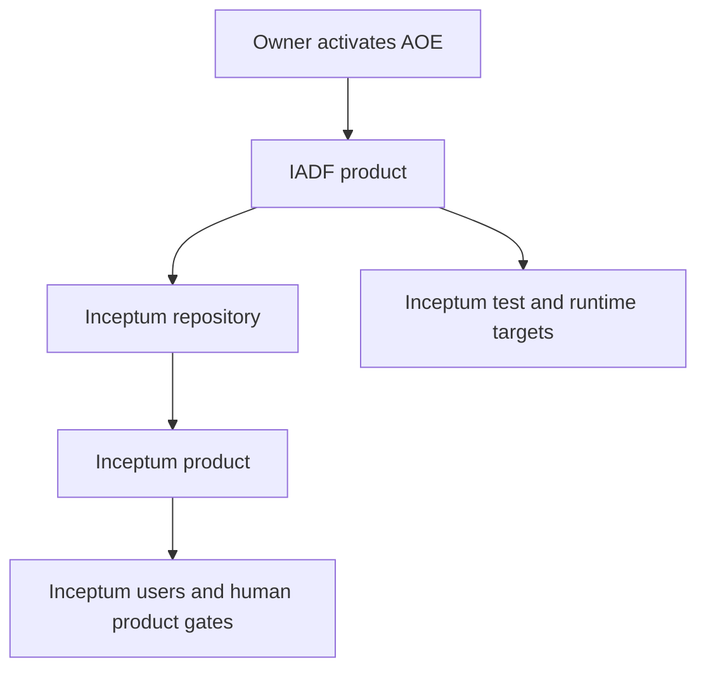
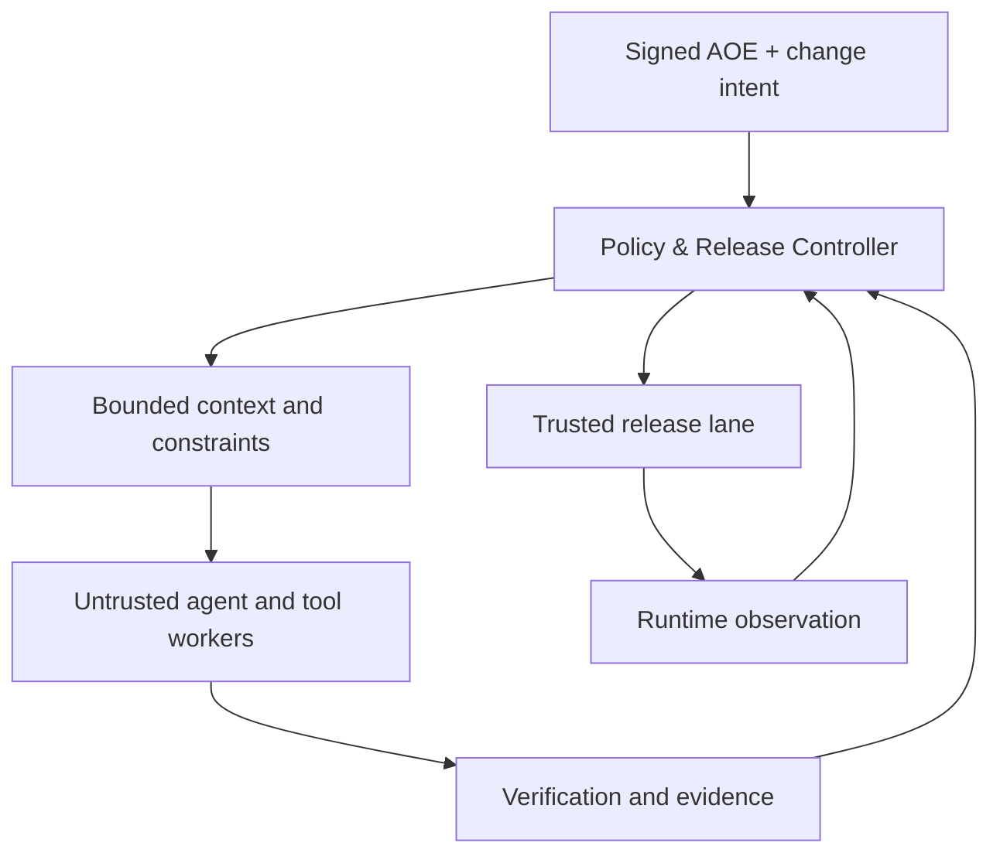
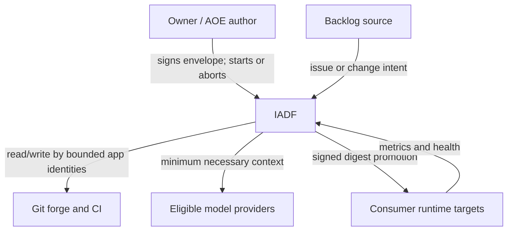
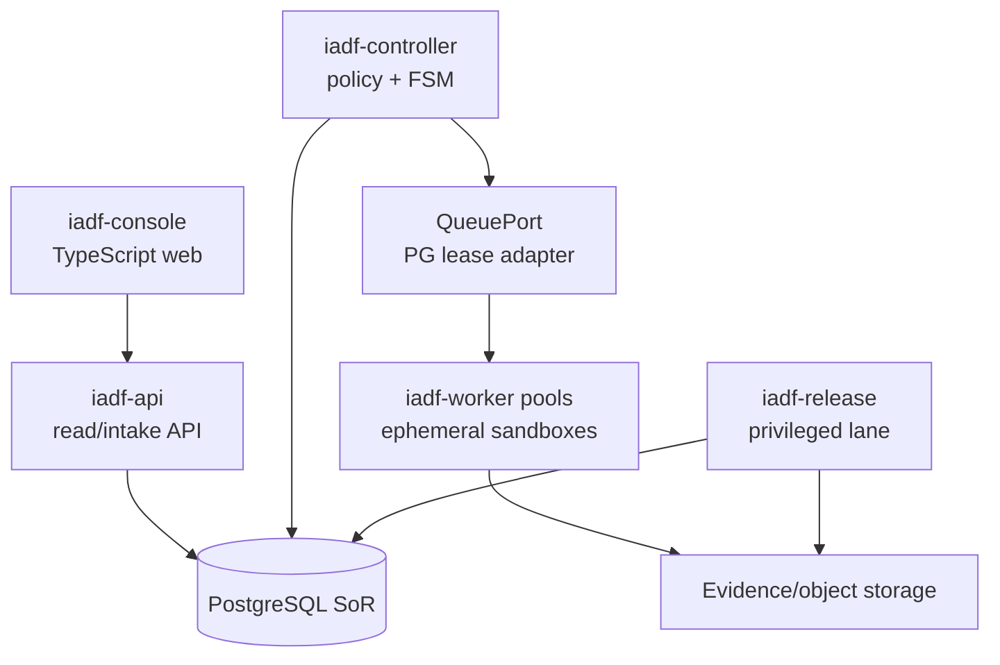
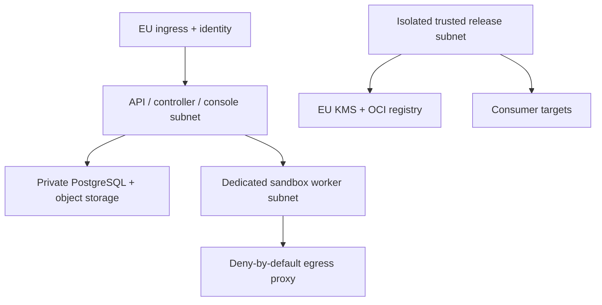
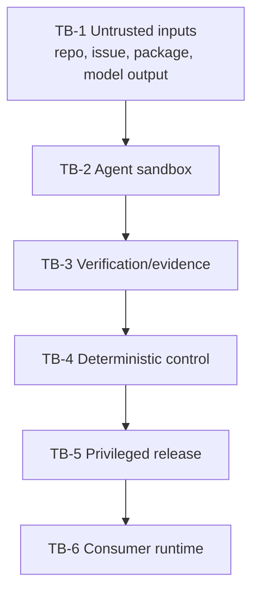
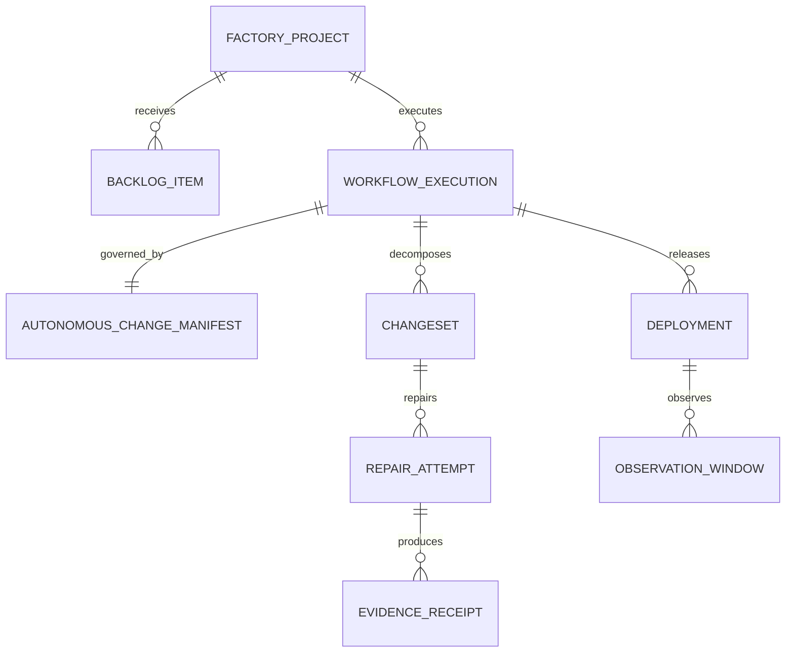
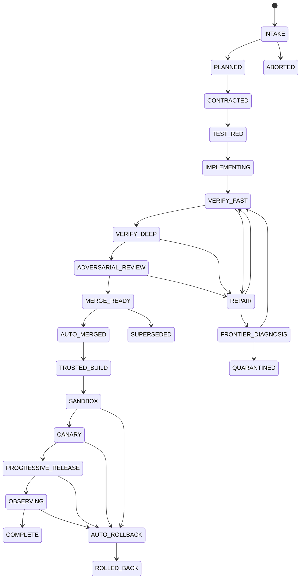
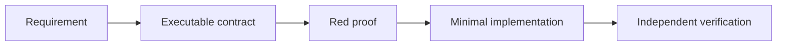
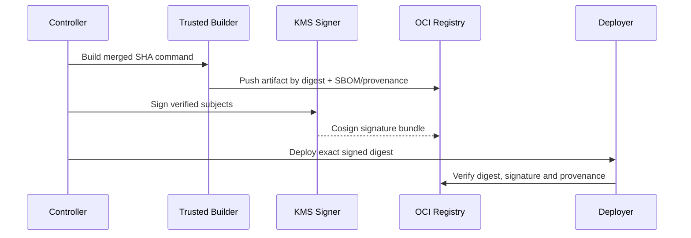

# Inceptum Autonomous Development Factory — Architecture Design Document

**File:** `IADF_Architecture_Design_Document_v1.0.md`  
**Product:** Inceptum Autonomous Development Factory (IADF)  
**Document type:** Architecture Design Document (ADD)  
**Version:** 1.0  
**Status:** DESIGN-COMPLETE PROPOSED BASELINE; PRODUCTION NOT AUTHORIZED  
**Date:** 16 August 2026  
**Language:** English, preserving normative Italian source concepts and stable architecture terms  
**Decision owner before envelope activation:** Product owner  
**Sole runtime operational authority after activation:** deterministic Policy & Release Controller  
**First consumer and end-to-end validation case:** Inceptum  
**Research cut-off:** 16 August 2026; volatile facts require the dated bindings defined herein

> **Normative language.** `MUST`, `MUST NOT`, `SHOULD`, `SHOULD NOT` and `MAY` have their RFC 2119 meaning. “Agent” always denotes a fallible cognitive worker. An agent is never an operational authority.

---

## 1. Metadata and version history

### 1.1 Document control

| Field | Value |
|---|---|
| Architecture identifier | `IADF-ADD-001` |
| Architecture baseline | `IADF-BASELINE-1.0` |
| Selected alternative | `ALT-F` — explicit deterministic state machine plus evolutionary workflow adapter |
| Primary repository convention | one product repository per consumer; separate IADF repository |
| Baseline deployment | EU single-region, modular services, PostgreSQL, object storage, isolated workers |
| Autonomy mode | bounded, policy-gated, fail-closed, no runtime human gate |
| Assurance limit | automated evidence is not independent assurance; the factory cannot certify itself |
| Success terminals | `COMPLETE` only |
| Non-success terminals | `QUARANTINED`, `ABORTED`, `ROLLED_BACK`, `SUPERSEDED` |
| Forbidden terminal/runtime state | `WAIT_FOR_HUMAN` |

### 1.2 Version history

| Version | Date | Status | Change |
|---|---:|---|---|
| 0.1 | 2026-08-16 | Working | Source reconciliation, current primary-source research and architecture drivers |
| 0.5 | 2026-08-16 | Working | Logical, data, state, security, delivery and FinOps architecture |
| 1.0 | 2026-08-16 | Proposed design baseline | Complete 42-section ADD, traceability, fitness catalogue and final assurance; production activation remains gated by §40 evidence |

### 1.3 Source precedence and decision rule

The following order is authoritative:

1. the execution prompt that commissioned this document;
2. `INCEPTUM_ARCH_ALT_004_Fully_Autonomous_Optimized_Factory_v1.0`;
3. an updated Inceptum ADD v2, if present and verifiable;
4. the approved Inceptum ADD v1, the Inceptum Initial Requirements Baseline and the meta-architecture research;
5. dated official/primary external sources.

Contradictions are not silently averaged. They are entered in `DIV-*`, resolved conservatively and reversibly, and tested by a fitness function where possible.

### 1.4 Divergence register

| ID | Divergence | Resolution in this ADD | Residual evidence |
|---|---|---|---|
| `DIV-001` | The referenced `INCEPTUM_Architecture_Design_Document_v2.0_Fully_Autonomous.md` was not available. | No fact is attributed to an unseen v2. Prompt, `ARCH-ALT-004`, approved v1, research and IRB form the evidence set. | If a genuine v2 appears, run semantic diff; incompatible changes create a new ADD version, never a silent edit. |
| `DIV-002` | Inceptum v1 gives humans product-level approval authority; IADF requires no human runtime gate. | Scope separation: IADF autonomously builds and releases software. Inceptum's user-facing approval gates remain application requirements to be implemented and tested. | End-to-end Inceptum acceptance tests prove both facts simultaneously. |
| `DIV-003` | `ARCH-ALT-004` used `AUTO_PASS`, `AUTO_REPAIR`, `AUTO_ROLLBACK`, `AUTO_QUARANTINE`, `AUTO_ABORT`. | Prompt-precedence canonical terminal algebra is `COMPLETE`, `QUARANTINED`, `ABORTED`, `ROLLED_BACK`, `SUPERSEDED`; repair is a bounded non-terminal path. | Migration test rejects legacy state names at API/storage boundaries. |
| `DIV-004` | Earlier research recommended human-gated merge/release for the Inceptum project. | Superseded only for IADF runtime governance by deterministic authority. The assurance limitation remains. | `FIT-IADF-003`, `FIT-IADF-004`. |
| `DIV-005` | Earlier price snapshots and current provider pages differ; some current pages expose multiple service-tier tables. | Every request uses a dated, signed `PriceBinding` including provider, endpoint, model snapshot, service tier, context band, cache mode, currency and source URL. Unknown price means no paid call. | Daily price-catalog probe and pre-run cost upper bound. |
| `DIV-006` | GitHub required checks may treat `skipped` or `neutral` as mergeable while IADF allows only typed `PASS`. | GitHub protection is defense in depth. A single IADF merge-eligibility check, emitted by the expected GitHub App, independently validates all signed receipts for the latest SHA. | Negative integration tests for skipped/neutral/stale/wrong-issuer checks. |
| `DIV-007` | Full autonomy might be read as permission for unbounded or irreversible action. | Autonomy exists only inside a pre-activated, versioned Autonomous Operating Envelope (AOE). Out-of-envelope or irreversible work terminates as `QUARANTINED` or `ABORTED`. | Property tests over every transition and side effect. |
| `DIV-008` | The factory must maintain itself but must not self-certify. | Version N builds N+1; N−1 independently verifies and releases N+1. A candidate never issues its own trusted verification or release receipt. | `FIT-IADF-020`, clean-room recovery drill. |

---

## 2. Executive summary

IADF is a separate software product that converts a bounded, authorized change intent into a verified and, when policy permits, progressively released software change without runtime human gates. The first consumer is Inceptum; Inceptum is not embedded into the factory and its functional perimeter is unchanged.

The selected architecture is an explicit finite-state machine hosted by a small deterministic control core. PostgreSQL is the canonical source of truth; a transactional outbox and a PostgreSQL-backed queue provide durable at-least-once work delivery with exactly-once state effects through idempotency keys and optimistic versions. Six logical planes separate authority, context, untrusted cognitive execution, evidence, privileged release and runtime observation. LLMs propose artifacts, tests, code, review findings and diagnoses. Only the Policy & Release Controller may advance state, merge, sign, promote, roll back or terminate a run.

The baseline deliberately avoids an agent swarm, event-stream platform, graph/vector database, Kubernetes and Temporal. It exposes ports for each. Adoption is triggered by measured scale, replay, isolation or retrieval limits, not fashion. Workers run in ephemeral rootless containers under gVisor, without release credentials, with deny-by-default egress and per-role capability grants. The trusted build/release lane uses a different workload identity, consumes source by immutable SHA, builds once, produces CycloneDX SBOM and SLSA provenance, signs by KMS-backed Cosign and promotes the same digest.

Quality is contract-first and TDD-first. A valid red proof precedes implementation. Deterministic tests, static analysis, security scans, architecture checks, provenance verification and runtime SLO analysis produce typed receipts. The result algebra distinguishes `PASS`, `FAIL`, `NOT_RUN`, `SKIPPED`, `UNKNOWN`, `ERROR`, `INCONCLUSIVE`, `TIMEOUT`, `STALE`, `EXPIRED` and `SUPERSEDED`; only `PASS` is promotable. Missing evidence is never `PASS`.

Self-healing is bounded: deterministic remediation first; at most two main repair attempts, and the second is allowed only after the failure fingerprint changes; then at most one frontier diagnosis. Failure to restore a provable path ends in `QUARANTINED` or rollback. There are no infinite retries and no `WAIT_FOR_HUMAN` state.

Model selection is a benchmarked, policy-bound portfolio. The initial candidate lane uses cost-efficient models for classification/extraction, a main coding model for normal work and a frontier model only for high-attention diagnosis or architecture tasks. EU processing, retention eligibility, exact snapshot, price and token/cost receipts are mandatory. Provider substitution is a governed binding change, never an invisible fallback.

The architecture is ready for a Development Plan subject to the open bindings listed in §40. Those decisions do not block planning because each has a reversible baseline and an evidence-driven trigger.

---

## 3. Scope and boundary

### 3.1 In scope

IADF owns:

- project/repository onboarding and capability discovery;
- ingestion and normalization of backlog/change requests;
- creation and policy activation of an `AutonomousChangeManifest` (`ACM`);
- repository indexing and bounded context assembly;
- contract synthesis, red-proof generation, implementation and documentation;
- deterministic and adversarial automated review;
- bounded diagnosis and repair;
- branch/commit/pull-request lifecycle through a forge adapter;
- evidence normalization, signing, retention and replay;
- merge eligibility and merge through a dedicated identity;
- trusted build, SBOM, provenance, signing, deployment and rollback;
- runtime observation and automatic promotion/rollback;
- model routing, usage metering and cost enforcement;
- self-maintenance through N−1 verification;
- export, deletion, recovery and portability of factory-owned state.

### 3.2 Out of scope

IADF does not:

- redefine a consumer product's business scope or accept its business outcomes;
- grant an LLM merge, release, signing, secrets-management or policy authority;
- perform out-of-envelope legal, financial, physical or destructive actions;
- provide independent third-party security or regulatory certification;
- manufacture evidence from prose or model confidence;
- allow an untrusted worker to access production credentials or signing keys;
- promise support for every language, forge, cloud or deployment target in v1;
- treat a model/provider benchmark as permanent;
- require a person to unblock a runtime transition.

### 3.3 Product relationship with Inceptum



IADF sees Inceptum as a consumer configuration, repository and deployment target. Inceptum remains the single-person project-inception SaaS described by its own IRB/ADD, producing its three governed artifacts and preserving its product-level approval semantics. IADF's first end-to-end proof is to build, verify, release and roll back a representative Inceptum vertical slice.

### 3.4 Autonomy boundary

Before activation, a human may author, inspect and sign an AOE. After activation, all runtime decisions are machine-enforced. A task that needs authority not present in the AOE cannot ask for it: it terminates safely. A new AOE is a new external input and creates a new run or superseding manifest; it is not a hidden continuation.

---

## 4. Glossary

| Term | Rigorous definition |
|---|---|
| ACM | Immutable `AutonomousChangeManifest`: authorized work, scope, budgets, policies, data class, environments and rollback contract. |
| AOE | `AutonomousOperatingEnvelope`: signed policy boundary within which IADF may act without runtime approval. |
| Agent | Fallible model-backed worker producing proposals or findings; no operational authority. |
| Attempt | One execution of a step against an immutable input fingerprint. |
| Authority | The deterministic component/identity uniquely permitted to cause a side effect. |
| Canonical state | Versioned state in PostgreSQL controlled by the Policy & Release Controller. |
| ChangeSet | Minimal coherent code/config/docs change with contracts, tests and receipts. |
| Consumer | Product repository and targets managed by IADF, initially Inceptum. |
| Evidence | Immutable artifact or receipt with subject digest, producer, policy/version and result algebra. |
| Failure fingerprint | Stable hash of normalized failing checks, locations, error classes, environment and subject SHA. |
| Fitness function | Automated, objective architecture/quality assertion with threshold and owner. |
| Frontier lane | Expensive high-attention model lane invoked only by deterministic risk/diagnostic policy. |
| Latest SHA | Current immutable head commit of the candidate change at eligibility evaluation time. |
| ModelBinding | Versioned allowed provider/model snapshot/endpoint/eligibility/parameters for a role. |
| Policy bundle | Signed, versioned OPA/Rego policy plus non-bypassable controller invariants. |
| PriceBinding | Dated price terms and source needed to compute a pre-run upper bound and actual cost. |
| Receipt | Machine-verifiable statement over a subject digest, typed result and issuer identity. |
| Repair frontier | Set of remaining distinct, policy-permitted repair hypotheses. |
| Result algebra | `PASS \| FAIL \| NOT_RUN \| SKIPPED \| UNKNOWN \| ERROR \| INCONCLUSIVE \| TIMEOUT \| STALE \| EXPIRED \| SUPERSEDED`; only `PASS` advances. |
| Side effect | Any external mutation: repository write, merge, signing, deployment, rollback, deletion, paid model call. |
| Trusted lane | Isolated build/release execution with privileged workload identity unavailable to agents. |
| Verification plan | Complete expected set of gates, receipt schemas and issuers for a given ACM and SHA. |

---

## 5. Stakeholders and concerns

| Stakeholder | Primary concern | Architecture response | Evidence |
|---|---|---|---|
| Product owner | Autonomous delivery without silent scope expansion | Signed AOE/ACM, deterministic scope diff, fail-closed terminal outcomes | ACM, policy receipt, traceability |
| Consumer maintainer | Correct, understandable, reversible changes | contract/TDD chain, bounded diff, docs and rollback contract | PR evidence bundle, rollback drill |
| End user | No regression, secure and accessible behavior | acceptance/security/accessibility tests, progressive delivery | test and runtime receipts |
| Security owner | No excessive agency or secret leakage | capability matrix, separate identities, sandbox, egress allowlist | IAM diff, sandbox and secret-scan receipts |
| Platform/operator | Recoverable state and diagnosable runs | durable FSM, idempotency, outbox, telemetry plus audit | replay/recovery fitnesses |
| FinOps owner | Predictable spend and no runaway loops | pre-authorized caps, per-call price binding, kill limits | `CostReceipt`, budget events |
| Compliance/privacy owner | EU processing and lifecycle proof | data classes, endpoint eligibility, retention/deletion workflows | provider binding and deletion receipt |
| Auditor | Verifiable chain, no fabricated pass | signed typed receipts, immutable subjects, provenance verification | exportable evidence graph |
| Model/provider | Valid, policy-compliant API use | adapter contract, rate/cost limits, no secret in prompt | request metadata without content |
| Future adapter author | Portability without core rewrite | ports, conformance suites, canonical schemas | adapter fitness pack |

---

## 6. Assumptions and constraints

### 6.1 Assumptions

| ID | Assumption | Confidence | If false |
|---|---|---:|---|
| `ASM-001` | Consumer source is Git-based and has deterministic checkout by commit SHA. | High | Consumer is ineligible until a content-addressed source adapter exists. |
| `ASM-002` | Baseline workload is one owner, two concurrent ACMs and small-to-medium repositories. | Medium | Scale triggers may activate an external queue/Temporal and more workers. |
| `ASM-003` | At least one model binding can meet EU processing, retention and tool/structured-output eligibility. | Medium | Run local/open-weight only or quarantine model-dependent work. |
| `ASM-004` | Inceptum keeps its v1 logical shape: TypeScript web, Python modular backend, PostgreSQL, object storage, queue and OTel. | Medium | Consumer discovery creates a new profile; IADF core is unchanged. |
| `ASM-005` | Consumer changes can be made reversible or isolated before production. | Medium | Irreversible change is quarantined. |
| `ASM-006` | A forge can enforce identity-specific checks and immutable SHA reads. | High | Merge remains disabled for that adapter. |

### 6.2 Hard constraints

| ID | Constraint |
|---|---|
| `CON-001` | No runtime human gate after AOE activation. |
| `CON-002` | No LLM may merge, sign, release, promote, roll back, change policy, access production secrets or declare authoritative PASS. |
| `CON-003` | Every external mutation has one deterministic authority, idempotency key and audit event. |
| `CON-004` | Missing, unknown, stale, skipped, neutral or wrong-issuer evidence cannot advance. |
| `CON-005` | Retry and repair loops are finite and budgeted. |
| `CON-006` | Destructive or irreversible data changes are out of baseline and end `QUARANTINED`. |
| `CON-007` | The factory cannot independently certify its own release. |
| `CON-008` | Inceptum's functional perimeter is not changed by this ADD. |
| `CON-009` | Provider, model, price, region and retention claims are dated bindings, not timeless assumptions. |
| `CON-010` | Baseline must be operable by a small team and reproducible locally with synthetic data. |

### 6.3 Baseline capacity and lifecycle hypotheses

- two concurrent ACMs, up to 20 queued;
- repositories up to 2 GB checkout and 250,000 source lines;
- candidate diff soft limit 1,500 changed lines and hard limit 5,000 excluding generated lock/SBOM files;
- evidence object retention 400 days by default, configurable by class; audit ledger 7 years only if AOE/legal policy explicitly requires it, otherwise 400 days;
- prompts/responses with consumer source: 30 days maximum in IADF storage, preferably content-minimized; provider retention must satisfy the binding;
- backups: encrypted daily full plus continuous/WAL where supported; quarterly restore exercise;
- all values are testable baseline hypotheses, not production volume commitments.

---

## 7. Architecture drivers

| Priority | Driver | Consequence |
|---:|---|---|
| 1 | Deterministic authority over probabilistic workers | Explicit FSM, typed guards and segregated release credentials |
| 2 | Evidence completeness and latest-SHA binding | Verification plan and signed receipts are first-class data |
| 3 | Safe autonomy within finite bounds | AOE, risk classes, budget reservations, terminal quarantine/abort |
| 4 | Recoverability before throughput | PostgreSQL SoR, outbox, idempotency, reversible deployments |
| 5 | Contract-first correctness | Red proof precedes implementation; tests are independent artifacts |
| 6 | Least privilege and hostile-output handling | Sandboxed workers, deny egress, validated structured outputs |
| 7 | FinOps predictability | Static routing policy, context minimization, cost receipts, hard caps |
| 8 | Provider and infrastructure portability | Ports and conformance suites; no provider-specific domain objects |
| 9 | Small-team operability | Modular core and few baseline data services |
| 10 | Evolution without premature platforms | Measured triggers for Temporal, K8s, vector/graph/event-stream systems |

### 7.1 Quantitative quality scenarios

“Hard baseline” denotes a safety threshold that may not be relaxed by pilot results; “pilot hypothesis” denotes a value to validate before claiming an SLO; “target” denotes the improvement threshold after the stated cohort. Each value below names its derivation driver and executable verification.

| ID | Attribute | Stimulus and measure | Threshold and status / derivation | Verification and fitness |
|---|---|---|---|---|
| `NFR-IADF-001` | State integrity/idempotence | duplicate/out-of-order event | **hard baseline:** zero illegal transitions and exactly one committed effective side effect; drivers 1–2 | property/fault injection; `FIT-IADF-001`, `FIT-IADF-010` |
| `NFR-IADF-002` | Availability | scheduled control-plane window | **pilot hypothesis:** ≥99.5% monthly excluding declared maintenance; driver 9 and two-ACM baseline | SLI receipt; `FIT-IADF-040` plus monthly SLI query |
| `NFR-IADF-003` | Recovery | regional service restart/data restore | **baseline target:** RPO ≤1 min and RTO ≤30 min; drivers 4 and 6 | quarterly restore drill; `FIT-IADF-027` |
| `NFR-IADF-004` | Control latency | command not involving external tool/model | **pilot hypothesis:** p95 ≤500 ms and p99 ≤1 s; driver 9 | trace histogram; `FIT-IADF-040` |
| `NFR-IADF-005` | Isolation/concurrency | two independent standard ACMs | **hard baseline:** zero cross-run data/credential contamination; derived from `ASM-002` and driver 6 | isolation load test; `FIT-IADF-017`, `FIT-IADF-040` |
| `NFR-IADF-006` | Evidence integrity | candidate requests merge | **hard baseline:** 100% expected receipts present, `PASS`, fresh, latest SHA and trusted issuer; driver 2 | merge-negative suite; `FIT-IADF-004`, `FIT-IADF-022` |
| `NFR-IADF-007` | Rollback time | abort signal during canary | **baseline target:** p95 ≤10 min stateless and ≤30 min with reversible migration; drivers 3–4 and observation-window limits | game day; `FIT-IADF-030`, `FIT-IADF-031` |
| `NFR-IADF-008` | Cost/accepted ChangeSet | standard ACM | **pilot hypothesis:** p50 ≤€2.50 and p95 ≤€8; AOE hard cap always authoritative; driver 7 and §31.3 sensitivity | cost reconciliation; `FIT-IADF-013`, `FIT-IADF-014` |
| `NFR-IADF-009` | Frontier token share | all model input tokens | **hard baseline:** ≤15% frontier input tokens per 30-day window; prompt constraint and driver 7 | usage query; `FIT-IADF-015`, `FIT-IADF-019` |
| `NFR-IADF-010` | Context/cache efficiency | cache-eligible stable input | **target:** ≥65% cached/reused by month 2; prompt target and driver 7 | model receipts; `FIT-IADF-015`, `FIT-IADF-017` |
| `NFR-IADF-011` | ChangeSet latency | standard ACM from activation | **pilot hypothesis:** p50 ≤90 min and p95 ≤4 h excluding provider outage; drivers 4 and 9 | state timestamps; `FIT-IADF-005`, `FIT-IADF-018`, `FIT-IADF-040` |
| `NFR-IADF-012` | First-pass acceptance | first attempt reaches deep verification | **pilot baseline:** ≥60%; **target:** ≥75% after 50 eligible ACMs; quality priorities 1–3 | cohort metric; `FIT-IADF-008`, `FIT-IADF-009`, `FIT-IADF-029` |
| `NFR-IADF-013` | Quarantine rate | standard eligible ACM | **pilot hypothesis:** ≤15%; **target:** <5% after 50 ACMs without reducing gates; drivers 2–4 | cohort metric; `FIT-IADF-005`, `FIT-IADF-035` |
| `NFR-IADF-014` | Accessibility | operator console | **hard baseline:** WCAG 2.2 AA automated critical/serious findings zero plus complete keyboard path; external accessibility requirement | accessibility receipt; `FIT-IADF-039` |
| `NFR-IADF-015` | Portability | clean environment reconstruction | **baseline target:** restore and process a synthetic ACM in ≤4 h; drivers 8 and 10 | quarterly portability drill; `FIT-IADF-026`, `FIT-IADF-027` |
| `NFR-IADF-016` | Confidentiality/isolation | untrusted worker attempts secret/network escape | **hard baseline:** zero secret reads and zero non-allowlisted destinations; priority 3 and driver 6 | adversarial sandbox suite; `FIT-IADF-016`, `FIT-IADF-017`, `FIT-IADF-023` |
| `NFR-IADF-017` | Audit/evidence completeness | terminal run export | **hard baseline:** 100% transitions and side effects linked to actor, policy and subject; priority 5 | graph-completeness query; `FIT-IADF-005`, `FIT-IADF-022` |
| `NFR-IADF-018` | Deletion lifecycle | eligible erase request | **baseline target:** primary deletion ≤30 days, retained tombstone and honest backup-expiry status; lifecycle/data-minimization constraint | deletion rehearsal; `FIT-IADF-025` |
| `NFR-IADF-019` | State durability | acknowledged transition/outbox event under crash, failover and restore corpus | **hard baseline:** zero committed transition/event loss and 100% terminal-run reconstruction; drivers 1 and 4 | crash/replay and restore suite; `FIT-IADF-001`, `FIT-IADF-027` |
| `NFR-IADF-020` | Supply-chain trust/reproducibility | every release artifact and clean-build sample | **hard baseline:** 100% have verified SBOM, provenance and signature; exact rebuild digest where profile declares reproducibility, otherwise declared normalized-equivalence result and no stronger claim; priority 3 | trust/clean-build suite; `FIT-IADF-020`, `FIT-IADF-021`, `FIT-IADF-031` |
| `NFR-IADF-021` | Throughput/concurrency | production-like two-ACM/20-queued profile | **pilot hypothesis:** ≥2 standard ChangeSets active, 20 queued and ready-to-lease p95 ≤30 s at DB CPU ≤60%; `ASM-002` | scheduler/load test; `FIT-IADF-035`, `FIT-IADF-040` |
| `NFR-IADF-022` | Token budget | standard ChangeSet before repair | **pilot envelope:** ≤2.1M input and ≤0.28M output/reasoning tokens, no frontier; every AOE/task has a lower-or-equal hard cap where specified; §31.3 workload and driver 7 | token-ledger/reservation tests; `FIT-IADF-013`, `FIT-IADF-014`, `FIT-IADF-015` |
| `NFR-IADF-023` | Repair convergence | deterministically classified repairable failures | **target:** ≥80% converge within one recipe plus at most two main repairs after 50 cases; **hard baseline:** 100% non-convergent cases terminate without gate weakening; priorities 1 and 4 | seeded repair cohort; `FIT-IADF-018`, `FIT-IADF-019` |
| `NFR-IADF-024` | Observability completeness | controller/release operations over 30 days | **hard baseline:** 100% canonical commands/side effects have trace correlation; **pilot target:** ≥99% non-authoritative spans exported; zero seeded secrets survive redaction; priorities 3 and 5 | graph/trace/redaction test; `FIT-IADF-022`, `FIT-IADF-023`, `FIT-IADF-033` |
| `NFR-IADF-025` | EU/SEE residency | confidential/restricted model, object and telemetry routes | **hard baseline:** 100% prove eligible endpoint/region/retention before use; unknown eligibility admits zero calls; jurisdiction constraint | route/probe test; `FIT-IADF-024` |
| `NFR-IADF-026` | Maintainability | architecture graph and baseline deployment | **hard baseline:** zero forbidden plane dependencies, ≤6 baseline code deployables and 100% deployables have owner/SLO/runbook; drivers 9–10 | architecture test; `FIT-IADF-028`, `FIT-IADF-032` |
| `NFR-IADF-027` | Extensibility | substitute one adapter via a declared port | **baseline target:** zero canonical entity/result/transition-schema changes and 100% applicable conformance tests `PASS`; drivers 8 and 10 | quarterly substitution/restore drill; `FIT-IADF-026`, `FIT-IADF-027`, `FIT-IADF-038` |

---

## 8. Requirements catalogue

### 8.1 Functional requirements

| ID | Requirement | Priority | Acceptance summary |
|---|---|---:|---|
| `FR-IADF-001` | Register a consumer project and immutable repository identity. | MUST | clone/read proof and identity receipt |
| `FR-IADF-002` | Discover languages, manifests, test commands, architecture rules and deployment descriptors without mutation. | MUST | discovery inventory with confidence/evidence |
| `FR-IADF-003` | Ingest issue, API request or signed file and normalize it into a backlog item. | MUST | schema-valid `BacklogItem` |
| `FR-IADF-004` | Derive an ACM with scope, exclusions, budgets, risk inputs, policies and rollback contract. | MUST | signed/activated ACM |
| `FR-IADF-005` | Reject ambiguous or out-of-envelope input to a safe terminal state. | MUST | no planning side effect after rejection |
| `FR-IADF-006` | Build a bounded repository index and context pack by symbol/dependency/test relevance. | MUST | context manifest with hashes and token budget |
| `FR-IADF-007` | Create versioned API/event/data/UI/quality contracts before production code. | MUST | contract receipt and diff |
| `FR-IADF-008` | Prove at least one new/changed acceptance test fails for the expected reason before implementation. | MUST | signed red-proof receipt |
| `FR-IADF-009` | Decompose work into dependency-ordered, bounded ChangeSets. | MUST | acyclic plan within size/risk caps |
| `FR-IADF-010` | Generate or modify code only inside granted paths and commands. | MUST | sandbox policy attestation |
| `FR-IADF-011` | Run deterministic fast verification on each candidate attempt. | MUST | typed receipts per expected gate |
| `FR-IADF-012` | Run deep verification including integration, E2E, mutation/property tests as applicable. | MUST | verification-plan closure |
| `FR-IADF-013` | Perform independent automated review from structured diff and contracts. | MUST | review findings; no release authority |
| `FR-IADF-014` | Normalize all tool/model outputs before use in a guard. | MUST | schema validation and untrusted label |
| `FR-IADF-015` | Apply deterministic repair recipes before model-based repair. | MUST | repair decision receipt |
| `FR-IADF-016` | Limit main repair attempts to two, allowing attempt two only after fingerprint change. | MUST | transition property |
| `FR-IADF-017` | Allow at most one frontier diagnosis after bounded main repair. | MUST | model lane receipt and cap |
| `FR-IADF-018` | Create/update a pull request and rebase/reverify on latest target head. | MUST | PR and head/base SHA receipts |
| `FR-IADF-019` | Compute merge eligibility only from the complete latest-SHA evidence set. | MUST | eligibility receipt |
| `FR-IADF-020` | Merge only through the dedicated merge identity and idempotent command. | MUST | forge audit + controller event |
| `FR-IADF-021` | Build once in the trusted lane from the merged immutable SHA. | MUST | artifact digest and provenance |
| `FR-IADF-022` | Produce SBOM, vulnerability result, SLSA provenance and signature. | MUST | verified supply-chain bundle |
| `FR-IADF-023` | Deploy the same signed digest through staged progressive delivery. | MUST | deployment receipts by stage |
| `FR-IADF-024` | Promote or roll back solely from deterministic health policy. | MUST | policy evaluation and metric window |
| `FR-IADF-025` | Execute only expand/contract or otherwise proven reversible migrations. | MUST | migration compatibility receipt |
| `FR-IADF-026` | Persist an append-only audit event for every transition and side effect. | MUST | audit graph completeness |
| `FR-IADF-027` | Meter model tokens, cache, tool/compute and infrastructure cost per ACM. | MUST | reconciled `CostReceipt` |
| `FR-IADF-028` | Enforce per-call, per-attempt, per-ACM and monthly budgets. | MUST | hard-stop tests |
| `FR-IADF-029` | Export canonical state, artifacts, receipts and configuration in open formats. | MUST | clean-room import proof |
| `FR-IADF-030` | Execute classified retention, deletion and legal-hold policies. | MUST | deletion/hold receipts |
| `FR-IADF-031` | Maintain IADF using N−1 to verify/release N+1. | MUST | lineage and independent version proof |
| `FR-IADF-032` | Supersede an active non-terminal ACM with a newly activated manifest. | MUST | `SUPERSEDED` and lineage link |
| `FR-IADF-033` | Quarantine irreversibility, secret exposure, unknown evidence or policy ambiguity. | MUST | fail-closed transition |
| `FR-IADF-034` | Resume after process failure from canonical state without repeating committed effects. | MUST | crash/replay suite |
| `FR-IADF-035` | Expose read-only run/evidence/cost views and controlled start/abort APIs. | MUST | RBAC/API tests |
| `FR-IADF-036` | Support local synthetic mode without paid model calls or production credentials. | MUST | offline E2E |
| `FR-IADF-037` | Validate Inceptum end to end as a consumer without changing its functional scope. | MUST | Inceptum acceptance pack |
| `FR-IADF-038` | Detect drift in contracts, architecture rules, policies, price bindings and model bindings. | MUST | drift receipt |
| `FR-IADF-039` | Never silently fall back to another provider/model/region. | MUST | adapter failure test |
| `FR-IADF-040` | Terminate every run as one of the five canonical terminal states. | MUST | liveness/model-check test |

### 8.2 Security, data and operational requirements

| ID | Requirement |
|---|---|
| `SEC-IADF-001` | Workload identities MUST be distinct for controller, context reader, worker, verifier, merge bot, builder, signer and deployer. |
| `SEC-IADF-002` | Worker sandboxes MUST be ephemeral, rootless, resource-limited and deny egress except through an audited proxy. |
| `SEC-IADF-003` | Source content, issues, tool output and model output MUST be treated as untrusted data, never instructions with authority. |
| `SEC-IADF-004` | Secrets MUST be references resolved just-in-time for the minimum eligible identity; secret values MUST NOT enter prompts/evidence/logs. |
| `SEC-IADF-005` | Policy bundles, model/price bindings and release expectations MUST be signed and version-pinned. |
| `SEC-IADF-006` | Build/sign/release keys MUST be unavailable to repository-defined jobs and agents. |
| `SEC-IADF-007` | High/critical security findings, credential leaks or provenance failure MUST block and quarantine/rollback. |
| `SEC-IADF-008` | Cross-project caches MUST contain no source content unless content-addressed, encrypted and tenant-separated. |
| `DAT-IADF-001` | PostgreSQL is authoritative for workflow, policy references, budgets and metadata; object storage is authoritative for immutable large evidence/artifacts. |
| `DAT-IADF-002` | Every persistent entity MUST declare owner, classification, retention, deletion behavior and immutable/versioned fields. |
| `DAT-IADF-003` | Consumer source sent to models MUST satisfy an eligible regional/retention binding and minimum-necessary context rule. |
| `DAT-IADF-004` | Backups MUST be encrypted, restore-tested and subject to documented delayed-deletion semantics. |
| `OPS-IADF-001` | Infrastructure and policy changes MUST follow the same ACM/evidence/release flow as application code. |
| `OPS-IADF-002` | Telemetry MUST be separable from the audit/evidence ledger; telemetry loss cannot create PASS. |
| `OPS-IADF-003` | Alerts are informational during runtime; correctness relies on automatic terminal/rollback behavior, not a responder. |
| `OPS-IADF-004` | Adapter versions and external API compatibility MUST be probed before use and pinned for a run. |

---

## 9. Use-case catalogue

Each use case names its initiating actor; the only authority for transitions and operational side effects is the Policy & Release Controller unless a narrower deterministic authority is explicitly named.

### `UC-IADF-001` — Onboard a consumer repository

- **Actor/trigger:** owner submits repository identity and an inactive AOE.
- **Preconditions:** forge adapter configured; read-only credential reference valid.
- **Flow:** resolve immutable repository identity → clone in read-only sandbox → discover manifests/tests/architecture/deployment → create `ProjectBinding` and confidence report → validate adapter capabilities.
- **Failure/idempotency:** same repository fingerprint returns the same profile version; access or ambiguous identity ends `ABORTED`.
- **Evidence/terminal:** discovery, access-scope and conformance receipts; `COMPLETE` for onboarding run.

### `UC-IADF-002` — Activate an Autonomous Operating Envelope

- **Actor/trigger:** owner signs a versioned AOE before runtime.
- **Preconditions:** policy schema valid; budgets funded; identities and target scopes resolve.
- **Flow:** verify signature → compile policy → run meta-invariant tests → freeze digest → activate effective interval.
- **Failure:** invalid/overbroad/unsigned policy is `ABORTED`; no partial activation.
- **Evidence:** policy compilation, separation-of-duty and budget receipts.

### `UC-IADF-003` — Ingest and normalize a backlog item

- **Actor/trigger:** forge webhook, API or signed file.
- **Flow:** authenticate source → deduplicate → sanitize as untrusted → map acceptance intent and exclusions → persist `BacklogItem`.
- **Failure:** duplicate is idempotent success; schema ambiguity or injection markers are recorded and bounded, not obeyed.
- **Terminal:** `COMPLETE` or `QUARANTINED` when authority cannot be established.

### `UC-IADF-004` — Create and admit an ACM

- **Actor/trigger:** deterministic intake planner after backlog normalization.
- **Flow:** derive affected scopes → compute risk → bind policy/model/price/tool versions → reserve budgets → define verification and rollback contracts → admission decision.
- **Failure:** missing rollback, unsupported data class, unknown price or hard trigger outside AOE ends `QUARANTINED`.
- **Idempotency:** `(project_id, backlog_digest, aoe_digest)`.

### `UC-IADF-005` — Index repository context

- **Actor/trigger:** admitted ACM.
- **Flow:** content-addressed checkout → Tree-sitter syntax/dependency index → LSP symbol enrichment where supported → test/ownership/ADR links → context manifest.
- **Failure:** partial index is marked `UNKNOWN`; bounded lexical fallback may be used only if verification plan accepts it.
- **Evidence:** file hashes, parser versions, coverage and token estimate.

### `UC-IADF-006` — Decompose work into ChangeSets

- **Actor/trigger:** canonical planner with approved context pack.
- **Flow:** slice by user-visible value and dependency → enforce size/path/risk caps → topologically order → bind contracts/tests.
- **Failure:** cycles or oversized scope cause deterministic split; if still unsafe, `QUARANTINED`.
- **Evidence:** acyclic graph, scope diff and risk receipt.

### `UC-IADF-007` — Synthesize contracts

- **Actor/trigger:** contract agent proposal.
- **Flow:** propose OpenAPI/JSON Schema/DB/UI invariants → schema/lint/compatibility verification → controller accepts immutable contract digest.
- **Permissions:** repository read; write only candidate contract paths; no merge/release.
- **Failure:** contract incompatibility may split or quarantine; model prose cannot override a compatibility result.

### `UC-IADF-008` — Produce a red proof

- **Actor/trigger:** accepted contract.
- **Flow:** test agent writes acceptance test → verifier runs it against base and candidate pre-implementation → expected targeted failure must occur while unrelated baseline tests stay green.
- **Failure:** test already passes, fails for wrong reason or destabilizes baseline => `FAIL`, revise test within attempt budget.
- **Evidence:** test digest, command/environment, expected/actual failure signature.

### `UC-IADF-009` — Implement a ChangeSet

- **Actor/trigger:** valid red proof.
- **Flow:** coding agent receives minimum context → edits allowed paths in worktree → local deterministic validation → emits patch manifest.
- **Constraints:** no secrets, no production network, no direct branch protection/release calls.
- **Failure:** policy violation kills sandbox and quarantines the ACM.

### `UC-IADF-010` — Run fast verification

- **Actor/trigger:** candidate commit.
- **Flow:** format/lint/type/unit/contract/secret/architecture checks in parallel → normalize receipts → aggregate only after all expected checks finish.
- **Failure:** `ERROR`, `TIMEOUT`, `UNKNOWN`, `STALE` are not pass; transient infrastructure retry is bounded to two with exponential backoff and jitter.
- **Evidence:** signed receipt per gate on exact SHA.

### `UC-IADF-011` — Run deep verification

- **Actor/trigger:** fast gates all `PASS`.
- **Flow:** integration/E2E/property/mutation/performance/security/accessibility as risk profile requires → verify test independence and coverage deltas.
- **Failure:** deterministic fail enters bounded repair; verifier outage after retry ends `QUARANTINED`.
- **Authority:** verifier may report; controller decides transition.

### `UC-IADF-012` — Perform adversarial automated review

- **Actor/trigger:** deep-verifiable diff.
- **Flow:** independent reviewer gets contract, diff and risk slices but not implementer chain-of-thought → emits structured findings → deterministic scanners corroborate where possible.
- **Failure:** high/critical unresolved finding blocks; model “looks good” is never evidence.
- **Evidence:** finding set, dispositions, reviewer binding and input digests.

### `UC-IADF-013` — Apply deterministic repair

- **Actor/trigger:** known failure pattern.
- **Flow:** select signed recipe by fingerprint → patch formatting/import/lockfile/generated artifacts/config → rerun affected and regression gates.
- **Budget:** at most one recipe application per identical fingerprint.
- **Failure:** unchanged fingerprint escalates to main repair; no recipe loop.

### `UC-IADF-014` — Execute bounded model repair

- **Actor/trigger:** repairable failure not solved deterministically.
- **Flow:** construct `FailureCapsule` → main model attempt 1 → verify → allow attempt 2 only if fingerprint changed → verify.
- **Failure:** unchanged or repeated fingerprint closes main frontier; then UC-IADF-015 or terminal quarantine.
- **Evidence:** hypothesis, patch, fingerprint lineage, token/cost receipts.

### `UC-IADF-015` — Execute one frontier diagnosis

- **Actor/trigger:** main repair exhausted and deterministic risk policy permits frontier spend.
- **Flow:** frontier model receives minimized failure capsule and architecture slice → proposes one diagnosis/patch plan → main/deterministic executor applies → full verification.
- **Limit:** exactly zero or one frontier diagnosis per ACM unless a new superseding ACM is activated.
- **Failure:** non-pass ends `QUARANTINED`; frontier cannot request more authority.

### `UC-IADF-016` — Rebase and refresh evidence

- **Actor/trigger:** target branch changes before merge.
- **Flow:** forge adapter rebases in isolated worktree → new SHA invalidates prior receipts → full risk-derived verification plan reruns.
- **Failure:** conflict enters bounded repair; stale receipts remain immutable but ineligible.
- **Evidence:** old/new lineage and base SHA.

### `UC-IADF-017` — Compute and execute autonomous merge

- **Actor/trigger:** all expected latest-SHA receipts are trusted `PASS` and budgets/policy remain valid.
- **Flow:** controller locks candidate → emits merge eligibility → merge bot verifies expected app identity and SHA → executes merge once → confirms merged SHA.
- **Failure:** any drift, neutral/skipped check, wrong issuer or policy expiry removes eligibility; race triggers re-evaluation.
- **Terminal:** merge is not yet `COMPLETE`; release flow continues.

### `UC-IADF-018` — Trusted build and signing

- **Actor/trigger:** merged SHA.
- **Flow:** isolated trusted builder checks out by SHA → reproducible build → generate CycloneDX SBOM and SLSA provenance → scan → sign digest/attestations with KMS-backed Cosign.
- **Failure:** build/provenance/signature problem => `QUARANTINED`; no untrusted rebuild promoted.
- **Evidence:** artifact, builder identity, dependencies, commands, digests and signature bundle.

### `UC-IADF-019` — Progressive deploy and promotion

- **Actor/trigger:** verified signed artifact.
- **Flow:** deploy same digest to synthetic → internal/preview → 5% canary → 25% → 100%; evaluate minimum sample/window and guardrails at every stage.
- **Failure:** hard safety/SLO breach immediately invokes UC-IADF-020; insufficient sample is `UNKNOWN` and times out to rollback, never promotion.
- **Evidence:** target, digest, config, metric query/window and decision.

### `UC-IADF-020` — Automatic rollback

- **Actor/trigger:** deployment error, health-policy breach or operator abort command permitted by AOE.
- **Flow:** stop promotion → route traffic to last-known-good digest → run down-migration only if pre-proven safe → verify restoration → preserve incident capsule.
- **Terminal:** `ROLLED_BACK` when restored; `QUARANTINED` if restoration cannot be proven.
- **Idempotency:** `(environment, deployment_id, rollback_target_digest)`.

### `UC-IADF-021` — Abort or supersede a run

- **Actor/trigger:** deterministic invalidation/kill signal or new signed ACM.
- **Flow:** cancel leases → block new side effects → compensate reversible work → terminal `ABORTED` or `SUPERSEDED` → link successor.
- **Constraint:** already merged/released effects require rollback; terminal records are immutable.

### `UC-IADF-022` — Enforce a cost budget

- **Actor/trigger:** every paid call/compute reservation.
- **Flow:** refresh eligible price binding → estimate worst-case → atomically reserve → execute → reconcile actual → release remainder.
- **Failure:** price unknown/stale or insufficient budget blocks call; total cap breach aborts/quarantines according to policy.
- **Evidence:** estimate, reservation, provider usage and FX snapshot.

### `UC-IADF-023` — Export, restore or delete factory state

- **Actor/trigger:** authorized administrative command outside a running change or lifecycle policy.
- **Flow:** classify objects → export open schemas and digests / restore into clean environment / delete eligible rows and objects → handle backup expiry → emit receipt.
- **Failure:** legal hold or shared immutable evidence prevents erasure and records a tombstone reason; no false deletion claim.

### `UC-IADF-024` — Maintain IADF with N−1

- **Actor/trigger:** IADF change ACM.
- **Flow:** stable N−1 orchestrates workers building N+1 → N−1 verifies candidate against conformance/security/recovery suites → N−1 trusted lane signs and canaries N+1.
- **Failure:** N+1 cannot sign or mark itself complete; rollback uses last-known-good N−1.
- **Evidence:** version-separated identities, builder/verifier lineage.

### `UC-IADF-025` — Validate Inceptum end to end

- **Actor/trigger:** milestone 12 validation ACM.
- **Flow:** onboard Inceptum → implement a bounded vertical slice across its TypeScript/Python/PostgreSQL architecture → prove contracts/red test → verify the product's own human gates → merge/build/sign/deploy synthetic canary → rollback drill → evidence export.
- **Failure:** any attempt to absorb Inceptum's domain into IADF or bypass its product gates fails architecture fitness.
- **Terminal:** `COMPLETE` only after traceability, release and rollback evidence close.

### `UC-IADF-026` — Compile an ADD into executable constraints

- **Machine actors / trigger / preconditions:** Constraint Compiler and controller; triggered by onboarding or a new architecture-source digest; source precedence, ADD format and repository identity are known.
- **Happy path / data / authorization:** read-only source parser extracts requirements, invariants, ADRs, allowed dependencies, fitnesses and deployment rules into versioned `Constraint` records and a typed `ConstraintGraph` linked to `ProjectBinding`/source digests; compiler can write only the constraint candidate namespace and controller alone activates it.
- **Failure / rollback / terminal:** unresolved duplicate ID, contradiction, non-executable MUST or coverage gap ends `QUARANTINED`; activation is atomic and rollback restores the prior signed constraint version for a new run; terminal `COMPLETE` or `QUARANTINED`.
- **Evidence / idempotency:** schema/ID/coverage/conflict/architecture-rule receipts; key `(project_id, source_set_digest, compiler_version)`.

### `UC-IADF-027` — Generate the technical backlog automatically

- **Machine actors / trigger / preconditions:** deterministic decomposition service with planner proposal; triggered by an admitted product requirement set and compiled constraints.
- **Happy path / data / authorization:** produce dependency-ordered vertical ChangeSets with contracts, acceptance tests, risk, cost ceiling, DoR and trace edges; write only candidate backlog records, then controller seals the plan.
- **Failure / rollback / terminal:** cycle, uncovered requirement, oversized slice or scope expansion causes up to three deterministic splits, then `QUARANTINED`; rollback discards the candidate plan; terminal `COMPLETE` or `QUARANTINED`.
- **Evidence / idempotency:** requirement-coverage, DAG, size/risk and budget receipts; key `(manifest_digest, constraint_set_digest, planner_policy_version)`.

### `UC-IADF-028` — Develop a standard feature

- **Machine actors / trigger / preconditions:** controller, contract/test/implementation agents and verifiers; trigger is one R0/R1 Ready ChangeSet with current bindings and budget.
- **Happy path / data / authorization:** execute contract → red proof → bounded implementation → fast/deep/review → latest-SHA merge → trusted build and configured release; agents receive only §21 grants, while controller/release identities own effects.
- **Failure / rollback / terminal:** bounded repair then quarantine; post-deploy regression rolls back; terminal `COMPLETE`, `QUARANTINED`, `ABORTED` or `ROLLED_BACK`.
- **Evidence / idempotency:** complete requirement-to-deployment graph and cost receipt; keys are the transition/side-effect keys in §20.3.

### `UC-IADF-029` — Execute a high-risk cross-cutting change

- **Machine actors / trigger / preconditions:** controller, multi-context planner, security/migration reviewers and verifiers; hard trigger or score R2/R3, exact cross-context scope and reversible contract.
- **Happy path / data / authorization:** partition by bounded context, materialize integration/public/security contracts, serialize conflicting ChangeSets, run expanded property/security/performance/compatibility gates and conservative staged release; frontier is optional only by policy.
- **Failure / rollback / terminal:** public/security/data ambiguity, irreversibility or incomplete evidence quarantines; any released regression invokes automatic rollback; terminal `COMPLETE`, `QUARANTINED` or `ROLLED_BACK`.
- **Evidence / idempotency:** cross-context dependency map, risk hard-trigger receipt, integration contracts and full deep/release bundle; key `(manifest_digest, cross_cutting_scope_digest)`.

### `UC-IADF-030` — Handle a breaking contract

- **Machine actors / trigger / preconditions:** contract compiler, compatibility verifier and controller; a proposed API/event/data contract is classified breaking.
- **Happy path / data / authorization:** create a versioned parallel contract, compatibility adapter and consumer-migration ChangeSets; prove old/new coexistence and retirement conditions; agents may edit contract/adapter paths only.
- **Failure / rollback / terminal:** if a parallel version/compatibility window cannot preserve authorized consumers, the original change is `QUARANTINED`; rollback restores routing to the prior contract version; terminal `COMPLETE`, `QUARANTINED` or `ROLLED_BACK`.
- **Evidence / idempotency:** compatibility matrix, consumer inventory, old/new tests and deprecation-window receipt; key `(contract_id, old_version, proposed_version, consumer_set_digest)`.

### `UC-IADF-031` — Execute a reversible data migration

- **Machine actors / trigger / preconditions:** migration analyst, DB verifier, controller and deployer; expand/contract plan, backup/restore proof and bounded synthetic/representative dataset exist.
- **Happy path / data / authorization:** apply expand migration, deploy dual-compatible code, backfill idempotent batches with invariant checks, switch writes and defer contract/drop to a later ACM; only migration runner has scoped DB DDL/DML capability.
- **Failure / rollback / terminal:** invariant/SLO failure stops batches and restores code/traffic plus proven data compensation; destructive/lossy classification quarantines before execution; terminal `COMPLETE`, `ROLLED_BACK` or `QUARANTINED`.
- **Evidence / idempotency:** schema/data invariant, batch cursor, compatibility, restore and rollback receipts; key `(migration_id, phase, batch_range)`.

### `UC-IADF-032` — Correct a bug

- **Machine actors / trigger / preconditions:** intake/planner, test author, implementer and verifier; reproducible defect or precise failing contract with affected supported version.
- **Happy path / data / authorization:** produce minimal reproducer as red proof, isolate root scope, patch smallest ChangeSet, run regression/hidden tests and normal delivery; capability is restricted to affected paths.
- **Failure / rollback / terminal:** unreproducible/ambiguous issue is `QUARANTINED`; non-convergent repair follows UC-IADF-035; released regression rolls back; terminal `COMPLETE`, `QUARANTINED` or `ROLLED_BACK`.
- **Evidence / idempotency:** reproduction fingerprint, failing/passing tests, diff and regression receipts; key `(project_id, defect_fingerprint, base_sha)`.

### `UC-IADF-033` — Remediate a security finding

- **Machine actors / trigger / preconditions:** signed scanner/external-finding intake, threat modeller, implementer, security verifier and controller; finding identity, severity, affected subject and policy are verified.
- **Happy path / data / authorization:** raise risk by hard-trigger policy, create abuse-case/red test, patch in sandbox, run complete security/regression/supply-chain suite and staged release; no agent receives production or signing secrets.
- **Failure / rollback / terminal:** credential exposure causes revocation/rotation/containment and quarantine; unfixable or unverifiable high/critical finding blocks release; regression invokes rollback; terminal `COMPLETE`, `QUARANTINED` or `ROLLED_BACK`.
- **Evidence / idempotency:** original finding, exploit/negative test, secret rotation facts where applicable, scanner and release receipts; key `(finding_source, finding_id, affected_digest)`.

### `UC-IADF-034` — Upgrade a dependency

- **Machine actors / trigger / preconditions:** update intake, resolver, supply-chain verifier, implementer and controller; exact package, target version, registry and license policy exist.
- **Happy path / data / authorization:** verify real version/API/provenance, update manifest/lockfile, generate SBOM diff, run compile/contracts/tests/security/license checks and normal delivery; package network is mirror-only.
- **Failure / rollback / terminal:** nonexistent/version-confused package, critical finding, incompatible license/API or unpinned transitive change quarantines; rollback restores prior lockfile/artifact digest; terminal `COMPLETE`, `QUARANTINED` or `ROLLED_BACK`.
- **Evidence / idempotency:** registry metadata, API documentation/version, lock/SBOM/vulnerability/license diffs and tests; key `(ecosystem, package, from_version, to_version, base_sha)`.

### `UC-IADF-035` — Terminate a non-convergent failure

- **Machine actors / trigger / preconditions:** repair coordinator and controller; verification has a stable failure capsule/fingerprint and ordinary repair budget.
- **Happy path / data / authorization:** deterministic recipe once, main repair at most twice with changed fingerprint prerequisite, one eligible frontier diagnosis, then full verification; agents retain original bounded grants.
- **Failure / rollback / terminal:** identical fingerprint, A→B→A oscillation, exhausted budget or post-frontier non-PASS seals capsule and ends `QUARANTINED`; released work first rolls back; no live retry/approval path.
- **Evidence / idempotency:** complete fingerprint/hypothesis/patch/cost lineage; key `(changeset_id, fingerprint, repair_ordinal)`.

### `UC-IADF-036` — Stop on budget exhaustion

- **Machine actors / trigger / preconditions:** budget guard and controller; a reservation would exceed call/task/attempt/manifest/month cap.
- **Happy path / data / authorization:** deny new paid/forward side effects, release unused reservations, preserve rollback reserve, cancel leases and reconcile provider usage; only budget guard writes the ledger.
- **Failure / rollback / terminal:** before release, invalid/cancelled work is `ABORTED`, otherwise `QUARANTINED`; after a release effect, execute `AUTO_ROLLBACK` then `ROLLED_BACK` or quarantine on failure.
- **Evidence / idempotency:** ledger version, denied authorization, cleanup/cost/rollback receipts; key `(budget_account, ledger_version, attempted_command_id)`.

### `UC-IADF-037` — Quarantine one ChangeSet

- **Machine actors / trigger / preconditions:** controller and scheduler; a ChangeSet hits out-of-envelope, irreversibility, security or exhausted-repair rule.
- **Happy path / data / authorization:** cancel its leases, seal `QuarantineRecord`, block dependents and allow non-conflicting/non-dependent ChangeSets to continue; controller alone owns terminal state.
- **Failure / rollback / terminal:** any partial external effect is compensated/rolled back first; inability to prove compensation is captured in the quarantine record; affected ChangeSet/run terminal `QUARANTINED`.
- **Evidence / idempotency:** dependency/lock graph, cancellation and sealed capsule receipts; key `(changeset_id, reason_digest, state_version)`.

### `UC-IADF-038` — Handle model unavailability

- **Machine actors / trigger / preconditions:** model gateway, eligibility catalogue and controller; exact binding returns a classified transport/rate/service failure.
- **Happy path / data / authorization:** enter finite `TECHNICAL_PAUSE`, retry the same immutable request/binding at most twice with backoff, reconcile whether a timed-out call completed and resume only within deadline/budget.
- **Failure / rollback / terminal:** no provider/model/region fallback; exhaustion or binding invalidation produces `QUARANTINED` (or rollback if release safety is affected); terminal `COMPLETE` after recovery, otherwise safe terminal.
- **Evidence / idempotency:** endpoint/request IDs, attempt class, no-fallback network log and cost reconciliation; key `(model_binding_id, request_digest, transport_attempt)`.

### `UC-IADF-039` — Update a model binding

- **Machine actors / trigger / preconditions:** provider probe, benchmark runner, binding catalogue and controller; price/quality/deprecation/eligibility trigger and signed benchmark corpus exist.
- **Happy path / data / authorization:** probe exact endpoint/features/retention/region/price, run champion/challenger evaluation, create signed future-effective `ModelBinding`/`PriceBinding`, canary it on new tasks and supersede only after thresholds pass.
- **Failure / rollback / terminal:** ineligible/regressive challenger is rejected; rollback restores prior binding for new tasks; active calls never silently rebind; binding-maintenance run ends `COMPLETE` or `ABORTED/QUARANTINED`.
- **Evidence / idempotency:** provider facts, benchmark confidence intervals, cost and signed binding diff; key `(role, candidate_binding_digest, benchmark_digest)`.

### `UC-IADF-040` — Recover after controller crash

- **Machine actors / trigger / preconditions:** standby controller, DB/queue/outbox adapters and external fact reconcilers; leader lease expires while canonical storage is reachable or restorable.
- **Happy path / data / authorization:** acquire fenced lease, restore/re-read `WorkflowExecution`/`WorkflowState`, replay unacknowledged outbox, query external commands by idempotency key and resume timers without repeating committed effects.
- **Failure / rollback / terminal:** state/external fact inconsistency or RPO/RTO breach quarantines affected runs; already released unhealthy work rolls back; terminal remains unchanged or becomes safe terminal.
- **Evidence / idempotency:** lease/fencing, recovery trace, before/after state/audit and external facts; key `(run_id, recovered_state_version, command_id)`.

### `UC-IADF-041` — Invalidate stale evidence

- **Machine actors / trigger / preconditions:** receipt validator and controller; base/head SHA, policy, tool, binding, plan or freshness window changes.
- **Happy path / data / authorization:** mark prior receipts `STALE`, `EXPIRED` or evidence-`SUPERSEDED`, invalidate aggregate eligibility, create new plan/subject lineage and rerun every affected gate; validators cannot delete old evidence.
- **Failure / rollback / terminal:** inability to rebuild a complete plan or reverify within budget quarantines; no merge/release with stale evidence; terminal `COMPLETE` after revalidation or `QUARANTINED`.
- **Evidence / idempotency:** invalidation cause, old/new subject/version graph and new receipts; key `(receipt_set_digest, invalidation_cause_digest, new_subject_digest)`.

### `UC-IADF-042` — Run independent ChangeSets in parallel

- **Machine actors / trigger / preconditions:** deterministic scheduler/controller and worker pools; DAG-ready ChangeSets have disjoint path/symbol/contract/deployment write sets and independent budgets.
- **Happy path / data / authorization:** acquire scoped leases, run isolated snapshots/sandboxes concurrently, keep receipts/budgets/cache namespaces separate and merge only through serialized latest-base revalidation.
- **Failure / rollback / terminal:** one quarantine does not block unrelated nodes; newly detected overlap routes affected work to UC-IADF-043; each ChangeSet/run reaches its own canonical terminal.
- **Evidence / idempotency:** write-set/disjointness, lease, isolation and queue-age receipts; keys `(changeset_id, attempt_id)` plus per-resource lock key.

### `UC-IADF-043` — Resolve conflicting ChangeSets

- **Machine actors / trigger / preconditions:** scheduler, constraint compiler, planner and controller; path/symbol/contract overlap or base race is detected.
- **Happy path / data / authorization:** enter finite `CONFLICT_RESOLUTION`, deterministically order, split or regenerate the affected plan (≤3), rebase and invalidate/reverify evidence; agents cannot widen scope.
- **Failure / rollback / terminal:** unresolved cycle, semantic incompatibility or oversize affected set is quarantined while independent work continues; rollback discards candidate conflict plan; terminal `COMPLETE` or `QUARANTINED` for the affected path.
- **Evidence / idempotency:** conflict graph, before/after plan, lineage and revalidation receipts; key `(run_id, sorted_conflicting_changesets, plan_version)`.

### 9.1 Mandatory scenario coverage

| Prompt scenario | Use case |
|---|---|
| new-project onboarding | `UC-IADF-001` |
| ADD to executable constraints | `UC-IADF-026` |
| automatic technical backlog | `UC-IADF-027` |
| standard feature | `UC-IADF-028` |
| high-risk cross-cutting change | `UC-IADF-029` |
| breaking contract | `UC-IADF-030` |
| reversible data migration | `UC-IADF-031` |
| bug correction | `UC-IADF-032` |
| security finding | `UC-IADF-033` |
| dependency upgrade | `UC-IADF-034` |
| non-convergent failure | `UC-IADF-035` |
| budget exhaustion | `UC-IADF-036` |
| autonomous merge | `UC-IADF-017` |
| trusted build and signing | `UC-IADF-018` |
| canary deployment | `UC-IADF-019` |
| automatic rollback | `UC-IADF-020` |
| ChangeSet quarantine | `UC-IADF-037` |
| model unavailable | `UC-IADF-038` |
| model-binding update | `UC-IADF-039` |
| factory update | `UC-IADF-024` |
| controller crash recovery | `UC-IADF-040` |
| stale-evidence invalidation | `UC-IADF-041` |
| parallel independent ChangeSets | `UC-IADF-042` |
| conflicting ChangeSets | `UC-IADF-043` |
| Inceptum end-to-end development | `UC-IADF-025` |

### 9.2 Mandatory-field supplement for pipeline use cases

The narratives above provide actor, trigger and happy/failure flow. This companion table makes every remaining required field explicit for `UC-IADF-001`–`UC-IADF-025`; later scenario use cases carry the same fields inline. “Rollback” means deterministic compensation or discard, never an informal manual action.

| Use case | Additional precondition; data; authorization | Rollback and terminal | Evidence; idempotency key |
|---|---|---|---|
| `UC-IADF-001` | unique forge repository identity; `FactoryProject`/`ProjectBinding`; API may use only owner-signed intake and context reader token | discard unactivated binding; `COMPLETE` or `ABORTED` | access/discovery receipts; `(forge,repository_id,default_head_digest)` |
| `UC-IADF-002` | pre-authorized signer and funded limits; AOE/policy/binding versions; only envelope authority activates | atomic return to prior active version before runs; `COMPLETE` or `ABORTED` | signature/compile/meta-policy receipts; `(aoe_id,version,digest)` |
| `UC-IADF-003` | active ingestion source and schema; `BacklogItem`; forge/API intake identity has no planning/release grants | reject candidate record without run side effects; `COMPLETE` or `QUARANTINED` | source/auth/schema receipt; `(source,external_id,payload_digest)` |
| `UC-IADF-004` | active AOE, backlog digest and price/policy/tool bindings; ACM/risk/plan/reservations; controller only | release reservation and discard unactivated manifest; `COMPLETE` admission or `QUARANTINED` | admission/risk/budget/rollback-contract receipts; `(project_id,backlog_digest,aoe_digest)` |
| `UC-IADF-005` | content-addressed snapshot; `RepoMap`, indexes and `ContextPack`; context reader only | discard partial index/cache namespace; `COMPLETE` or `QUARANTINED` | parser/coverage/provenance receipt; `(project_id,snapshot_digest,index_binding_digest)` |
| `UC-IADF-006` | admitted ACM and bounded graph policy; ChangeSet/DAG candidate; planner proposes, controller seals | discard candidate DAG and preserve prior plan; `COMPLETE` or `QUARANTINED` | coverage/acyclic/scope/risk receipts; `(manifest_digest,constraint_digest,plan_version)` |
| `UC-IADF-007` | compiled requirements and compatibility policy; contract/schema/mock/fixture records; writer only on contract candidate paths | restore prior contract candidate before activation; `COMPLETE` or `QUARANTINED` | schema/compatibility/trace receipts; `(changeset_id,requirement_set_digest,contract_version)` |
| `UC-IADF-008` | accepted contract and immutable base SHA; protected test/fixture/red-proof data; test author lacks oracle-policy/hidden-test grants | discard invalid test candidate, never weaken baseline oracle; `COMPLETE` or `QUARANTINED` | base/candidate command and expected-failure receipts; `(changeset_id,base_sha,test_digest)` |
| `UC-IADF-009` | current red proof and scoped capability; worktree/patch/lock diff; sole writer has no verifier/release authority | destroy sandbox and discard candidate SHA; `COMPLETE` task or `QUARANTINED` run | sandbox/grant/patch receipts; `(changeset_id,red_digest,attempt_ordinal)` |
| `UC-IADF-010` | immutable candidate and closed fast plan; tool outputs/receipts; verifier identities only | no product effect; discard ephemeral runner and enter bounded repair/quarantine; run eventually one canonical terminal | tool/environment/receipt set; `(gate_id,candidate_sha,tool_binding_digest)` |
| `UC-IADF-011` | fast aggregate `PASS` and risk-derived deep plan; deep artifacts/findings; isolated verifier grants | no release effect; bounded repair or quarantine; eventual canonical run terminal | complete deep receipt set; `(gate_id,candidate_sha,plan_version)` |
| `UC-IADF-012` | deep-verifiable SHA and independent review binding; `Finding`/disposition data; reviewer read-only | discard review attempt, preserve findings, repair or quarantine; eventual canonical terminal | review input/binding/finding receipts; `(candidate_sha,review_profile,binding_digest)` |
| `UC-IADF-013` | signed recipe and matching fingerprint; repair lineage/patch; deterministic recipe runner only | reverse candidate patch/discard worktree; return to verify or advance bounded repair; eventual canonical terminal | recipe/fingerprint/diff receipts; `(changeset_id,fingerprint,recipe_id)` |
| `UC-IADF-014` | complete failure capsule and main-attempt budget; `RepairAttempt`/patch/cost; repair agent scoped to candidate paths | discard failed candidate and retain immutable lineage; verify, frontier or `QUARANTINED` | hypothesis/fingerprint/cost receipts; `(changeset_id,fingerprint,main_ordinal)` |
| `UC-IADF-015` | ordinary frontier exhausted, R3 policy and frontier reservation; diagnosis/plan/patch lineage; model remains advisory | discard candidate; no second frontier; `COMPLETE` after full downstream flow or `QUARANTINED` | risk/route/diagnosis/application receipts; `(run_id,failure_capsule_digest,frontier_binding)` |
| `UC-IADF-016` | merge not executed and target fact current; base/head/receipt lineage; forge writer only through signed command | restore pre-rebase branch candidate or regenerate it; downstream `COMPLETE`, `SUPERSEDED` or `QUARANTINED` | forge/rebase/invalidation receipts; `(pr_id,old_head,new_base)` |
| `UC-IADF-017` | latest-SHA merge lock and complete eligibility; PR/head/receipt set; controller authorizes and dedicated merge App alone merges | if merge fact absent, release lock/reverify; if merged, compensation is a new revert/release path, never history rewrite; downstream canonical terminal | `MergeEligibilityReceipt` and forge fact; `(repository_id,pr_id,head_sha)` |
| `UC-IADF-018` | confirmed merged SHA and trusted build/sign bindings; artifact/SBOM/provenance/signature bundle; isolated builder and signer identities | delete/quarantine unsigned candidate artifacts; do not replace source history; downstream `COMPLETE` or `QUARANTINED` | builder/provenance/scan/signature receipts; `(merged_sha,build_definition_digest)` and `(artifact_digest,signing_policy)` |
| `UC-IADF-019` | verified trust bundle, target/health/rollback bindings and healthy signed predecessor; deployment/window data; deployer only | execute pre-proven traffic/config/data compensation; `COMPLETE`, `ROLLED_BACK` or `QUARANTINED` | per-stage digest/config/health receipts; `(environment,artifact_digest,stage)` |
| `UC-IADF-020` | release effect plus verified last-known-good target; rollback/deployment/health data; controller authorizes, deployer executes | rollback is the compensation; retry only by §20 limits; `ROLLED_BACK` or `QUARANTINED` | trigger/target/restoration receipts; `(environment,deployment_id,rollback_target_digest)` |
| `UC-IADF-021` | cancellable active run or newer signed ACM; lease/effect/lineage data; controller only | compensate all proven effects or route released state through rollback; `ABORTED`, `SUPERSEDED`, `ROLLED_BACK` or `QUARANTINED` | authority/cleanup/successor receipts; `(old_run_id,reason_or_new_manifest_digest)` |
| `UC-IADF-022` | current `PriceBinding`, ledger and protected reserve; reservation/usage/FX data; budget guard alone grants spend | cancel unstarted call, release reservation and preserve rollback reserve; downstream safe canonical terminal | estimate/provider/reconciliation receipts; `(budget_account,command_id,price_binding_version)` |
| `UC-IADF-023` | authorized lifecycle policy and no conflicting legal hold; export/deletion/restore manifests; dedicated lifecycle identity | restore pre-delete references until erasure boundary; thereafter report irreversible extent honestly; lifecycle run `COMPLETE`, `ABORTED` or `QUARANTINED` | manifest/hash/hold/erase/restore receipts; `(lifecycle_command_id,subject_set_digest,policy_version)` |
| `UC-IADF-024` | stable N−1 and isolated N+1 identities; `FactoryVersion`/conformance/release records; N+1 has no self-sign/release grant | route back to signed N−1 and quarantine N+1; `COMPLETE`, `ROLLED_BACK` or `QUARANTINED` | version-separated build/eval/sign/deploy receipts; `(candidate_factory_digest,stable_factory_digest)` |
| `UC-IADF-025` | Inceptum binding, bounded representative ACM and synthetic/reversible target; consumer contracts/source/evidence; no IADF domain grant over Inceptum business state | rollback synthetic release and discard candidate without altering consumer scope; `COMPLETE`, `ROLLED_BACK` or `QUARANTINED` | end-to-end trace, product-gate preservation and rollback receipts; `(inceptum_project_id,manifest_digest,base_sha)` |

---

## 10. Principles and invariants

| ID | Invariant | Enforcement |
|---|---|---|
| `INV-IADF-001` | The Policy & Release Controller is the sole runtime transition authority. | DB grants + transition API + property tests |
| `INV-IADF-002` | LLM output is untrusted proposal data. | schema validator and capability denial |
| `INV-IADF-003` | No LLM credential can merge, sign, deploy, roll back, alter policy or read production secrets. | separate workload identities/IAM test |
| `INV-IADF-004` | Only `PASS` from a trusted expected issuer on latest SHA satisfies a gate. | receipt algebra validator |
| `INV-IADF-005` | Evidence absence is `UNKNOWN`, never success. | closed-world verification plan |
| `INV-IADF-006` | Every side effect has one authority, policy decision, idempotency key and audit event. | side-effect registry fitness |
| `INV-IADF-007` | Canonical state exists only in PostgreSQL; caches and telemetry are non-authoritative. | write path and recovery test |
| `INV-IADF-008` | State updates and outbox events commit in one transaction. | DB integration/fault test |
| `INV-IADF-009` | Work delivery is at least once; state effects are exactly once by key/version. | duplicate/reorder fault tests |
| `INV-IADF-010` | A run has exactly one immutable ACM and one activated AOE digest. | foreign keys and immutability trigger |
| `INV-IADF-011` | Scope expansion creates a superseding ACM; it never mutates the current one. | diff guard |
| `INV-IADF-012` | No infinite retry: every retry class has count, elapsed-time and cost limits. | retry policy schema/liveness test |
| `INV-IADF-013` | Main repair ≤2; attempt 2 requires a changed failure fingerprint; frontier diagnosis ≤1. | transition guard |
| `INV-IADF-014` | A candidate is built once in the trusted lane and the same digest is promoted. | provenance/deploy digest comparison |
| `INV-IADF-015` | Repository-defined code cannot access signing or deployment credentials. | trust-boundary attack test |
| `INV-IADF-016` | Paid model invocation requires valid model, eligibility and price bindings plus budget reservation. | gateway hard guard |
| `INV-IADF-017` | No silent model/provider/region fallback. | adapter contract test |
| `INV-IADF-018` | Irreversible operations are never executed in the baseline. | migration and side-effect classifier |
| `INV-IADF-019` | All non-success states have bounded recovery or a canonical terminal. | state model checking |
| `INV-IADF-020` | A terminal state never transitions; a new intent creates a new/superseding run. | DB constraint/property test |
| `INV-IADF-021` | IADF N+1 cannot issue its own trusted release receipt. | version/issuer predicate |
| `INV-IADF-022` | Automated review does not constitute independent assurance or certification. | wording/claim scan and evidence taxonomy |
| `INV-IADF-023` | Consumer business invariants are preserved unless explicitly changed by an in-scope consumer ACM. | contract/ADR drift gate |
| `INV-IADF-024` | Inceptum remains a consumer and its functional scope is not incorporated into IADF. | dependency and namespace architecture test |
| `INV-IADF-025` | Sensitive content is minimized, classified and routed only to an eligible endpoint. | DLP/routing gate |
| `INV-IADF-026` | Unknown/stale policy, price, tool or provider capability fails closed. | expiry and outage tests |
| `INV-IADF-027` | Observation can trigger policy evaluation but cannot directly mutate workflow/release state. | API/IAM topology test |
| `INV-IADF-028` | Alerts never substitute for an automatic safe terminal or rollback. | failure-path review |

---

## 11. Alternative architectures

### 11.1 Alternatives evaluated

| ID | Topology | Strengths | Structural weaknesses | Disposition |
|---|---|---|---|---|
| `ALT-A` | Linear CI pipeline | smallest cognitive/operational surface; familiar; cheap | weak durable recovery, branching and compensation; pipeline status tends to become accidental authority | Rejected as canonical topology; retained as execution adapter |
| `ALT-B` | Hierarchical agent swarm | parallel exploration; natural role decomposition | emergent authority, message/state ambiguity, high token duplication, hard loop bounds and poor replay | Rejected |
| `ALT-C` | LangGraph-centric agent workflow | graph/checkpoint abstractions and agent-oriented ecosystem | mixes cognitive flow with operational authority unless wrapped; checkpoint is not release evidence; framework coupling | Conditional adapter for cognitive subgraphs only |
| `ALT-D` | Temporal-centric durable orchestration | durable timers, retries, replay and compensation; strong long-running workflow model | operational cluster/learning cost; deterministic replay constraints; history/versioning complexity disproportionate to initial load | Conditional `WorkflowPort` adapter |
| `ALT-E` | Explicit FSM + PostgreSQL/outbox/queue | transparent guards, queryable state, transactional authority, low baseline component count | controller code must implement timers/leasing/versioning carefully; throughput ceiling | Acceptable baseline |
| `ALT-F` | Explicit FSM + PostgreSQL/outbox/queue behind evolutionary workflow port | benefits of E plus an explicit migration seam for Temporal/other engines | slightly more interface/conformance work from day one | **Selected** |

### 11.2 Rejected “multi-agent consensus” premise

No number of agreeing models creates authority or independent assurance. Correlated model errors, shared prompts and shared training/data make majority voting an unreliable release guard. Multiple agents are introduced only where a measurable independent work product exists: contract proposal, test proposal, code proposal, adversarial findings and diagnosis. All outputs are verified by non-model controls or explicitly labeled advisory.

### 11.3 Conditional technology triggers

| Technology | Not needed in baseline because | Adopt only when | Required exit evidence before adoption |
|---|---|---|---|
| Temporal | two-concurrent-ACM load and PostgreSQL FSM are tractable | p95 run duration >24 h with timer/recovery defects, >50 concurrent runs, or FSM incident rate >2/quarter attributable to orchestration | 30-day shadow replay, semantic equivalence and rollback to PG adapter |
| Kubernetes | fixed small service set; rootless container hosts suffice | >3 worker pools across >2 failure domains, autoscaling lag breaches SLO, or approved multi-tenant isolation needs scheduler policy | threat/TCO review and platform recovery drill |
| RabbitMQ/SQS | PG queue avoids another data plane | sustained >20 jobs/s, queue p95 age >30 s at <60% DB CPU, or isolation requires independent queue | duplicate/order/DR conformance suite |
| Kafka/Redpanda | outbox consumers and audit volume are low | >10 independent event consumers or replay volume exceeds DB retention/IO budget | schema registry, retention, DR and ownership decision |
| Vector DB | structural and lexical retrieval is sufficient and auditable | benchmark shows ≥10-point task-success gain at fixed cost on repositories >1 MLOC | poisoning, deletion, tenant-isolation and recall evaluation |
| Graph DB | dependency graph fits relational adjacency/recursive CTEs | p95 dependency query >2 s after indexing and query tuning, with clear >30% task-success benefit | portability/export and consistency tests |
| Argo Rollouts | Kubernetes is absent | Kubernetes trigger fires and canary traffic control is required | automated rollback game day; no indefinite pause configuration |
| Firecracker/Kata | gVisor plus dedicated host meets baseline threat | untrusted multi-tenant workloads, kernel escape finding, regulated isolation profile or failed sandbox fitness | cold-start/cost/escape benchmark and recovery plan |

---

## 12. Architecture decision matrix

Scores are 1 (poor) to 5 (strong). Weights total 100. Determinism and loop-risk control are veto criteria: a score below 3 makes an alternative ineligible regardless of total. “Loop risk” is scored positively: 5 means the lowest exposure to unbounded or emergent loops.

| Criterion | Weight | A | B | C | D | E | F |
|---|---:|---:|---:|---:|---:|---:|---:|
| Quality potential | 10 | 3 | 3 | 4 | 4 | 5 | 5 |
| Determinism and authority clarity | 11 | 3 | 1 | 2 | 5 | 5 | 5 |
| Durability | 8 | 2 | 2 | 4 | 5 | 4 | 4 |
| Failure recovery and replay | 9 | 2 | 2 | 4 | 5 | 4 | 5 |
| Idempotence enforceability | 8 | 3 | 1 | 3 | 5 | 5 | 5 |
| Auditability | 8 | 3 | 2 | 3 | 5 | 5 | 5 |
| Loop-risk control | 8 | 3 | 1 | 3 | 5 | 5 | 5 |
| Operational cost | 8 | 5 | 2 | 3 | 2 | 5 | 4 |
| Token overhead | 6 | 5 | 1 | 3 | 4 | 5 | 5 |
| Vendor lock-in | 6 | 4 | 3 | 2 | 2 | 4 | 5 |
| Implementation complexity | 6 | 5 | 1 | 3 | 2 | 5 | 4 |
| Operator capability fit | 5 | 5 | 2 | 3 | 2 | 5 | 5 |
| Reversibility/evolution | 7 | 3 | 2 | 3 | 4 | 4 | 5 |
| **Weighted score / 500** | **100** | **339** | **177** | **310** | **402** | **470** | **478** |
| Veto passed | — | Yes | **No** | **No** | Yes | Yes | Yes |

`ALT-F` wins narrowly over E because the workflow abstraction and conformance suite improve failure recovery, portability and reversibility without changing domain state or authority. The eight-point margin is only 1.6% of the 500-point scale; the adapter is therefore a controlled seam, not permission to introduce a framework prematurely.

### 12.1 Sensitivity analysis

The selection is stable when any single criterion weight varies by ±30% while all others remain fixed: the `ALT-F` advantage over `ALT-E` stays between 5.3 and 10.7 weighted points. It is intentionally not presented as universally dominant. In a coordinated “minimum baseline surface” scenario—failure recovery, lock-in and reversibility weights reduced by 30%, while operational cost and complexity weights rise by 30%—`ALT-E` wins by 2.8 points. Conversely, in a coordinated “migration and recovery” scenario using the opposite adjustments, `ALT-F` wins by 18.8 points. The small team therefore selects F only with these enforceable conditions: the port has one PostgreSQL implementation initially, its conformance suite is mandatory, and no second orchestration engine is deployed before a §11.3 trigger is proven.

---

## 13. Selected architecture

### 13.1 Architectural style

IADF is a **modular control product with isolated execution planes**, not a swarm and not a collection of one-agent microservices. Its domain core is a typed Python application implementing commands, guards, state transitions, budgets and evidence expectations. It is deployed as separately privileged processes:

1. `iadf-api` — intake, read views and pre-runtime administrative commands;
2. `iadf-controller` — sole state-transition and policy authority;
3. `iadf-worker` pools — untrusted context/agent/verification work, capability-profiled;
4. `iadf-release` — isolated merge/build/sign/deploy commands under narrow identities;
5. `iadf-console` — TypeScript read-oriented operator UI;
6. `otel-collector` — non-authoritative telemetry collection.

PostgreSQL, object storage, a forge, an OCI registry/KMS and consumer targets are external infrastructure. `QueuePort` initially uses PostgreSQL leasing (`FOR UPDATE SKIP LOCKED`) while all state effects remain controller commands. `WorkflowPort` initially uses the explicit FSM adapter.

### 13.2 Six planes and authority allocation

| Plane | Responsibilities | May decide | Must never decide |
|---|---|---|---|
| Autonomous Control | admission, state, policy, risk, budgets, leases, terminal outcome | all state transitions and side-effect commands | cognitive content quality without evidence |
| Context & Constraint | index, provenance, context packs, architecture/contract rules | deterministic inclusion/exclusion under policy | scope, merge, release |
| Agent Execution | contract/test/code/review/diagnosis proposals | no operational decision | policy, PASS, merge, secrets, deploy |
| Verification & Evidence | run tools, normalize/sign receipts, evidence graph | typed result for its own deterministic check | aggregate eligibility or release |
| Trusted Release | merge/build/SBOM/provenance/sign/deploy/rollback execution | execute a controller-authorized command after revalidation | create/relax the policy or accept model claims |
| Runtime Observation | collect/query metrics/logs/traces and health windows | issue signed observation receipts | mutate workflow directly |

#### 13.2.1 Mandatory plane-capability realization

Named capabilities are modules, profiles or external data services—not one microservice per name.

| Plane | Required named capabilities | Realization |
|---|---|---|
| Autonomous Control | Factory Controller, canonical state store, Policy Engine, Lease Manager, Scheduler, Risk Scorer, Model Router, Retry Controller, Cost Governor, Quarantine Manager, Deployment Reconciler | `CMP-IADF-002`–`CMP-IADF-007`, `CMP-IADF-013`, `CMP-IADF-017`, `CMP-IADF-023`, PostgreSQL and controller modules/commands |
| Context & Constraint | ADD compiler, requirement/ADR/risk/fitness graph, repository index, AST index, dependency graph, symbol search, package/API verifier, ContextPack builder, artifact cache | `CMP-IADF-008`–`CMP-IADF-012`, `CMP-IADF-021`; Tree-sitter/LSP/lexical resolver plus digest-addressed object cache |
| Agent Execution | Intake/Decomposer, Context Curator, Architecture Planner, Contract Designer, Test/Oracle Designer, Module Implementer, Static/Security Analyst, Adversarial Reviewer, Repair Agent, IaC/Release Author, Documentation/Trace Agent | the stateless `AGT-001`–`AGT-014` capability profiles in §21 executed by `CMP-IADF-014`–`CMP-IADF-017`; no profile has state/release authority |
| Verification & Evidence | formatter, linter, compiler, type checker, test runners, schema validator, architecture boundary checker, security scanner, policy evaluator, hidden test service, receipt signer, evidence ledger | `CMP-IADF-018`–`CMP-IADF-022` with tool-specific verifier identities and a closed expected receipt set |
| Trusted Release | Merge Bot, trusted builder, artifact registry, SBOM generator, provenance generator, signer, deployment controller, rollback controller | `CMP-IADF-024`–`CMP-IADF-027`, selected OCI registry/KMS and separately privileged execution profiles |
| Runtime Observation | telemetry collector, SLO evaluator, anomaly detector, error-budget monitor, deployment health evaluator, rollback trigger | `CMP-IADF-028`–`CMP-IADF-029`; evaluators issue receipts and controller policy alone commands promotion/rollback |

### 13.3 Control loop



### 13.4 Decision/risk formula

For an ACM, each normalized input is an integer in `[0,3]` unless noted:

\[
R = 3S + 3D + 2A + 2M + C + 2F
\]

where `S` security/privacy exposure, `D` data/destructiveness, `A` public/API surface, `M` migration/deployment complexity, `C` change size/coupling and `F` failure/novelty history. Range is `0..39`.

| Risk class | Score | Routing and verification |
|---|---:|---|
| `R0` trivial | 0–5 | deterministic tools + cheap lane; fast gates, targeted deep gates |
| `R1` standard | 6–13 | main model; complete normal verification |
| `R2` elevated | 14–22 | main model, independent review, expanded security/property/performance suite |
| `R3` critical-but-reversible | 23–30 | frontier attention may be admitted; full deep/adversarial verification and conservative canary |
| Out of envelope | 31–39 | `QUARANTINED`, unless AOE explicitly authorizes that exact class with reversible controls |

Hard triggers override the sum: possible secret disclosure, auth/authorization change, public contract break, destructive migration, signing/policy/IAM change, unknown data residency, irreversibility or self-release attempt is at least `R3` and may be ineligible. No critical risk is hidden by a low average score.

### 13.5 Baseline technology selections

| Concern | Baseline | Reason | Port/alternative |
|---|---|---|---|
| Domain/control implementation | Python 3.13+ typed, modular architecture | matches Inceptum stack, rich tooling, small-team fit | language is internal; OpenAPI/events are boundary |
| API | FastAPI-compatible ASGI candidate; binding pinned after spike | OpenAPI and async support | any conforming `ApiPort` implementation |
| Canonical DB | supported PostgreSQL major, candidate 18 | transactions, serializable isolation, JSONB, recursive queries, mature operations | SQL export and repository ports |
| Queue | PostgreSQL-backed leases + outbox | few components and transactional clarity | RabbitMQ/SQS/Temporal adapters |
| Object storage | S3-compatible API; filesystem adapter in synthetic local mode | immutable large objects and portability | cloud S3/MinIO-compatible binding |
| Policy | OPA/Rego signed bundle plus non-bypassable core invariants | declarative, testable policy and decision logs | embedded evaluator adapter |
| Repo analysis | Tree-sitter + LSP 3.17 where supported + lexical fallback | incremental syntax and standard symbol queries | SCIP/LSIF index import conditional |
| Sandbox | rootless OCI container under gVisor on dedicated workers | reduced host attack surface without K8s | Firecracker/Kata trigger |
| Forge/CI | GitHub App + GitHub Actions adapter initially | Inceptum compatibility; OIDC/attestation ecosystem | forge/CI ports |
| SBOM/vulnerability | Syft/CycloneDX 1.7 + Grype/OSV/Trivy candidates, pinned after benchmark | open, machine-readable supply-chain evidence | adapter accepts SPDX if required |
| Signing | Cosign bundle with KMS-backed key, workload identity | private key outside jobs; portable verification | keyless Sigstore where transparency policy allows |
| Telemetry | OpenTelemetry SDK/Collector via OTLP | vendor-neutral signals | backend chosen operationally |
| IaC | OpenTofu-compatible HCL candidate | portability and reviewable plans | target adapter may bind Terraform/cloud-native |

---

## 14. C4 system context



### 14.1 External-system contracts

| System | Inbound/outbound contract | Trust stance | Failure behavior |
|---|---|---|---|
| Owner identity provider | OIDC/WebAuthn or signed administrative request | trusted only for pre-runtime AOE and abort/start scope | invalid signature aborts command |
| Backlog source | authenticated webhook/API, dedup key, untrusted payload | content hostile; source identity verified | quarantine ambiguity |
| Git forge | app installation identity, commit/PR/check/merge APIs | facts verified by immutable SHA and issuer | no merge on API uncertainty |
| Model provider | structured request/response adapter, regional endpoint | model output untrusted; provider claims bound and probed | no silent fallback; bounded retry/quarantine |
| Package registries | pinned lockfile/digest and metadata | dependency content untrusted | resolver/scanner failure blocks |
| OCI registry | digest-addressed artifact/signature/attestation API | deployer verifies signature/provenance locally | verification error blocks/rolls back |
| KMS/HSM | sign/verify by workload identity | signing service trusted; key unavailable to build steps | signing uncertainty quarantines |
| Consumer target | deployment/health/rollback adapter | target state independently observed | unknown health times out to rollback |

---

## 15. Container view



### 15.1 Container catalogue

| Container | Deployable/runtime | Responsibilities | Identity and network | Scaling/failure |
|---|---|---|---|---|
| `iadf-console` | static TypeScript app | read views, evidence drill-down, AOE authoring before activation, start/abort commands | user OIDC to API only; no direct data/provider access | stateless horizontal; failure does not stop active runs |
| `iadf-api` | ASGI container | authenticate, validate intake/admin commands, query projections | `svc-api`; DB limited tables/functions; no merge/sign/deploy | ≥2 replicas when availability requires; idempotent API |
| `iadf-controller` | singleton-active, standby-capable container | policy, risk, budgets, transitions, timers, outbox, command issuance | `svc-controller`; exclusive transition procedures; egress only adapters | leader lease; crash resumes from DB; no split brain |
| `iadf-worker-context` | ephemeral worker pool | checkout, index, context assembly | read-only repo token; object write; no model unless role allows | scale by queue age; disposable |
| `iadf-worker-agent` | ephemeral sandbox pool | model/tool proposal tasks | model-gateway only; scoped worktree; no privileged secret | scale by budget/queue; kill on policy breach |
| `iadf-worker-verify` | isolated verifier pool | deterministic tests/scans and receipt emission | read candidate/artifacts; evidence-signing workload identity scoped to verifier class | autoscale by test minutes; tool error typed |
| `iadf-release` | privileged command runner, separated profiles | merge; trusted build; signing; deploy; rollback | distinct short-lived identities per operation; deny agent ingress | serialized per target; fail closed |
| `otel-collector` | collector process | redact, batch and export telemetry | signal endpoints only; cannot call controller command API | buffer limits; loss alerts but cannot alter evidence |
| PostgreSQL | managed or hardened container | canonical state, policies, metadata, outbox, queue, audit indices | TLS, role grants, encryption, PITR | HA profile after SLO trigger |
| Object storage | S3-compatible | immutable evidence, logs, source snapshots where authorized, artifacts/SBOM/provenance | per-prefix roles, object lock where policy requires | versioned, lifecycle-managed |

### 15.2 Deployable consolidation rule

Logical modules do not imply deployables. The baseline has six IADF code deployables because privilege and failure isolation justify them. A new deployable requires: an independent scaling or trust boundary, an owner/runbook, a failure budget, a cost estimate and `FIT-IADF-032` passing. Agent roles are configurations, not services.

---

## 16. Component view

### 16.1 Autonomous Control Plane components

| ID / component | Responsibility and authority | Inputs → outputs/API | Data and side effects | Identity; failure/scaling; implementation/alternative; fitness |
|---|---|---|---|---|
| `CMP-IADF-001` Intake & Project Registry | canonical project identity and intake dedup; no run transitions | repo/backlog command → `FactoryProject`, `ProjectBinding`, `BacklogItem` | DB writes; read-only forge probe | `svc-api`; schema/auth failure aborts; API replicas; Python/PostgreSQL; alternate forge adapters; `FIT-IADF-001/006` |
| `CMP-IADF-002` AOE/ACM Manager | validates/signature-pins AOE and immutable ACM; authority only before run activation | policy package + intent → activated digest or reject | DB/versioned object writes; budget reservation request | `svc-controller`; fail closed; singleton; JSON Schema/OPA; `FIT-IADF-002/013` |
| `CMP-IADF-003` Risk & Admission Engine | deterministic score/hard triggers and verification profile | ACM/context metadata → `RiskAssessment`, `VerificationPlan` | no external mutation; canonical records | controller module; pure/idempotent; scale with controller; decision table; `FIT-IADF-011/028` |
| `CMP-IADF-004` Policy Evaluator | evaluates signed Rego bundle plus compiled hard invariants | typed policy input → allow/deny/reason/bundle digest | policy decision log | controller identity; evaluator timeout=deny; embedded/sidecar OPA candidate; `FIT-IADF-002/003` |
| `CMP-IADF-005` Workflow/FSM Engine | **sole transition authority**; timers, leases, terminal liveness | commands/events/version → transition + outbox | transactional DB effects | `svc-controller`; serializable retry ≤3; PG adapter, Temporal conditional; `FIT-IADF-001/005/010` |
| `CMP-IADF-006` Budget & FinOps Guard | reserve/reconcile spend and enforce caps | cost estimate/usage → reservation/receipt/deny | DB budget ledger; authorizes paid calls only | controller + model gateway; stale price denies; row-lock scale; `FIT-IADF-013/014` |
| `CMP-IADF-007` Side-effect Command Registry | validates authority, idempotency and compensator before dispatch | transition intent → signed command envelope | outbox write; no direct external call | controller only; unknown command quarantines; typed registry; `FIT-IADF-004/010` |

### 16.2 Context & Constraint Plane components

| ID / component | Responsibility and authority | Inputs → outputs/API | Data and side effects | Identity; failure/scaling; implementation/alternative; fitness |
|---|---|---|---|---|
| `CMP-IADF-008` Source Snapshotter | content-addressed checkout and base/head lineage | repo ref/SHA → read-only snapshot manifest | object snapshot if authorized; no branch write | context reader; retry 2; Git CLI/libgit; `FIT-IADF-006/027` |
| `CMP-IADF-009` Structural Indexer | syntax, symbol, import/dependency and test links | snapshot → `RepoMap` | cache/object writes only | context worker; unsupported grammar gives explicit gap; Tree-sitter/LSP; SCIP import alt; `FIT-IADF-007/026` |
| `CMP-IADF-010` Constraint Catalogue | resolves contracts, ADRs, ownership, path and architecture rules | project/version → constraint pack | versioned DB/object records | read-only to workers; conflict quarantines; schema registry; `FIT-IADF-008/028` |
| `CMP-IADF-011` Context Assembler | minimal role/task-specific context and cache prefix | task/index/constraints/budget → `ContextPack` | content-addressed cache; may invoke DLP | context identity; oversize deterministically prunes/splits; lexical/structural first, vector alt; `FIT-IADF-007/015/023` |
| `CMP-IADF-012` Provider Eligibility Catalogue | verifies model/tool endpoint, residency, retention and feature probes | role/data class/time → eligible binding set | binding/probe records | controller-approved writer; unknown denies; provider adapters; `FIT-IADF-012/024` |

### 16.3 Agent Execution Plane components

| ID / component | Responsibility and authority | Inputs → outputs/API | Data and side effects | Identity; failure/scaling; implementation/alternative; fitness |
|---|---|---|---|---|
| `CMP-IADF-013` Deterministic Model Router | static policy maps task/risk/eligibility/budget to exact binding | `AgentRun` → `ModelBinding` or deny | budget reservation then provider call via gateway | no model self-routing; no fallback; horizontally scalable; `FIT-IADF-012/014/015` |
| `CMP-IADF-014` Agent Task Runner | executes bounded role prompt/tool loop and validates structured result | task/context/capability → proposal/finding | worktree edits only where granted; model calls | ephemeral role identity; step/tool/wall/cost caps; provider-neutral SDK adapter; `FIT-IADF-009/012` |
| `CMP-IADF-015` Sandbox Manager | creates, constrains, destroys execution environment | sandbox spec → attestation/lease | ephemeral compute/network proxy | host agent separate from model; fail-kill; gVisor baseline, Firecracker/Kata alt; `FIT-IADF-016/017` |
| `CMP-IADF-016` Failure Capsule Builder | minimizes reproducible diagnostics without secrets | failed receipts/logs/diff → capsule + fingerprint | immutable evidence object | deterministic module; incomplete capsule blocks repair; `FIT-IADF-018/023` |
| `CMP-IADF-017` Repair Coordinator | selects recipe/main/frontier path within fixed bounds | capsule/history → repair task or terminal recommendation | no state mutation; proposals only | controller issues each attempt; pure rules; `FIT-IADF-018/019` |

### 16.4 Verification & Evidence Plane components

| ID / component | Responsibility and authority | Inputs → outputs/API | Data and side effects | Identity; failure/scaling; implementation/alternative; fitness |
|---|---|---|---|---|
| `CMP-IADF-018` Verification Planner | materializes closed expected gate set by risk/change | ACM/SHA/contracts → plan | canonical DB record | deterministic; any unresolved gate=`UNKNOWN`; `FIT-IADF-008/011` |
| `CMP-IADF-019` Tool Executor & Normalizer | runs pinned tests/scanners and maps native statuses to result algebra | gate spec/snapshot → typed receipt | sandbox compute; evidence objects | verifier role by tool class; timeout/retry explicit; pytest/Playwright/Syft/Trivy etc.; `FIT-IADF-009/011` |
| `CMP-IADF-020` Receipt Signer/Validator | signs verifier facts and verifies schema/issuer/subject/freshness | native result → signed `EvidenceReceipt`; receipt set → validation | evidence object/metadata | verifier-specific signing identity, not release key; KMS/workload attestation; `FIT-IADF-004/022` |
| `CMP-IADF-021` Evidence Graph & Exporter | links requirements→changes→tests→receipts→artifact→deployment | entity/event stream → query/export | DB metadata and immutable objects | evidence writer; missing edge reports gap; JSON/NDJSON/SARIF/JUnit/CycloneDX; `FIT-IADF-022/025` |
| `CMP-IADF-022` Automated Review Coordinator | independent reviewer and deterministic finding disposition workflow | diff/contracts/risk → findings | advisory evidence only | review model has read-only/no forge authority; main/frontier policy; `FIT-IADF-029` |

### 16.5 Trusted Release and Runtime Observation components

| ID / component | Responsibility and authority | Inputs → outputs/API | Data and side effects | Identity; failure/scaling; implementation/alternative; fitness |
|---|---|---|---|---|
| `CMP-IADF-023` Merge Eligibility Engine | complete-set latest-SHA validation and eligibility receipt | plan/receipts/policy/head → eligibility | canonical decision; no merge itself | controller module; any uncertainty denies; `FIT-IADF-003/004` |
| `CMP-IADF-024` Forge/Merge Adapter | revalidates eligibility and performs idempotent PR/merge actions | signed command → forge fact | PR/check/merge side effects | dedicated GitHub App permissions; serialize PR; other forge adapter; `FIT-IADF-003/021` |
| `CMP-IADF-025` Trusted Builder | build once from merged SHA and generate dependency/material facts | merged SHA/build spec → artifact digest/SBOM/provenance | registry/object writes | isolated builder OIDC; no model; hosted hardened builder candidate; `FIT-IADF-020/021` |
| `CMP-IADF-026` Artifact Signer & Verifier | sign digest/attestations and verify trust expectations | artifact/provenance → Cosign bundle | KMS signing and registry attachment | signer identity only; failure quarantines; KMS-backed Cosign/keyless alt; `FIT-IADF-020/021` |
| `CMP-IADF-027` Deployment & Rollback Controller | same-digest staged deploy, promote and compensate | signed command/health receipt → deployment fact | target mutation | distinct deployer per environment; one active per target; adapter/Argo conditional; `FIT-IADF-030/031` |
| `CMP-IADF-028` Health Policy Evaluator | query minimum windows, compute typed health receipt | deployment/SLO spec/telemetry → `PASS/FAIL/UNKNOWN` | read telemetry, evidence write | observation identity, no controller writes; OTel backend adapter; `FIT-IADF-030/033` |
| `CMP-IADF-029` Telemetry Pipeline | collect/redact/export traces, metrics, logs | OTLP signals → backend | non-authoritative signal storage | collector identity; backpressure/drop policy; OTel Collector; `FIT-IADF-023/033` |
| `CMP-IADF-030` Lifecycle & Recovery Manager | retention, export, deletion, backup/restore and clean-room import | lifecycle command/policy → receipts | DB/object destructive effects only via dedicated command | lifecycle identity; legal hold blocks; open formats; `FIT-IADF-025/026/027` |

### 16.6 Component ports and deployment units

This mapping completes the per-component contract: the tables above own responsibility, authority, input/output, data, side effects, identity, failure/scaling, candidate/alternative and fitness; this table names the callable port/API and exact baseline deployment unit. A logical component cannot be independently deployed without passing `FIT-IADF-032`.

| Component | Primary port/API | Baseline deployment unit |
|---|---|---|
| `CMP-IADF-001` | `ProjectRegistryPort`; `POST/GET /v1/projects` | `iadf-api` |
| `CMP-IADF-002` | `EnvelopePort`; `POST /v1/envelopes:validate` and `POST /v1/envelopes:activate` | `iadf-controller` |
| `CMP-IADF-003` | `AdmissionPolicyPort.score_and_plan(ACM)` | `iadf-controller` |
| `CMP-IADF-004` | `PolicyPort.evaluate(signed_bundle,input)` | `iadf-controller` with pinned OPA evaluator |
| `CMP-IADF-005` | `WorkflowPort` and controller-internal `QueuePort` | `iadf-controller` |
| `CMP-IADF-006` | `BudgetPort.reserve`, `.reconcile`, `.deny` | `iadf-controller` |
| `CMP-IADF-007` | `SideEffectCommandPort.issue`, `.reconcile` plus transactional outbox | `iadf-controller` |
| `CMP-IADF-008` | read-only `SourceSnapshotPort` over `ForgePort` | `iadf-worker-context` |
| `CMP-IADF-009` | `IndexPort.build` and `.query(snapshot_digest)` | `iadf-worker-context` |
| `CMP-IADF-010` | `ConstraintPort.compile` and `.resolve`; immutable worker query endpoint | `iadf-controller` writer, `iadf-worker-context` read client |
| `CMP-IADF-011` | `ContextPackPort.build(task,limits)` | `iadf-worker-context` |
| `CMP-IADF-012` | `EligibilityPort.probe` and `.resolve(binding,time,data_class)` | `iadf-controller` |
| `CMP-IADF-013` | `ModelPort.authorize_and_invoke(exact_binding,envelope)` | `iadf-controller` model-gateway module |
| `CMP-IADF-014` | `AgentTaskPort.execute(task,capability,context)` | `iadf-worker-agent` |
| `CMP-IADF-015` | `SandboxPort.lease`, `.exec`, `.destroy`, `.attest` | `iadf-worker-agent` host supervisor |
| `CMP-IADF-016` | `FailureCapsulePort.normalize` and `.fingerprint` | `iadf-worker-agent` deterministic module |
| `CMP-IADF-017` | `RepairPolicyPort.next(fingerprint,history,budget)` | `iadf-controller` |
| `CMP-IADF-018` | `VerificationPlanPort.materialize` and `.close` | `iadf-controller` |
| `CMP-IADF-019` | `ToolExecutionPort` and `CIExecutionPort` | `iadf-worker-verify` |
| `CMP-IADF-020` | `EvidenceReceiptPort.issue` and `.verify` | `iadf-worker-verify`; trust validation also in controller |
| `CMP-IADF-021` | `EvidenceGraphPort.append`, `.verify`, `.export`; `GET /v1/runs/{id}/evidence` | `iadf-controller` writer, `iadf-api` read/export projection |
| `CMP-IADF-022` | read-only `ReviewTaskPort.execute` | `iadf-worker-agent` review profile |
| `CMP-IADF-023` | `MergeEligibilityPort.evaluate(latest_subject,plan)` | `iadf-controller` |
| `CMP-IADF-024` | privileged `ForgePort.open_pr`, `.rebase`, `.merge`, `.fact` | `iadf-release` merge profile |
| `CMP-IADF-025` | privileged `BuildPort.build(merged_sha,definition)` | `iadf-release` builder profile |
| `CMP-IADF-026` | privileged `SignerPort.sign` and `.verify(subject,trust_policy)` | `iadf-release` signer profile |
| `CMP-IADF-027` | privileged `DeploymentPort.deploy`, `.promote`, `.rollback`, `.fact` | `iadf-release` deployer profile |
| `CMP-IADF-028` | read-only `HealthPolicyPort.evaluate(query_profile,window)` | `iadf-worker-verify` observation profile |
| `CMP-IADF-029` | `TelemetryPort` using OTLP ingest/export | `otel-collector` |
| `CMP-IADF-030` | privileged `LifecyclePort.export`, `.restore`, `.delete`, `.hold` | `iadf-release` lifecycle profile, controller-authorized |

---

## 17. Deployment view

### 17.1 Baseline EU topology



### 17.2 Environment profiles

| Profile | Purpose | Models/data | Infrastructure | Release authority |
|---|---|---|---|---|
| `LOCAL-SYNTH` | deterministic development and disaster bootstrap | local stubs, synthetic source only | Compose/Podman, PostgreSQL, filesystem object store, gVisor if available | fake signer/target; never production-trusted |
| `DEV-EU` | adapter and integration validation | eligible EU provider with sanitized fixtures | single EU region, disposable workers | non-production KMS/registry |
| `STAGE-EU` | production-equivalent E2E and canary rehearsal | production policy/data classes with minimized fixtures | private subnets, managed DB/object/KMS | staging-only identities |
| `PROD-EU` | autonomous factory production | only active eligible bindings | multi-AZ data where SLO requires; dedicated sandbox/release hosts | separate merge/build/sign/deploy identities |
| `RECOVERY` | clean-room restore | stubs until integrity proven | independently provisioned target | disabled until recovery verification PASS |

### 17.3 Network and identity rules

- API ingress is authenticated and rate-limited; controller command endpoints are private.
- Sandboxes receive no cloud instance metadata, host socket or long-lived token. Egress goes only to the model gateway and approved package mirrors/forge endpoints required by the task.
- Model gateway never exposes provider credentials to an agent; it receives a signed call authorization with maximum tokens/cost and exact binding.
- Trusted release has no route from worker networks. It pulls immutable commands/evidence and revalidates signatures.
- KMS key policies bind signer workload identity, environment and artifact repository; builder cannot sign and signer cannot execute repository build scripts.
- Production target credentials are short-lived via workload identity/OIDC; static secrets are forbidden where provider support exists.

### 17.4 Resilience and recovery

| Failure | Detection | Automatic response | Data guarantee |
|---|---|---|---|
| controller process crash | lease expiry/health probe | standby obtains lease, rehydrates timers and replays unacknowledged commands | committed state/outbox preserved |
| duplicate worker result | idempotency/attempt subject | first valid committed result wins; duplicate archived | no duplicate transition |
| PostgreSQL failover | DB driver/health | bounded reconnect; all mutations stop until serializable transaction available | RPO target ≤1 min |
| object-store outage | receipt upload failure | result remains `ERROR`; bounded retry then quarantine | no PASS without object digest |
| model/provider outage | classified transport error | two infrastructure retries; optional same-binding regional retry only if binding names it; otherwise quarantine | no provider fallback |
| forge race | head/base mismatch | invalidate eligibility, rebase and reverify | stale evidence retained but unusable |
| telemetry outage during canary | health window `UNKNOWN` | hold only until finite timeout, then rollback | no blind promotion |
| release runner loss | command lease/idempotency | replacement queries external fact then continues/compensates | exactly-once effective operation |

---

## 18. Trust-boundary view



| Boundary | Assets crossing | Required control | Forbidden crossing |
|---|---|---|---|
| `TB-1→TB-2` | source, manifests, issue text, tool responses | content hashing, malware/secret scan, untrusted labeling, instruction/data separation | host credentials, unsanitized secret |
| `TB-2→TB-3` | patches, tests, structured proposals, logs | schema validation, size limits, path diff, reproducible command capture | agent-declared PASS or unsigned receipt |
| `TB-3→TB-4` | signed typed receipts and evidence digests | expected issuer, schema, subject/freshness/policy checks | native tool status without normalization |
| `TB-4→TB-5` | signed idempotent side-effect command | policy/ACM/version/expiry revalidation and nonce | natural-language command or model credential |
| `TB-5→TB-6` | verified signed artifact digest and deployment config | provenance/signature verification, least-privilege target identity | mutable tag-only artifact, build workspace |
| Provider boundary | minimized context and structured response | eligible EU endpoint, retention/data-class policy, DLP, cost reservation | secrets, unrelated repository content |
| Admin boundary | AOE/start/abort/export/delete commands | strong auth, signature, intent schema, audit | runtime gate/approval callback |

### 18.1 Secret inventory and ownership

| Secret/credential | Owner/holder | Consumers | Rotation/lifetime | Never available to |
|---|---|---|---|---|
| forge read token | secret manager / context identity | snapshotter | short-lived, per repository | model, release signer |
| forge PR token | secret manager / worker forge adapter | PR writer only | short-lived, no merge scope | model raw prompt, merge bot key |
| merge App credential | forge / merge workload identity | merge adapter | installation token per command | workers, CI repository jobs |
| model API key | model gateway identity | gateway adapter | rotated/provider policy | sandboxes and evidence/logs |
| evidence-signing key | KMS / verifier role | receipt signer class | non-exportable; rotated with trust overlap | agent and release signer |
| artifact-signing key | KMS / signer identity | artifact signer | non-exportable; environment-bound | builder, worker, controller code |
| deploy credential | cloud target / deployer identity | deployment adapter | OIDC short-lived | controller DB, workers, builder |
| DB credential | DB IAM/secret manager | named service role | short-lived/rotated | model and repository code |

---

## 19. Data model

### 19.1 Canonical data topology



### 19.2 Entity catalogue

Abbreviations: classification `PUB` public, `INT` internal, `CONF` confidential, `SRC` consumer source, `SEC` secret metadata (never secret value). Retention values are defaults and can only become stricter through the AOE unless a legal hold applies. For every row, the normative API/event schema ID is `iadf://schema/{entity-kebab-case}/v1` and the relational projection is `iadf_sql_v1.{entity_snake_case}`; a later incompatible schema creates `/v2`, never an in-place rewrite. Every identifier is a primary/unique index; every stored relation has an indexed foreign key, and the row adds workload-specific composite indexes where needed. If a row does not name a mutable state, its state is `IMMUTABLE`. Unless overridden, deletion occurs at retention expiry after reference/hold checks; every create/state change/deletion is bound to an `AuditEvent` and subject digest. Thus schema, state, index, deletion and evidence binding are explicit even when expressed by this table-wide rule.

| Entity | ID/version/state and authority | Key relations/indexes | Classification; retention/deletion; immutability/evidence |
|---|---|---|---|
| `FactoryProject` | UUID, version, `ACTIVE/INACTIVE/DELETED`; registry authority | repo identity unique, active binding | INT; life+30d; versioned identity receipt |
| `ProjectBinding` | UUID/version, `ACTIVE/EXPIRED/SUPERSEDED`; registry | project, repository/forge/deploy identities, discovery digest, capabilities | SRC/INT; life+400d; signed immutable version |
| `BacklogItem` | UUID/version/status; intake | project, source+external-id unique | CONF; 400d; payload digest/tombstone |
| `AutonomousOperatingEnvelope` | UUID/version/status; AOE manager pre-runtime | project, signature, effective interval | CONF; 7y max by policy; activated version immutable |
| `AutonomousChangeManifest` | UUID/version, `DRAFT/ACTIVATED/REJECTED`; AOE/ACM manager | backlog, AOE, scope/policy/budget digests | CONF; 7y max; immutable after activation |
| `WorkflowExecution` | UUID/version/FSM state; controller | manifest unique, current ChangeSet/attempt/deployment | INT; 400d; state only via transition procedure |
| `WorkflowState` | UUID/sequence/state/entered/exited; controller | execution, prior state, triggering command/event, policy decision | INT; 7y max; append-only, indexed by execution+sequence, transition receipt |
| `ChangeSet` | UUID/version/status; controller | run, dependency adjacency, scope digest | SRC/INT; 400d; immutable plan version |
| `Constraint` | UUID/version/type/status; constraint catalogue | project/manifest, source ADR/contract/policy digest, applies-to paths | INT/SRC; source retention; signed immutable version, indexed by project+type+path |
| `ConstraintGraph` | content digest/version, `CANDIDATE/ACTIVE/SUPERSEDED`; constraint catalogue/controller activation | project/source-set digest; typed requirement/ADR/risk/fitness/contract nodes and applicability/conflict/trace edges | INT/SRC; source retention; immutable graph version, indexed by project+source-set, compiler/coverage receipts |
| `ContractArtifact` | content digest/version; contract acceptance guard | changeset, schema kind, compatibility | SRC; 400d/object lifecycle; content-addressed |
| `TestSpecification` | digest/version; verifier catalogue | contract, requirement, expected failure | SRC; 400d; evidence-linked |
| `RedProof` | UUID/result; verifier | test, base SHA, failure fingerprint | INT/SRC; 400d; signed receipt subject |
| `RepositorySnapshot` | digest/SHA; snapshotter | project, base/head, object manifest | SRC; ≤30d content, metadata 400d; immutable |
| `RepoMap` | digest/version, `COMPLETE/PARTIAL`; indexer | snapshot, parser/language/symbol/dependency/test coverage | SRC; ≤30d content; rebuildable/cache, indexed by snapshot+symbol |
| `ContextPack` | digest/version; assembler | task, source fragments, budget | SRC; ≤30d; immutable, access logged |
| `AgentRun` | UUID/version/status; controller | workflow/changeset/repair attempt/role/model binding | CONF; 400d; prompt template/content refs, indexed by workflow+role+status |
| `AgentRunReceipt` | UUID/schema/result; agent-task runner/verifier fact authority | AgentRun, exact input/output/context/capability/model/tool/cost digests and abstention/error state | CONF/INT; 400d; signed immutable execution fact, never authoritative quality `PASS` |
| `AgentCapability` | UUID/version/expiry/status; policy controller | AgentRun, paths, commands, tools, network, limits | SEC metadata; 400d; signed immutable grant |
| `ModelBinding` | UUID/version/status; eligibility catalogue | provider, snapshot, endpoint, data class | INT; 7y metadata; signed version |
| `ToolBinding` | UUID/version/status; tool catalogue | tool image/binary digest, API/schema, commands, result mapper, capability classes | INT; 7y; signed/pinned, conformance evidence |
| `PriceBinding` | UUID/version/effective interval; FinOps catalogue | provider/model/tier/context/cache/currency | PUB/INT; 7y; source URL/hash immutable |
| `ModelInvocation` | UUID/status; model gateway | task, binding, usage, request IDs | CONF metadata; 400d; content refs minimized |
| `CostReservation` | UUID/status/version; budget guard | ACM/invocation/category | INT; 7y; append-only ledger effects |
| `CostReceipt` | UUID/digest; budget guard | reservation, usage/FX/source | INT; 7y; signed/immutable |
| `TokenLedger` | UUID/sequence; budget guard/model gateway | AgentRun/invocation/binding, uncached/cached/write/output tokens | INT; 7y; append-only, indexed by manifest+binding+time, cost evidence |
| `RepairAttempt` | UUID/ordinal/status; controller | changeset, input SHA, before/after fingerprint, recipe/model run | INT; 400d; immutable ordinal/lineage constraints |
| `FailureCapsule` | digest/version; capsule builder | attempt, failing receipts, log slices | SRC/CONF; 400d; secret-redacted immutable |
| `FailureFingerprint` | hash/algorithm version; capsule builder | capsule, normalized signatures | INT; 400d; immutable |
| `VerificationPlan` | UUID/version/status; verification planner | ACM/SHA, expected gates/issuers | INT; 400d; closed set once run starts |
| `GateExecution` | UUID/lease/status; controller/verifier | plan item, attempt, tool binding | INT; 400d; idempotency unique |
| `EvidenceReceipt` | UUID/schema/result; typed verifier authority | subject SHA/digest, issuer, policy, times | INT/SRC; 7y max; signed immutable/object digest |
| `Finding` | UUID/version/severity/status; review coordinator | SHA, contract, evidence/disposition and origin type | CONF; 400d; model-origin labeled, immutable versions |
| `PullRequest` | UUID/external-id/version; forge adapter | run, base/head SHA, forge facts | INT; 400d; external fact receipts |
| `MergeEligibilityReceipt` | UUID/result/expiry; controller | PR/head/base/merge-simulation SHA, plan and receipt-set digest | INT; 7y max; signed immutable |
| `ReleaseCandidate` | UUID/version/state plus OCI digest; trusted builder/controller | merged SHA, registry coordinates, trust bundle, deployment eligibility | INT; release life+400d; digest immutable, state versioned |
| `SBOM` | digest/spec version; trusted builder | artifact, components/vulnerabilities | INT; release life+400d; immutable |
| `ProvenanceAttestation` | digest/SLSA predicate; trusted builder | artifact, materials, builder identity | INT; release life+400d; signed immutable |
| `SignatureBundle` | digest/key version; signer | artifact/attestation subjects | INT; release life+400d; immutable |
| `ArtifactTrustBundle` | digest/version/result; trusted builder/signer validator | ReleaseCandidate, SBOM, scans, provenance, signatures, trust expectations | INT; release life+400d; immutable aggregate, indexed by candidate digest |
| `ReleaseEvidenceBundle` | digest/schema/result; evidence exporter/controller | candidate, trust bundle, complete gate root, cost, deployment/observation/rollback facts | INT/CONF; release life+400d; immutable export manifest and verification receipt |
| `Deployment` | UUID/version/state; deploy controller | artifact digest, environment, stage | INT; 7y max; state via controller command |
| `ObservationWindow` | UUID/version/state/start/end; health evaluator/controller | deployment, stage, stable/candidate series, queries, min samples | INT; 400d; immutable after close, indexed by deployment+stage+end |
| `HealthReceipt` | UUID/result/window; health evaluator | deployment, metric queries/thresholds | INT; 400d; signed immutable |
| `RollbackContract` | UUID/version; ACM manager | deployment type, target, data steps | CONF; 7y max; immutable after admission |
| `RollbackRecord` | UUID/version/state; deployment controller | execution/deployment, from/to digest, commands, data compensation, health receipt | CONF/INT; 7y; append-only facts, indexed by environment+time |
| `QuarantineRecord` | UUID/version/reason class; controller | execution/ChangeSet, sealed failure capsule, cancelled leases, uncompensated effects | CONF; 7y max; immutable terminal evidence, indexed by project+reason |
| `SupersessionRecord` | UUID/version; controller | old execution/manifest, new manifest/execution, reason and compensation facts | INT; 7y max; immutable lineage, unique old execution |
| `FactoryVersion` | semantic version + source/artifact digest/state; N−1 release controller | prior/successor versions, policy/schema/adapter compatibility, trust bundle | INT; product life+7y; immutable release record, indexed by version+digest |
| `PolicyBundle` | digest/version/status; policy admin pre-runtime | Rego/modules/data/signature | CONF; 7y; signed immutable |
| `PolicyDecision` | UUID/result/reasons; evaluator | bundle, input digest, command/transition | INT; 7y max; append-only |
| `SideEffectCommand` | UUID/type/status; controller | run, authority, key, payload/compensator | CONF; 7y max; immutable envelope/status versioned |
| `OutboxEvent` | sequence/id/status; controller transaction | aggregate/version/topic | INT; 400d; append-only payload |
| `WorkLease` | UUID/version/expiry; queue adapter | task, worker, attempt | INT; 30d; mutable lease, full event audit |
| `AuditEvent` | time-sortable UUID/sequence; event authority | actor, action, subject, before/after digest | INT; 7y max; append-only/hash chained |
| `RetentionRule` | UUID/version; lifecycle policy | class, store, period, hold behavior | INT; 7y; signed version |
| `DeletionReceipt` | UUID/status; lifecycle manager | subject set, stores, backup expiry/tombstone | CONF; 7y; immutable, no deleted content |
| `AdapterBinding` | UUID/version/status; platform config | port, implementation, version, conformance | INT; 7y; signed/pinned |
| `FitnessResult` | UUID/result; fitness runner | fitness ID, subject, threshold/tool | INT; 7y max; signed typed receipt |

### 19.3 Consistency, isolation and indexing

- Controller mutations use `SERIALIZABLE` transactions or guarded optimistic versions. SQLSTATE `40001` retries are limited to three with jitter; exhaustion becomes `ERROR` and safe retry/terminal handling.
- Aggregate rows carry `version`; commands specify `expected_version`; transitions with mismatches have no side effect.
- State change, audit event and outbox record are atomic. External effects are reconciled by idempotency key and a read-after-write fact check.
- Primary query indexes: `(project_id,state,updated_at)`, `(run_id,sequence)`, `(subject_digest,gate_id,issuer_id)`, `(command_type,idempotency_key) UNIQUE`, `(binding_id,effective_from,effective_to)`, `(deployment_id,stage,window_end)`.
- Large content lives in object storage addressed by SHA-256 or stronger; DB stores digest, media type, size, classification, retention and key version.
- No mutable model conversation is canonical state. A task may reference immutable request/response envelopes, but state is reconstructed without provider conversation state.

### 19.4 Deletion and legal hold semantics

Active runs, release evidence and security incident evidence cannot be deleted until terminal and policy-eligible. Deletion is a workflow: mark pending → prevent new references → erase primary objects/rows → rotate/destroy dedicated encryption key where used → record provider deletion limitations → wait for documented backup expiry → close with `DeletionReceipt`. A legal hold prevents deletion and records the rule; the UI/API must not claim erasure. Hashes retained after erasure must be non-reversible and justified.

---

## 20. State machine

### 20.1 Canonical states

The mandatory happy path is exactly: `INTAKE` → `PLANNED` → `CONTRACTED` → `TEST_RED` → `IMPLEMENTING` → `VERIFY_FAST` → `VERIFY_DEEP` → `ADVERSARIAL_REVIEW` → `MERGE_READY` → `AUTO_MERGED` → `TRUSTED_BUILD` → `SANDBOX` → `CANARY` → `PROGRESSIVE_RELEASE` → `OBSERVING` → `COMPLETE`. Failure routing uses the non-terminal states `REPAIR`, `FRONTIER_DIAGNOSIS` and `AUTO_ROLLBACK`, then one of the five canonical terminals.



The top-level states above are canonical and include the complete mandated path. `TECHNICAL_PAUSE`, `CONFLICT_RESOLUTION` and `REBASING` are finite controller-owned technical substates described below; they never wait for a person. Detailed indexing, policy evaluation, signing and per-stage deployment are `WorkflowState`/step records nested beneath the applicable top-level state. They may not introduce another terminal.

### 20.2 Result algebra

```text
Result := PASS | FAIL | NOT_RUN | SKIPPED | UNKNOWN | ERROR
        | INCONCLUSIVE | TIMEOUT | STALE | EXPIRED | SUPERSEDED
eligible(Result) := Result == PASS
aggregate(expected, receipts) := PASS
  iff every expected gate has exactly one current trusted PASS receipt
      over the same latest subject digest and active policy/binding versions;
  otherwise preserve the most safety-significant non-PASS typed result;
  absence of an expected receipt is NOT_RUN when execution was never scheduled,
  or UNKNOWN when execution/existence cannot be established.
```

`FAIL` means the evaluated subject violated the requirement. `NOT_RUN` means the expected evaluator was not executed. `SKIPPED` means it was deliberately bypassed under a native condition; required work cannot use this as success. `UNKNOWN` means existence, issuer or meaning cannot be established. `ERROR` means execution failed. `INCONCLUSIVE` means execution completed but could not decide. `TIMEOUT` is an explicit bounded execution expiry. `STALE` means a valid receipt targets an old subject/policy/tool/binding. `EXPIRED` means its allowed evidence time window elapsed. Evidence-result `SUPERSEDED` means an explicitly newer plan/receipt replaces it; it is distinct from the workflow terminal state with the same label. Only `PASS` satisfies a blocking predicate.

### 20.3 Transition table

All commands carry `run_id`, `expected_version`, `issued_at`, `expires_at`, `policy_digest` and caller workload identity. The table explicitly names the command, event and idempotency-key shape for each transition. “Receipt” means a trusted typed receipt.

| From → To | Guard | Command → event → idempotency key | Authority and required receipt | Retry / timeout | Compensation or failure terminal |
|---|---|---|---|---|---|
| `INTAKE→PLANNED` | active signed AOE; valid immutable manifest; source access; risk/rollback/budget PASS; RepoMap coverage and acyclic ChangeSets within caps | `PlanRun` → `RunPlanned` → `plan:{manifest_digest}` | controller; policy, admission, source, RepoMap, scope/risk and reservation receipts | DB serialization ≤3; source infra ≤2; deterministic split ≤3; total 45 min | invalid authority=`ABORTED`; ambiguity/coverage/irreversibility=`QUARANTINED` |
| `PLANNED→CONTRACTED` | all required contracts schema-valid, trace-complete and compatibility PASS | `AcceptContracts` → `ContractsAccepted` → `contract:{run}:{plan_version}` | controller; contract/schema/compatibility receipts | one transport retry; contract proposals ≤2; 30 min | conflict may enter `CONFLICT_RESOLUTION`; unresolved incompatibility=`QUARANTINED` |
| `CONTRACTED→TEST_RED` | verification plan contains independent tests for changed contracts | `ProveRed` → `RedProofRecorded` → `red:{changeset}:{base_sha}:{test_digest}` | controller after verifier receipt; baseline and expected-failure receipts | test proposal ≤2; tool infra ≤2; 30 min | wrong/already-green/flaky proof=`QUARANTINED` after budget |
| `TEST_RED→IMPLEMENTING` | every applicable red proof is `PASS`; grant/model/tool/price bindings current | `StartImplementation` → `ImplementationStarted` → `impl:{changeset}:{red_digest}` | controller; red-proof, capability and budget receipts | dispatch infra ≤2; start ≤5 min | binding/cost unknown=`QUARANTINED`; explicit cancel=`ABORTED` |
| `IMPLEMENTING→VERIFY_FAST` | candidate SHA exists; patch within path/command/network/size constraints | `VerifyFast` → `CandidateSubmitted` → `fast:{changeset}:{candidate_sha}` | controller; sandbox attestation and patch manifest | steps≤30, wall≤45 min; dispatch infra≤2 | capability/security breach=`QUARANTINED`; no viable patch=`ABORTED` |
| `VERIFY_FAST→VERIFY_DEEP` | complete fast plan has exactly one current trusted `PASS` per gate | `VerifyDeep` → `FastVerificationPassed` → `deep:{run}:{candidate_sha}:{plan_version}` | controller; signed fast aggregate plus members | tool infra≤2; gate-specific timeout, default 30 min | valid failure=`REPAIR`; non-PASS infrastructure exhausted=`QUARANTINED` |
| `VERIFY_DEEP→ADVERSARIAL_REVIEW` | all risk-derived deep gates current `PASS` | `ReviewAdversarially` → `DeepVerificationPassed` → `review:{run}:{candidate_sha}` | controller; deep aggregate/members | tool infra≤2; suite≤90 min | valid failure=`REPAIR`; unknown/error exhausted=`QUARANTINED` |
| `ADVERSARIAL_REVIEW→MERGE_READY` | required findings resolved; security, docs, trace and architecture PASS | `SealMergeCandidate` → `MergeCandidateReady` → `ready:{pr}:{candidate_sha}:{plan_digest}` | controller; finding dispositions and verification-plan closure | reviewer main≤1 plus risk-permitted adversarial task≤1; 30 min | repairable finding=`REPAIR`; hard/unresolved=`QUARANTINED` |
| `VERIFY_FAST/VERIFY_DEEP/ADVERSARIAL_REVIEW→REPAIR` | valid `FAIL` is classified repairable and attempts/budget remain | `StartRepair` → `RepairStarted` → `repair:{changeset}:{fingerprint}:{ordinal}` | controller; failure capsule/classification/budget receipts | deterministic recipe≤1 per fingerprint; main total≤2 | policy/security violation=`QUARANTINED`; cancellation before effects=`ABORTED` |
| `REPAIR→VERIFY_FAST` | repair produced a new SHA and did not weaken protected tests/contracts | `VerifyRepair` → `RepairCandidateSubmitted` → `fast:{changeset}:{new_sha}` | controller; repair lineage, capability and cost receipts | same overall limits; main attempt 2 requires changed fingerprint | unchanged/exhausted path proceeds to frontier or quarantine |
| `REPAIR→FRONTIER_DIAGNOSIS` | ordinary repair exhausted; frontier not used; R3 attention and budget eligible | `DiagnoseFrontier` → `FrontierDiagnosisStarted` → `frontier:{run}:{failure_capsule_digest}` | controller; route/risk/eligibility/reservation receipts | exactly one call; task wall≤30 min | call/policy failure=`QUARANTINED` |
| `FRONTIER_DIAGNOSIS→VERIFY_FAST` | one bounded plan was applied by normal executor and produced new SHA | `VerifyFrontierRepair` → `FrontierCandidateSubmitted` → `fast:{changeset}:{new_sha}` | controller; diagnosis provenance, patch and sandbox receipts | no second frontier; full verification restarts | any non-PASS after complete verification=`QUARANTINED` |
| `FRONTIER_DIAGNOSIS→QUARANTINED` | no admissible patch, call fails or verification cannot be restored | `QuarantineRun` → `RunQuarantined` → `quarantine:{run}:{failure_digest}` | controller; sealed capsule and cancelled-lease receipts | no retry; terminal ≤5 min after cleanup | no transition out; later authority creates a new run |
| `MERGE_READY→REBASING` | forge target base/head changed or evidence is `STALE/EXPIRED/SUPERSEDED` | `RebaseCandidate` → `EvidenceInvalidated` → `rebase:{pr}:{old_head}:{new_base}` | controller commands forge adapter; current head/base fact | rebase≤2; 20 min | conflict enters `CONFLICT_RESOLUTION`; failure=`QUARANTINED` |
| `REBASING→VERIFY_FAST` | rebase produces new candidate SHA inside scope | `VerifyRebase` → `RebaseCompleted` → `fast:{changeset}:{new_sha}` | controller; lineage and patch-scope receipts | no old receipt reuse; normal verification timeouts | failure=`REPAIR` or `QUARANTINED` by class |
| `MERGE_READY→AUTO_MERGED` | eligibility `PASS`; App issuer, branch rules and latest SHA unchanged inside merge lock | `MergeCandidate` → `CandidateMerged` → `merge:{repo}:{pr}:{head_sha}` | controller command; merge bot executes; eligibility and forge fact | external reconciliation≤3; 10 min | race=`REBASING`; unknown/wrong issuer=`QUARANTINED` |
| `AUTO_MERGED→TRUSTED_BUILD` | merged SHA confirmed and trusted builder binding current | `BuildTrusted` → `TrustedBuildStarted` → `build:{repo}:{merged_sha}:{definition_digest}` | controller commands trusted builder; merged-SHA receipt | one clean infrastructure retry; 60 min | deterministic build defect requires new remediation ACM; current run=`QUARANTINED` |
| `TRUSTED_BUILD→SANDBOX` | artifact, SBOM, scans, SLSA provenance and KMS/Cosign signature all verify | `DeploySandbox` → `TrustedArtifactReady` → `deploy:sandbox:{artifact_digest}:{config_digest}` | controller commands signer/deployer; complete ArtifactTrustBundle | build no semantic retry; signing infra≤2; deploy timeout≤15 min | any trust uncertainty=`QUARANTINED`; sandbox health failure=`AUTO_ROLLBACK` |
| `SANDBOX→CANARY` | synthetic/preview window current `PASS`; same signed digest; rollback target healthy | `StartCanary` → `SandboxPassed` → `deploy:canary5:{artifact_digest}` | controller commands deployer; deployment and health receipts | finite ≥15 min/min sample | `FAIL`, timeout or `UNKNOWN` at deadline=`AUTO_ROLLBACK` |
| `CANARY→PROGRESSIVE_RELEASE` | 5% canary health current `PASS`, min samples/window and no hard signal | `PromoteProgressively` → `CanaryPassed` → `deploy:progressive:{artifact_digest}:{stage_plan}` | controller; health/policy/digest receipts | each 25% stage finite ≥30 min | any non-PASS at deadline=`AUTO_ROLLBACK` |
| `PROGRESSIVE_RELEASE→OBSERVING` | 100% traffic uses identical digest and stage guard `PASS` | `ObserveFullRelease` → `ProgressiveReleaseCompleted` → `observe:{deployment}:{artifact_digest}` | controller; stage deployment/health receipts | stabilization ≥60 min; no indefinite pause | any regression/unknown at deadline=`AUTO_ROLLBACK` |
| `OBSERVING→COMPLETE` | final health `PASS`; evidence graph complete; costs reconciled; cleanup PASS | `CompleteRun` → `RunCompleted` → `complete:{run}:{artifact_digest}:{evidence_root}` | controller; final health, evidence, cost and cleanup receipts | closure≤15 min | release effect with unknown health=`AUTO_ROLLBACK`; other closure ambiguity=`QUARANTINED` |
| `SANDBOX/CANARY/PROGRESSIVE_RELEASE/OBSERVING→AUTO_ROLLBACK` | health `FAIL`, finite `UNKNOWN/TIMEOUT`, abort signal or policy revocation | `RollbackDeployment` → `RollbackStarted` → `rollback:{environment}:{deployment}:{target_digest}` | controller commands deployer; trigger and signed last-known-good receipts | immediate dispatch; reconcile≤3; SLO 10 min stateless/30 min data | block forward promotion; failed command/target=`QUARANTINED` |
| `AUTO_ROLLBACK→ROLLED_BACK` | known-good digest restored and compatibility/data/health checks current `PASS` | `CloseRollback` → `RollbackCompleted` → `rollback-close:{deployment}:{target_digest}` | controller; rollback deployment, health and data receipts | no forward retry; target SLO above | restoration non-PASS=`QUARANTINED` |
| active state→`TECHNICAL_PAUSE` | same-binding provider/tool/worker transient or rate limit; no active privileged side effect | `PauseTechnically` → `TechnicalPauseStarted` → `pause:{run}:{state}:{failure_class}:{count}` | controller; classified infrastructure receipt | same immutable operation≤2; exponential backoff+jitter; state deadline unchanged | exhaustion=`QUARANTINED`; budget expiry may abort/rollback |
| `TECHNICAL_PAUSE→prior safe state` | dependency/service recovers, binding remains current and deadline/budget valid | `ResumeTechnical` → `TechnicalPauseEnded` → `resume:{run}:{paused_state}:{count}` | controller; probe/eligibility/budget receipts | no new attempt count for pure transport; total retries still≤2 | failed probe/exhaustion=`QUARANTINED` |
| `PLANNED/CONTRACTED→CONFLICT_RESOLUTION` | ChangeSet write sets or contracts conflict | `ResolveConflict` → `ConflictDetected` → `conflict:{run}:{sorted_changeset_ids}:{plan_version}` | controller; dependency/write-set receipt | deterministic serialize/split≤3; 15 min | independent sets continue; unresolved cycle=`QUARANTINED` for affected set |
| `CONFLICT_RESOLUTION→PLANNED` | deterministic serialization/split yields acyclic bounded plan | `ReplanConflicts` → `ConflictResolved` → `plan:{manifest_digest}:{new_plan_version}` | controller; new plan/scope/risk receipt | no model retry needed; replan≤3 total | affected failure=`QUARANTINED`; unrelated work remains schedulable |
| state with invalid evidence→`VERIFY_FAST` or `PLANNED` | subject/policy/tool/plan changed but scope remains authorized | `InvalidateEvidence` → `EvidenceInvalidated` → `invalidate:{run}:{old_subject}:{new_subject}` | controller; invalidation-cause receipt | no stale receipt reuse; normal downstream timeout | inability to reconstruct plan=`QUARANTINED` |
| pre-release active→`ABORTED` or `QUARANTINED` | budget exhausted and no committed release effect | `StopForBudget` → `BudgetExhausted` → `budget-stop:{run}:{ledger_version}` | controller; cost ledger and cleanup receipts | no more paid/forward calls; cleanup≤5 min | invalid input/cancel=`ABORTED`; otherwise sealed `QUARANTINED` |
| post-release active→`AUTO_ROLLBACK` | forward budget exhausted; protected rollback reserve exists | `RollbackForBudget` → `BudgetRollbackStarted` → `rollback:{environment}:{deployment}:{target_digest}` | controller; ledger and rollback-target receipts | immediate; reserve only | failed rollback=`QUARANTINED` |
| any non-terminal→`SUPERSEDED` | newer signed manifest explicitly supersedes and no uncompensated release effect | `SupersedeRun` → `RunSuperseded` → `supersede:{old_run}:{new_manifest}` | controller; signature, lineage and cleanup receipts | cancel leases≤2 min | released effect first enters `AUTO_ROLLBACK` |
| any eligible non-terminal→`ABORTED` | invalid authorization, explicit bounded cancellation or impossible pre-effect execution | `AbortRun` → `RunAborted` → `abort:{run}:{reason_digest}` | controller; authorization/reason/cleanup receipt | cancellation≤5 min | uncompensated/released effect requires rollback or quarantine |
| any non-terminal→`QUARANTINED` | out-of-envelope, irreversibility, security breach, evidence ambiguity or exhausted path | `QuarantineRun` → `RunQuarantined` → `quarantine:{run}:{reason_digest}` | controller; sealed incident capsule and cleanup facts | no retry; terminal after safe cancellation | none; new authority creates new execution |
| state X→state X after crash | committed state exists; expired lease/unknown external command is reconciled | `RecoverLease` → `ExecutionRecovered` → `recover:{run}:{state_version}:{command_id}` | controller; canonical state, outbox and external fact receipt | DB retry≤3; command reconcile≤3; state deadline applies | mismatch=`QUARANTINED`; committed effects are never blindly repeated |

### 20.4 Liveness and anti-loop rules

1. Every non-terminal state has a maximum residence time and a timer owned by the controller.
2. Infrastructure retries: maximum two per identical external operation, plus DB serialization retry maximum three; retries consume elapsed-time and cost budgets.
3. An identical `(state, subject_digest, failure_fingerprint, policy_digest)` cannot invoke the same repair recipe twice.
4. A second main repair is legal only if attempt one changed the failure fingerprint and did not introduce a hard-trigger risk.
5. Frontier diagnosis is a single advisory task; it cannot recursively call another frontier task.
6. A state timeout maps to explicit `TIMEOUT`; controller selects repair, rollback or terminal state from policy.
7. Terminal states are immutable. Recovery is modeled as a new linked run, never reopening the old one.

---

## 21. Agent capability matrix

Agents are role templates instantiated as finite `AgentRun`s. Adding an agent requires a benchmarked improvement over a deterministic tool or an existing role and must not add authority.

| Role | Minimum input | Structured output | Files/commands/network | Secrets and limits | Authority / measurable benefit |
|---|---|---|---|---|---|
| `AGT-001` Requirements normalizer | backlog payload, glossary, AOE exclusions | acceptance criteria, ambiguity list, requirement links | read intake only; no shell; model endpoint | no secrets; 1 call, ≤32k input, ≤4k output | none; ≥95% schema validity and lower untraceable requirements |
| `AGT-002` Change decomposer / architecture planner | ACM, repository map, constraints | acyclic ChangeSet plan, affected paths, architecture/risk evidence | read index/contracts; no repo write; model endpoint | no secrets; ≤2 calls/20 tool steps | none; plan must pass deterministic size/dependency/architecture checks |
| `AGT-003` Contract designer | requirements, existing contracts, compatibility policy | patch for schemas/specs and rationale links | write contract paths only; schema tools; model endpoint | no prod secret; ≤2 attempts | none; contracts validate and map to requirements |
| `AGT-004` Test/oracle designer | accepted contract, test conventions, source slice | failing acceptance/property test patch | write test paths only; run allowlisted test command | fixture secrets synthetic; ≤2 attempts/30 min | none; independent red proof required |
| `AGT-005` Module implementer | ChangeSet, red proof, bounded context | source patch, change manifest, self-check results | write allowlisted source/docs; allowlisted build/test; package mirror only | no release/prod secrets; ≤30 tool steps/45 min | none; candidate diff only |
| `AGT-006` Documentation/trace agent | contract/diff/evidence requirements | docs/ADR/trace patch | docs paths and link checker; no external network | no secrets; ≤1 main call | none; freshness/link/trace gates decide |
| `AGT-007` Adversarial reviewer | immutable diff, contracts, risk and test summary | typed findings with severity/location/rule/confidence | read-only; no shell except read-only analyzers; model endpoint | no credentials; 1 call + deterministic corroboration | none; recall benefit measured on seeded defects |
| `AGT-008` Main repair agent | minimized failure capsule and allowed paths | one hypothesis, patch and predicted fingerprint change | same bounded write/commands as implementer | no secrets; max 2 main attempts total | none; attempt 2 only on changed fingerprint |
| `AGT-009` Frontier diagnostician | failure capsule, architecture slice, attempt lineage | one diagnosis and bounded patch plan | read-only; model endpoint; cannot apply patch directly | no secrets; exactly 1 invocation/ACM; high-attention budget | none; must improve recovery on hard benchmark without >15% token share |
| `AGT-010` Migration analyst | schema contract, compatibility matrix, sample synthetic data | expand/contract plan and invariants | read schemas; write migration/test paths; local DB only | synthetic creds only; elevated risk profile | none; destructive plan is rejected/quarantined |
| `AGT-011` Static/security analyst and threat modeller | ACM/diff/static/security receipts/trust boundaries/current threat catalogue | finding synthesis, threat deltas and proposed negative tests | read-only; no infrastructure mutation; deterministic analyzers only through read profile | no secrets; one main call, frontier only by R3 policy | none; seeded threat/finding recall benchmark; scanners remain authoritative |
| `AGT-012` Cost/context optimizer | usage receipts, cache/context manifests | proposed routing/context changes with predicted savings | read metrics/evidence; no provider/admin APIs | no API keys; one proposal per cohort | none; adopted only after A/B fitness and no quality regression |
| `AGT-013` Context curator | task, `RepoMap`, `ConstraintGraph`, source classification and token ceiling | ranked minimal `ContextPack` proposal with coverage/gap manifest | read snapshot/index only; no repository write; approved retrieval tools/model endpoint | no secrets; one cheap/main call, fixed token ceiling | none; accepted only if provenance/coverage/cross-project isolation and task-success benchmark pass |
| `AGT-014` IaC/release author | deployment/IaC contract, target adapter schema, health/rollback requirements | IaC/configuration/runbook patch and reversible rollout plan | write IaC/deployment-doc candidate paths; local validate/plan only; no cloud/release API | no cloud/forge/signing secrets; ≤1 main repair path | none; IaC/security/plan/rollback verifiers decide and deployer alone mutates target |

### 21.1 Non-agent automated actors

| Actor | Nature | Permitted authority |
|---|---|---|
| Policy & Release Controller | deterministic code | state transitions, policy/budget decisions, signed side-effect commands |
| Verification runner | deterministic tool executor | assert its specific typed test result only |
| Merge bot | narrow deterministic adapter | execute an already-authorized merge after independent revalidation |
| Trusted builder/signer/deployer | narrow deterministic workloads | build/sign/deploy/rollback only from valid controller commands |
| Runtime observer | deterministic queries | assert a health receipt over an exact window; no workflow mutation |

### 21.2 Tool-loop guard

Each task has `max_steps`, `max_wall_seconds`, `max_input_tokens`, `max_output_tokens`, `max_tool_calls`, `max_cost`, allowed tool names, allowed command patterns, allowed paths and egress destinations. The sandbox kills the process at a limit; the result is `TIMEOUT` or policy `FAIL`, never a request for more permission. Natural-language tool names are not executable; only registry IDs with JSON Schema arguments are accepted.

---

## 22. Model routing

### 22.1 Selection principle

Model selection is an empirically maintained policy, not an intelligence hierarchy. A cheaper model that passes the repository-specific benchmark with lower cost/latency is preferred. Frontier use is attention allocation for rare high-risk tasks, not default implementation. A model never routes itself.

### 22.2 Dated candidate snapshot (16 August 2026)

Prices below are public list snapshots in USD per million tokens and are **research inputs**, not runtime constants. Regional/partner/platform pricing can differ; only an active `PriceBinding` authorizes spend.

| Candidate | Public role/price snapshot | Context/cache observations | EU/data eligibility for IADF | Disposition |
|---|---|---|---|---|
| OpenAI `gpt-5.6-luna` | cost lane; $0.20 input / $1.20 output standard short-context headline | 1.05M context, 128k output; cached input and cache-write prices published | direct `eu.api.openai.com` lists EU storage/processing but requires eligible MAM/ZDR-style control; 10% regional uplift for eligible recent models | initial cheap-lane candidate after account/endpoint probe |
| OpenAI `gpt-5.6-terra` | cost-balanced main lane; $2 / $12 | same family context/tool/structured-output support | same binding requirements | initial main-lane candidate |
| OpenAI `gpt-5.6-sol` | frontier complex reasoning/coding; $5 / $30 | same family; long-context prices higher | same binding requirements | initial frontier candidate; ≤1 diagnosis and token-share cap |
| Anthropic `Claude Sonnet 5` | main challenger; $2 / $10 base | 1M-context documentation; cache hit priced at 0.1× base | first-party geo documentation does not establish EU inference for this binding; EU partner route such as Bedrock must prove model/region/retention and its own price | benchmark challenger; ineligible until binding proof |
| Anthropic `Claude Opus 5` | frontier challenger; $5 / $25 base | premium/fast and cache modifiers published | same partner/EU proof; availability must not be assumed | frontier benchmark challenger only |
| Google `gemini-3.7-flash` | cost/main challenger; introductory $0.75 / $3.75 through 2026-12-31, then published standard schedule | GA model; exact API/features pinned | jurisdictional EU endpoint keeps ML processing in EU; `store=false` required for zero retention in Interactions API; per-model availability probe required | challenger; promotion pricing expiry encoded |
| Mistral Medium 3.5 | main challenger; $1.50 / $7.50 | agentic/coding positioning, 256k model documentation | `api.eu.mistral.ai`, 1.1× price; regional feature/model availability probe; control-plane metadata may not be EU | strong EU challenger |
| Mistral Small 4 | cheap challenger; $0.15 / $0.60 | Apache 2.0/open-weight option, 256k documentation | same EU endpoint constraints | cheap/local challenger |
| Qwen3-Coder-Next 80B-A3B | open-weight coding challenger | 256k published model card; local serving required | eligible only under IADF-controlled EU infrastructure after license/security/TCO review | offline benchmark, not baseline serving |
| DeepSeek V4 family | open/API challenger with variable published API schedule | provider/model version volatility | no sufficient approved EU/retention binding in current evidence | excluded from sensitive production; benchmark only on synthetic data |

Research evidence for this dated snapshot: [OpenAI models](https://developers.openai.com/api/docs/models) and [pricing](https://developers.openai.com/api/docs/pricing); [OpenAI regional data controls](https://developers.openai.com/api/docs/guides/your-data); [Anthropic pricing](https://platform.claude.com/docs/en/about-claude/pricing); [Gemini 3.7 Flash](https://ai.google.dev/gemini-api/docs/latest-model), [EU residency](https://docs.cloud.google.com/gemini-enterprise-agent-platform/resources/data-residency) and [zero-retention control](https://docs.cloud.google.com/gemini-enterprise-agent-platform/resources/zero-data-retention); [Mistral pricing](https://mistral.ai/pricing/api/) and [regional inference](https://docs.mistral.ai/inference/regional-inference). Account eligibility and live availability remain binding-time facts.

### 22.3 Initial routing policy

| Task class | Default candidate | Escalation | Deterministic gates |
|---|---|---|---|
| classification, extraction, summarization of already-bounded context | cheap lane (`Luna` or `Small 4` winner) | main only after schema failure within one retry | schema, provenance, completeness |
| contract/test/code/docs for R0–R2 | main lane (`Terra` initial benchmark incumbent) | second main attempt under repair rule | compile, tests, contracts, architecture, security |
| independent review | different eligible main binding where cost allows, otherwise same model with isolated prompt | frontier only for R3 threat/architecture case, never as sole judge | deterministic scanners and seeded-defect evaluation |
| hard diagnosis after repair exhaustion | none by default | one `Sol`/`Opus 5` frontier winner if risk/budget permit | full verification; diagnosis itself has no PASS value |
| paid call with confidential/source data | only exact EU + retention-eligible binding | no fallback | endpoint/request-ID/data-class receipt |
| provider outage or price-binding expiry | deny | no silent substitute; new binding/run required | `UNKNOWN/ERROR` then quarantine by timeout |

### 22.4 Eligibility predicate

```text
eligible(binding, task, now) =
  binding.signature_valid
  and binding.model_snapshot_is_pinned
  and binding.endpoint_probe_passed
  and task.data_class in binding.allowed_data_classes
  and binding.processing_region satisfies task.region_policy
  and binding.retention_mode satisfies task.retention_policy
  and binding.tools contains task.required_tools
  and binding.price_binding.valid_at(now)
  and binding.benchmark_version == active_benchmark
  and binding.quality_floor_passed
  and budget.can_reserve(worst_case_cost)
```

### 22.5 `ModelBinding` and `PriceBinding` minimum fields

`ModelBinding` includes: provider, exact model ID/snapshot, endpoint base URL, API version, service tier, region, processing/storage claim source and date, retention mode, training-use setting, input/output modalities, structured-output/tool support, max context/output, rate limits, approved data classes, benchmark digest, quality/latency results, deprecation time and signature.

`PriceBinding` includes: currency, effective interval, input/cached-input/cache-write/output rates, context threshold, service/batch/fast tier, regional multiplier, tool-call/runtime prices, tax exclusion, FX source/time, source URL/content hash and maximum staleness (24 h for calls, shorter if provider announces a scheduled change).

### 22.6 Repository-specific benchmark `BENCH-IADF-001`

- ≥60 representative tasks: 15 contract/test, 25 implementation/repair, 10 review/security, 10 context/classification; at least 20 derived from Inceptum with secrets/sensitive data removed.
- Hidden deterministic tests, compile/type/static/security gates and exact patch application are authoritative scorers. Model graders may label style but cannot decide qualification.
- Primary score: successful verified task rate; secondary: first-pass rate, defect escape, p50/p95 latency, input/output/cache tokens, cost, tool failures, sandbox violations.
- Promotion floor: no hard security regression; verified success within 2 percentage points of incumbent (or better), and ≥20% cost reduction or ≥15% latency reduction; for frontier, ≥10-point recovery gain on the hard subset.
- 95% bootstrap confidence intervals are reported. Model promotion needs two consecutive runs on pinned harness/data; rollback occurs after a statistically/materially significant regression or policy incompatibility.

Tasks may cover multiple labels, but the corpus MUST include at least the following repository-specific surfaces:

| Surface | Minimum labeled tasks | Authoritative evidence |
|---|---:|---|
| Python implementation/test/tooling | 15 | compile/type/lint/unit/property/integration receipts |
| TypeScript implementation/UI/accessibility | 15 | type/lint/unit/Playwright/accessibility receipts |
| PostgreSQL, RLS and transactional data rules | 6 | migration/invariant/authorization/concurrency tests |
| outbox, queue, leases and concurrency | 6 | duplicate/reorder/crash/isolation fault traces |
| OpenAPI and JSON Schema contracts | 6 | schema/compatibility/generated-client tests |
| IaC and deployment configuration | 5 | validate/plan/policy/security/rollback receipts |
| CI, provenance and artifact trust | 5 | latest-SHA/status/signature/provenance negative tests |
| application and agentic security | 8 | seeded abuse cases, SAST/SCA/secret/sandbox results |
| reversible migration and deletion lifecycle | 6 | expand/contract, restore, store-manifest and deletion receipts |
| failure diagnosis and bounded repair | 10 | fingerprint-progress, regression and convergence trace |

The evaluation ledger records every required metric explicitly:

| Metric | Definition / deterministic authority |
|---|---|
| accepted patch rate | applied candidates that close the entire expected verification plan divided by attempted tasks |
| first-pass gate rate | candidates reaching deep verification without repair divided by eligible tasks |
| escaped regression | hidden/post-release seeded regression not caught before candidate eligibility; target zero for hard fixtures |
| architecture violation | forbidden dependency/scope/deployable rule accepted by the candidate; architecture checker decides |
| security violation | seeded high/critical abuse case not prevented/detected, or new blocking finding |
| tool-use reliability | schema-valid permitted tool calls producing reconciled results divided by attempted calls |
| schema-valid output | outputs validating on first parse against exact role schema divided by responses |
| repair convergence | repairable failures closing within deterministic plus bounded main/frontier limits |
| latency | p50/p95 task and provider wall time from signed monotonic timestamps |
| input tokens | provider-reported uncached input, reconciled to `TokenLedger` |
| cache tokens | cache-read and cache-write tokens separately, never inferred from a discount alone |
| output/reasoning tokens | provider-reported output and reasoning/billed categories separately when exposed; unknown remains explicit |
| cost per accepted ChangeSet | all attributed calls/tools/compute divided by fully verified accepted ChangeSets, with failed/quarantined cohorts separate |
| residency/retention eligibility | exact endpoint/account/model/request proof against active data-class policy; a benchmark score cannot override ineligibility |

---

## 23. Contract-first and TDD

### 23.1 Contract chain

The normative chain is:

```text
Requirement / ADR / Fitness
→ contract
→ schema validation
→ compatibility test
→ mock / fixture
→ red-test proof
→ minimal implementation
→ fast verification
→ deep verification
→ adversarial review
→ documentation / trace
```



No production implementation starts before the applicable contract and red proof are accepted. “Applicable” is decided by a deterministic matrix, not by the implementer.

| Change surface | Contract artifact | Required red/compatibility proof | Core verifier |
|---|---|---|---|
| HTTP API | OpenAPI 3.1.1 + JSON Schema 2020-12 | request/response negative and compatibility tests | schema validator + generated/hand acceptance tests |
| Domain event | versioned JSON Schema with producer/consumer semantics | old/new consumer compatibility and invalid-event tests | schema registry conformance |
| Relational data | migration plan, constraints and invariant queries | expand/contract compatibility; rollback rehearsal | ephemeral PostgreSQL migration suite |
| UI behavior | accessible interaction contract and stable semantic selectors | Playwright test fails on base for intended behavior | Playwright + accessibility engine |
| Security/auth | policy/permission matrix and abuse cases | denied-path test and privilege-diff assertion | unit/integration + IAM/policy tests |
| Architecture | import/dependency/deployable/ADR constraint | deliberate violating fixture fails fitness | architecture fitness runner |
| Performance | workload, data distribution and percentile SLO | regression fixture breaches threshold on base or new scenario demonstrates need | reproducible load runner |
| Documentation | trace/link/freshness contract | missing/old link fixture fails | doc/trace linter |

### 23.2 Red-proof rules

A red proof is `PASS` only when: (a) the new test is present and independently attributable to a requirement; (b) it fails against the pre-change base with the declared normalized signature; (c) the surrounding baseline suite remains within its existing result; (d) it is not disabled, skipped, quarantined or dependent on wall-clock randomness; and (e) after implementation it passes without weakening the assertion. Snapshot updates alone are not a valid red proof unless semantic assertions prove the intended change.

### 23.3 Test independence and anti-gaming

- Test-author and implementer tasks use separate contexts and write scopes; the implementer cannot edit protected acceptance tests without a new contract/test cycle.
- Hidden tests and mutation/property seeds are selected after candidate creation from a signed catalogue.
- Test deletion, assertion weakening, exclusion expansion, coverage denominator manipulation and linter suppression are architecture gates.
- Flaky-test classification requires repeated controlled runs and a stability receipt; a flaky required gate is `UNKNOWN`, not skipped.
- Generated clients/schemas are reproduced from contracts and diffed; generated files are never treated as authoritative source.

### 23.4 ChangeSet size and dependency policy

A ChangeSet SHOULD touch ≤15 logical files and ≤1,500 non-generated lines. Above that, a deterministic splitter attempts at most three vertical partitions. The hard ceiling is 5,000 non-generated lines or 40 logical files unless the AOE contains an exact bulk-change class (for example, formatter or generated migration) with semantic sampling. Cross-bounded-context changes require an integration contract and architecture review receipt.

### 23.5 Documentation and trace deliverables

The closed verification plan classifies each deliverable as required or deterministically not applicable. Where applicable, the Documentation/Trace Agent proposes and deterministic tools verify: maintained technical/user documentation; changelog entry; new or superseding ADR; requirement/contract/test/change trace; generated API documentation from the accepted OpenAPI/schema; deployment record; updated runbook and rollback procedure; reconciled `CostReceipt`; `AgentRunReceipt` for every agent task; machine-readable evidence index; and terminal `ReleaseEvidenceBundle`. Missing required documentation is `NOT_RUN` or `FAIL`, never silently waived.

---

## 24. Self-healing

### 24.1 Failure taxonomy

| Class | Examples | Default response | Retry budget |
|---|---|---|---:|
| deterministic mechanical | format, import order, generated artifact/lock mismatch | signed repair recipe | one per fingerprint |
| code/contract defect | compile/type/test/compatibility failure | main repair with failure capsule | ≤2 total; second needs changed fingerprint |
| ambiguous hard defect | novel concurrency/architecture/security interaction | one frontier diagnosis if R/budget eligible | ≤1 total |
| flaky/non-deterministic test | time/random/order/resource instability | controlled repetition and isolation; fix test or quarantine | diagnostic repeats ≤3, not pass retries |
| infrastructure transient | rate limit, worker loss, network reset | backoff+jitter same immutable input/binding | ≤2 and within state timeout |
| provider/tool incompatibility | deprecated API, unknown model/tool output | binding invalidation | no fallback; quarantine |
| policy/security violation | path/network/secret/privilege breach | kill sandbox, revoke lease, quarantine | zero retries |
| deployment health failure | error/SLO/data invariant breach | rollback | zero forward retries in same deployment |
| irreversible/destructive request | unsafe migration/delete/out-of-scope side effect | quarantine before execution | zero |

### 24.2 Failure capsule

The deterministic capsule contains exact base/head SHA, ChangeSet/contract digests, failing gate IDs and typed results, normalized errors with bounded log slices, changed-file/symbol map, environment/tool image digests, prior hypotheses/patches/fingerprints, remaining capabilities, budgets and explicit prohibited actions. It excludes secrets, unrelated source and model chain-of-thought.

### 24.3 Bounded repair algorithm

```text
1. Classify failure and compute fingerprint F0.
2. If a trusted deterministic recipe exists and was not used for F0:
     apply once; verify.
3. If repairable and main_attempts < 2:
     if main_attempts == 1 require current fingerprint != previous fingerprint;
     reserve budget; run one main repair; verify all affected + regression gates.
4. If still failing, frontier_used == false, policy admits high-attention diagnosis,
   and budget permits:
     run exactly one read-only frontier diagnosis;
     apply at most one resulting bounded patch using normal executor; fully verify.
5. If no complete PASS set: QUARANTINED.
```

### 24.4 Repair acceptance

A repair is accepted only if it changes the candidate SHA, respects capability/scope, does not weaken a contract/test/gate, removes the target failure, introduces no higher-severity failure and closes the complete verification plan. An altered error string alone does not prove progress; fingerprint change must reflect a changed failing gate/location/class or reduced failing set under the versioned normalization algorithm.

### 24.5 Explicitly prohibited repair mutations

A repair proposal is rejected and the attempt is quarantined if it tries to:

- create an infinite retry, reset an attempt counter or evade a wall-time/cost limit;
- disable, delete, skip or quarantine a required test; weaken an assertion/coverage denominator; or read/modify a hidden test;
- transform an error into a warning, swallow a failing exit code or add an ignore/suppression solely to manufacture green;
- increase a timeout arbitrarily rather than prove a separate performance/latency contract and root-cause fix;
- downgrade a finding severity, scanner rule, policy or required gate;
- introduce a vulnerable, nonexistent, unverified or disallowed dependency as a workaround;
- expand paths, symbols, data classes, network/tool capability or ACM scope implicitly;
- mutate the active AOE, policy, `ModelBinding`, `PriceBinding`, verifier trust root or release expectation.

### 24.6 Learning without self-corruption

Successful repair recipes may be proposed from cohorts but enter the signed recipe catalogue only through a separate IADF maintenance ACM and N−1 verification. Runtime prompts, model memory and unreviewed logs cannot mutate policy or recipes. Cohort optimizations are reversible configuration versions with control/challenger results.

---

## 25. Security architecture

### 25.1 Security objectives

1. Preserve the integrity of policy, state, evidence and released artifacts even if an agent or consumer repository is malicious.
2. Prevent excessive agency by construction, not prompt wording.
3. Keep secrets and unrelated source out of model contexts and untrusted workers.
4. Make every privileged action attributable, bounded, replayable and reversible.
5. Fail closed under missing evidence, control-plane uncertainty or provider drift.

### 25.2 Identity and authorization

- Human administrative identity is used only for AOE lifecycle, start/abort, export/delete and configuration outside active runtime; it is not a merge approval gate.
- Machine authentication uses short-lived workload identity/OIDC/mTLS. Each service and high-risk operation has a different principal.
- Authorization combines coarse infrastructure IAM, database roles, signed capability grants and OPA policy. The intersection, never the union, is effective permission.
- Non-bypassable core guards (no LLM authority, no missing evidence, no terminal reopening, no self-certification) are compiled into controller code and duplicated as policy tests; a policy bundle cannot relax them.
- Break-glass is not a runtime continuation mechanism. If used by infrastructure operators to contain an incident, the active run is aborted/quarantined; later work starts under a new AOE and is fully audited.

### 25.3 Isolation and egress

Baseline agent sandboxes are single-task, rootless OCI containers using gVisor `runsc`, read-only base image, tmpfs work area with quota, dropped Linux capabilities, seccomp/namespace constraints, no Docker socket, no host mount and separate network namespace. A proxy enforces DNS/IP/HTTP allowlists and records destination, task and bytes without logging secret content. Package installation uses pinned lockfiles and approved mirrors; arbitrary `curl | sh` is prohibited. Sandbox images and tools are digest-pinned and scanned.

### 25.4 Prompt-injection and untrusted-output defenses

- Repository text, comments, docs, issue bodies, web/package metadata and tool/model output are tagged as data and enclosed in structured fields; they cannot create tool grants.
- System policy, role templates and capability manifests are supplied outside untrusted context and referenced by signed digest.
- Tool calls require exact registry name and JSON Schema-valid arguments; path canonicalization rejects traversal/symlink escape.
- Outputs pass schema, size, content-type, DLP, secret and instruction-pattern checks. Suspicious content is evidence for review, not an instruction to follow.
- No model can read its own credential, policy evaluator internals or hidden test content. Hidden tests are mounted only in verifier environments.

### 25.5 Cryptography and data protection

- TLS 1.3 where supported, otherwise approved TLS 1.2 profile; mTLS for private service identities where practical.
- Storage encryption with provider-managed keys in low-risk local/dev and customer-managed KMS keys for production DB, objects, backups and artifact signing.
- Sensitive object prefixes may use per-project envelope keys so crypto-erasure is possible; keys and retention are policy-bound.
- Receipt and artifact signatures use approved algorithms supported by KMS/Cosign; trust roots and key versions are exported separately from artifacts.
- Hashes use SHA-256 minimum; canonical serialization is versioned. A signature covers subject digest, schema, issuer, result, timestamps and policy/binding digests.

### 25.6 Vulnerability and incident response

Critical exploitable dependency, secret leak, sandbox escape, artifact signature/provenance failure, unexpected production mutation or controller integrity failure immediately stops new side effects, revokes affected leases/identities and quarantines active runs; released candidates roll back when safe. Incident evidence is sealed. Automated containment is followed by a new remediation ACM; no live human approval is required for the safe terminal.

### 25.7 Security standards mapping

The control catalogue is informed by NIST SP 800-218 SSDF, NIST SP 800-218A for AI-related development, OWASP Top 10 for Agentic Applications/agentic security guidance and SLSA v1.2. This is a design mapping, not a claim of certification or full compliance.

---

## 26. Threat model

### 26.1 Method and assets

STRIDE is extended with agent-specific goal manipulation, tool misuse, memory/context poisoning and unbounded consumption. Critical assets: AOE/policy, canonical state, consumer source, secrets, evidence receipts, artifact/signing trust, production targets and budget.

| ID | Asset / actor / precondition | Attack path and impact | Detect / prevent | Response / residual risk / fitness |
|---|---|---|---|---|
| `THR-001` | policy; malicious admin key; key compromised | sign overbroad AOE → excessive authority | strong auth, signature provenance, hard invariants, policy diff/lint | abort/quarantine, revoke key; residual compromised legitimate authority; `FIT-IADF-002` |
| `THR-002` | controller; external attacker; API exposure | spoof command/transition → unauthorized state | private command API, mTLS/OIDC, nonce/version/idempotency | reject/audit/rate-limit; residual identity-provider compromise; `FIT-IADF-001/010` |
| `THR-003` | state; worker; DB path bug | direct DB mutation → forged progress | DB roles/procedures, controller-only grants, append-only audit | integrity quarantine/restore; residual DB superuser; `FIT-IADF-001/005` |
| `THR-004` | scope; malicious issue/repo | prompt injection requests wider tools/paths | untrusted labeling, fixed capability grant, schema tool calls | kill/quarantine on attempted violation; residual semantic manipulation; `FIT-IADF-016/028` |
| `THR-005` | secrets; agent/repo | read env/metadata/files and exfiltrate via model/log | no secret mount, metadata block, DLP, egress proxy | revoke/rotate/quarantine; residual side-channel; `FIT-IADF-016/017` |
| `THR-006` | host; malicious build code | container escape → cross-run/host compromise | gVisor, rootless, dedicated hosts, patching, no socket | drain host, rotate identities, Firecracker trigger; residual kernel/runtime zero-day; `FIT-IADF-017` |
| `THR-007` | other tenant/project; worker | cache/worktree collision → source disclosure | per-run namespace/key, content encryption, cleanup/isolation tests | purge/rekey/quarantine; residual storage implementation flaw; `FIT-IADF-017/026` |
| `THR-008` | budget; looping model/tool | repeated calls consume funds | atomic reservation, hard task/attempt/month caps, controller-only tasks | deny further calls/abort; residual price-report delay; `FIT-IADF-013/014` |
| `THR-009` | context; poisoned index/cache | malicious symbol/context ranked as authoritative | snapshot digest, provenance, structural constraints, cache namespace | rebuild index/quarantine; residual semantic poisoning; `FIT-IADF-007/023` |
| `THR-010` | contract/test; implementer | weaken/delete tests to manufacture green | protected test scope, red proof, hidden/mutation tests, diff rules | fail/repair/quarantine; residual equivalent-test weakness; `FIT-IADF-008/029` |
| `THR-011` | evidence; malicious job | upload forged `PASS` | verifier-specific issuer, signature/schema/subject validation | reject and incident quarantine; residual verifier identity compromise; `FIT-IADF-004/022` |
| `THR-012` | evidence; race | reuse old receipt after rebase | exact latest SHA, plan/policy/binding freshness | `STALE`, reverify; residual hash collision negligible; `FIT-IADF-004` |
| `THR-013` | merge; CI semantics | skipped/neutral required check treated as success | IADF typed algebra and expected App check independent of forge native status | deny merge; residual forge bug/compromise; `FIT-IADF-003` |
| `THR-014` | merge; agent token | direct push/merge bypass | branch/ruleset protection, no merge grant, app allowlist | detect forge audit, rollback/quarantine; residual forge admin compromise; `FIT-IADF-003/021` |
| `THR-015` | dependency; package maintainer attacker | typosquat/compromised update → malicious code | lock/digest, trusted registry/mirror, SBOM, scanner, provenance | quarantine/update rollback; residual zero-day; `FIT-IADF-020/021` |
| `THR-016` | build; repository script | steal signing key/forge artifact | build/sign identity separation, KMS non-exportable key, isolated provenance control | reject signature/provenance, rotate key; residual KMS/platform compromise; `FIT-IADF-020` |
| `THR-017` | artifact; registry attacker | tag replacement → deploy wrong binary | digest-only promotion, signature/provenance/material verification | block/rollback; residual trusted signer compromise; `FIT-IADF-021/031` |
| `THR-018` | deployment; compromised metrics | falsify health → bad promotion | signed query/window, independent hard probes/data invariants, min samples | timeout rollback; residual correlated observability compromise; `FIT-IADF-030/033` |
| `THR-019` | data; bad migration | irreversible loss/corruption | expand/contract only, backup/restore, invariant probes, destructive classifier | rollback/restore/quarantine; residual latent logical corruption; `FIT-IADF-031/034` |
| `THR-020` | provider data; routing bug | source sent outside EU/retention policy | exact endpoint binding, gateway allowlist, request receipt, no fallback | stop/rotate/incident; residual provider claim failure; `FIT-IADF-012/024` |
| `THR-021` | model output; provider/model compromise | targeted vulnerable patch/review collusion | no authority, deterministic gates, independent tools, model/version receipts | quarantine binding and cohort re-eval; residual unseen semantic defect; `FIT-IADF-009/029` |
| `THR-022` | self-maintenance; candidate N+1 | self-issued evidence/releases backdoored version | N−1 verifier/releaser, version-separated issuer predicate | rollback to N−1; residual N−1 compromise; `FIT-IADF-020/027` |
| `THR-023` | audit; insider/operator | delete/alter incident history | append-only/hash chain, object lock, separated export, DB audit | integrity alarm/restore; residual privileged storage conspiracy; `FIT-IADF-005/022` |
| `THR-024` | deletion; lifecycle bug | false erasure claim or evidence loss | store-by-store manifest, legal hold, backup-expiry tracking, deletion receipt | reopen lifecycle/incident; residual provider backup opacity; `FIT-IADF-025` |
| `THR-025` | availability; attacker/provider | exhaust queue/DB/provider → stuck run | quotas, admission, bounded timeouts, backpressure, safe terminals | abort/quarantine; residual region-wide outage; `FIT-IADF-005/010` |
| `THR-026` | tools/adapters; supply-chain attacker | compromised verifier/adapter fabricates results | tool image digest, verified release, conformance fixtures, issuer isolation | disable binding/reverify cleanly; residual upstream zero-day; `FIT-IADF-009/020` |
| `THR-027` | runtime product; IADF defect | factory changes Inceptum business scope | ACM scope/exclusions, consumer contracts, architecture/trace gates | rollback/quarantine; residual incomplete consumer specification; `FIT-IADF-028/035` |
| `THR-028` | assurance claim; commercial/social actor | market automated review as certification | evidence taxonomy and forbidden-claim linter | correct artifact/claim, require external assessor for certification; residual human misrepresentation; `FIT-IADF-036` |
| `THR-029` | deployment/data; compromised deployer or command channel | malicious rollback selects vulnerable/unsigned digest or unsafe down-migration | controller-signed expiring command, verified healthy signed target, compatibility receipt and target allowlist | reject command, revoke identity, restore through clean deployer or quarantine; residual controller/KMS common-mode compromise; `FIT-IADF-031/034` |
| `THR-030` | tool runner/host; malicious source or model output | command injection through shell interpolation, arguments, paths or generated build metadata | no implicit shell, typed argv templates, canonical paths, command allowlist, sandbox and capability grant | kill sandbox, seal command trace, quarantine; residual vulnerability in approved tool/parser; `FIT-IADF-016/017` |
| `THR-031` | source/secrets/network; malicious agent or dependency | network exfiltration through DNS, HTTP, redirects or covert high-volume output | deny-by-default proxy, DNS/IP/redirect pinning, destination and byte caps, DLP, no raw credential | terminate egress/lease, rotate exposed material, quarantine; residual permitted-endpoint covert channel; `FIT-IADF-016/017/023` |

### 26.2 Mandatory threat coverage cross-check

| Required threat | Catalogue coverage |
|---|---|
| prompt injection from issue, code or documentation | `THR-004`, `THR-009` |
| tool abuse | `THR-004`, `THR-026`, `THR-030` |
| command injection | `THR-030` |
| sandbox escape | `THR-006` |
| secret exfiltration | `THR-005`, `THR-031` |
| network exfiltration | `THR-031` |
| dependency confusion, malicious package and typosquatting | `THR-015`, `THR-026` |
| poisoned documentation | `THR-004`, `THR-009` |
| hidden-test gaming | `THR-010` |
| evidence forgery | `THR-011`, `THR-026` |
| stale receipt reuse | `THR-012` |
| policy tampering | `THR-001`, `THR-023` |
| cost exhaustion | `THR-008`, `THR-025` |
| workload identity abuse | `THR-002`, `THR-014`, `THR-016` |
| signature abuse | `THR-016`, `THR-017`, `THR-029` |
| compromised runner | `THR-006`, `THR-016`, `THR-026` |
| compromised model provider | `THR-021` |
| model drift | `THR-021` plus signed model-binding benchmark/expiry controls |
| malicious rollback | `THR-029` |
| factory self-modification | `THR-022` |
| cross-project contamination | `THR-007` |
| sensitive-data leakage | `THR-005`, `THR-007`, `THR-020`, `THR-031` |

### 26.3 Residual-risk policy

Residual risks are not averaged away. `Critical` residuals concerning signing, destructive data, secret exposure or controller integrity make the relevant operation ineligible. `High` residuals require explicit AOE class, reversible control and R3 verification. External independent assurance, when later desired, is an input/evidence source but is not simulated by another IADF agent.

---

## 27. Software supply chain

### 27.1 Trusted build chain



### 27.2 Dependency policy

- Direct dependencies are declared and version-pinned; lockfiles are required and generated in a controlled environment.
- Container bases, Actions, build tools and scanners are pinned by immutable digest/commit, not floating tag.
- New package names undergo registry provenance, age/maintainer, license, vulnerability and confusion/typosquat checks. A model-suggested library is not accepted unless it resolves in the approved registry and its documented API is verified against the pinned version.
- Update proposals are separate ACMs. Security updates may be prioritized but never bypass contract/tests/provenance.
- License policy is versioned; `UNKNOWN` license blocks release for distribution profiles.
- Dependency caches are read-only to untrusted builds or keyed by complete input digest; cache poisoning tests compare cached and clean outputs.

### 27.3 SBOM, vulnerability and provenance

The trusted builder produces CycloneDX 1.7 JSON by default, including packages, versions, hashes, licenses and dependency relationships; an SPDX export adapter may be added. Source/container/filesystem scanners are selected through a binding and can include Syft, Grype, Trivy and OSV-Scanner. Results use SARIF or normalized schemas. `Critical` and policy-defined exploitable `High` findings block; exceptions require a signed, expiring policy record created before the run—not a model disposition.

SLSA v1.2 provenance records immutable subject digests, build definition, external parameters, resolved materials where available and trusted builder identity. The producer and deployer both verify provenance expectations; merely generating an attestation is insufficient. The signing key is non-exportable KMS material unavailable to repository build steps. IADF targets SLSA Build L2-equivalent evidence initially and treats L3 as a conditional hardening goal after builder isolation assessment; this is not a formal certification claim.

The primary technical bases are the [SLSA v1.2 provenance](https://slsa.dev/spec/v1.2/build-provenance) and [artifact-verification](https://slsa.dev/spec/v1.2/verifying-artifacts) specifications, [Cosign KMS support](https://docs.sigstore.dev/cosign/key_management/overview/) and the [CycloneDX 1.7 specification](https://cyclonedx.org/specification/overview/).

### 27.4 Reproducibility and hermeticity

Builds pin tool images, time/locale where possible, dependency inputs and network policy. A scheduled sample of at least 10% of releases and all R3 releases is rebuilt in a clean second environment; digest mismatch is a release blocker/incident. Where bit-for-bit reproducibility is not technically possible, the build declares non-deterministic fields and verifies semantic artifacts through normalized comparison; the limitation is explicit in provenance.

### 27.5 Trust-root lifecycle

Trust configuration names allowed builder identities, KMS public keys/key versions, policy bundle signers, verifier issuers, registry namespaces and provenance predicates. Rotation uses an overlap window with dual verification; revocation immediately invalidates new eligibility and triggers impact analysis over releases signed by the key. Offline/exported public verification material is included in recovery packs.

---

## 28. Autonomous CI/CD

### 28.1 Principle

The forge and CI execute jobs; they do not own IADF state. The controller submits commands and consumes signed facts. A pipeline cannot transition the run by writing a status string. The only branch-protection check permitted to express aggregate eligibility is `iadf/merge-eligible`, emitted by the configured IADF GitHub App after it validates the complete receipt set for the exact head SHA.

### 28.2 Gate catalogue

| Gate | Required evidence | Typical tools | Non-PASS behavior |
|---|---|---|---|
| `AG-00` Admission/scope | active AOE/ACM, risk, budget, rollback | controller/OPA | abort/quarantine |
| `AG-01` Source integrity | exact repo/base/head/tool digests | Git/forge adapter | stale/abort |
| `AG-02` Contract validity | schema/lint/compatibility receipts | OpenAPI/JSON Schema/DB tools | repair/quarantine |
| `AG-03` Red proof | expected test failure on base | test runner | repair/quarantine |
| `AG-04` Patch capability | allowed path/command/network and diff caps | sandbox/policy | quarantine |
| `AG-05` Fast quality | format/lint/type/unit/secret/architecture | language tools/scanners | repair |
| `AG-06` Deep behavior | integration/E2E/property/mutation/accessibility/perf profile | pytest/Playwright/etc. | repair/quarantine |
| `AG-07` Security | SAST/dependency/container/IaC/secret findings | CodeQL if licensed, Semgrep/Trivy/OSV candidates | quarantine for hard findings |
| `AG-08` Review/trace/docs | finding disposition and bidirectional trace | reviewer + deterministic linters | repair/quarantine |
| `AG-09` Latest-SHA closure | every expected receipt trusted/current PASS | eligibility engine | rebase/reverify/deny |
| `AG-10` Trusted build | artifact, SBOM, provenance, scan | hosted builder/Syft/scanners | quarantine |
| `AG-11` Signature/trust | KMS/Cosign and provenance expectation verify | Cosign/SLSA verifier | quarantine |
| `AG-12` Progressive health | staged deployment and health windows | deployment/OTel adapters | rollback |
| `AG-13` Terminal closure | evidence graph, cost reconciliation, cleanup | controller/exporter | rollback/quarantine until finite timeout |

### 28.3 `MergeEligibilityReceipt`

The controller emits this signed receipt over: repository/PR identity; latest candidate and target-base SHA; merge-simulation SHA/result; ACM/AOE/policy and verification-plan digests; the complete expected-gate list and receipt-set root; finding-disposition root; diff/scope, dependency and schema-delta results; cost-ledger version/remaining cap; rollback-contract digest; issuer/workload identity; issue/expiry time and idempotency key. Its result is `PASS` only when all of the following are simultaneously true:

1. every expected receipt names the latest candidate or merge-simulation SHA, active policy/tool/model bindings and trusted issuer;
2. the merge simulation is `PASS` and target base/head facts remain unchanged under the merge lock;
3. every blocking check is typed `PASS`; `UNKNOWN`, `SKIPPED`, `STALE`, `NOT_RUN`, `ERROR`, `INCONCLUSIVE`, `TIMEOUT`, `EXPIRED` and evidence-`SUPERSEDED` are independently ineligible;
4. no unresolved blocking finding exists;
5. diff paths/symbols/commands remain within the immutable manifest;
6. dependency, lockfile, license, API/event/data-schema and architecture deltas conform;
7. actual plus worst-case remaining release cost is within the hard cap and protected rollback reserve remains funded;
8. a complete, current and reversible rollback contract names a verified last-known-good target.

Any failed clause produces its precise non-PASS result and no merge command. The receipt expires on any SHA/base/policy/plan/binding/budget/finding change and can be issued only by `CMP-IADF-023`, never CI or a model.

### 28.4 GitHub binding constraints

- GitHub App permissions are separated: read, PR/check writer and merge identity. The merge identity has no workflow-edit or secret-read permission unless an exact adapter requirement proves it.
- Branch/ruleset protections require the IADF eligibility check from the expected App. Native successful/skipped/neutral semantics are not trusted for gate algebra.
- Pull-request head SHA is fetched immediately before eligibility and again inside merge execution. A mismatch invalidates the command.
- Actions workflow references are pinned by commit; OIDC `sub`/audience and environment conditions restrict short-lived cloud roles.
- Self-hosted runners processing untrusted code are ephemeral and never reused across tasks; GitHub-hosted or equivalent trusted builders are evaluated separately for provenance/isolation.

This independent mapping is necessary because GitHub documents that required checks can be successful, skipped or neutral; see [protected branches](https://docs.github.com/repositories/configuring-branches-and-merges-in-your-repository/defining-the-mergeability-of-pull-requests/about-protected-branches) and [status checks](https://docs.github.com/en/pull-requests/reference/status-checks).

### 28.5 Concurrency and idempotency

One active merge/release lock exists per repository/environment. Work within independent ChangeSets may run in parallel when their path/symbol/dependency sets do not conflict. The controller detects write-set overlap before dispatch. External commands query the target for an existing fact keyed by command ID before mutation and reconcile after timeouts, preventing duplicate PRs, merges or deployments.

### 28.6 Failure status mapping

| Native condition | IADF result |
|---|---|
| tool asserts requirement met and receipt validates | `PASS` |
| tool asserts requirement violated | `FAIL` |
| required gate was never scheduled/executed | `NOT_RUN` |
| tool/CI explicitly bypassed the gate | `SKIPPED` |
| tool completed but cannot assert either satisfaction or violation; native `neutral` without a gate-specific proof | `INCONCLUSIVE` |
| runner/tool crash, malformed output, unavailable object | `ERROR` |
| elapsed hard limit | `TIMEOUT` |
| missing fact with unknowable execution state, ambiguous mapping or untrusted issuer | `UNKNOWN` |
| subject/policy/tool/binding/plan no longer current | `STALE` |
| receipt's declared freshness/effective interval elapsed | `EXPIRED` |
| newer explicit verification plan/receipt replaced this one | `SUPERSEDED` |

---

## 29. Progressive delivery

### 29.1 Strategy

The baseline uses a provider-neutral `DeploymentPort`. It prefers blue/green when a target supports two complete stacks and weighted canary where reliable traffic shaping exists. Argo Rollouts is conditional on Kubernetes. Every stage has a finite observation window; no indefinite manual pause is allowed.

| Stage | Traffic/data | Minimum evidence window | Advancement guard | Failure action |
|---|---|---|---|---|
| synthetic | no real user traffic; synthetic dataset | complete fixed suite | all functional/security/data probes PASS | quarantine |
| preview/internal | mirrored or controlled synthetic traffic | ≥15 min and ≥200 representative requests/probes | no invariant breach; error/latency/resource within target | rollback preview |
| canary 5% | ≤5% real traffic or equivalent shadow when privacy permits | ≥15 min and min sample | hard guard PASS; comparative SLO guard PASS | immediate rollback |
| canary 25% | 25% traffic | ≥30 min and min sample | same plus no adverse trend | immediate rollback |
| full 100% | all traffic | ≥60 min stabilization | same digest, final window PASS, evidence/cost closure | rollback |

For low-volume products such as early Inceptum, deterministic synthetic load fills the statistical minimum but is labeled synthetic. Absence of real samples cannot be misrepresented; an AOE may require a longer real-time window, otherwise policy uses the synthetic+hard-probe profile.

### 29.2 Default health guard profile

Profiles are consumer-versioned. Initial generic defaults:

- zero authentication/authorization invariant failures, data-corruption signals, secret exposures or critical security events;
- candidate 5xx/error rate `<1%` and no more than `+0.5` percentage point versus stable over the same window;
- p95 latency within the consumer's absolute SLO and no more than `1.20×` stable; p99 no more than `1.35×` stable;
- success/business invariant rate not below stable by more than 1 percentage point;
- CPU/memory/connection saturation below 85% sustained for 5 minutes unless consumer profile proves another ceiling;
- deployment/crash loop and health probe failures zero after warm-up;
- metric query coverage and sample minimum PASS. Query failure is `UNKNOWN` and times out to rollback.

### 29.3 Database migration protocol

Only expand/contract is baseline:

1. expand schema compatibly and deploy code able to read old/new;
2. backfill in bounded, idempotent batches with invariant checks and pause/rollback triggers;
3. switch writes under a versioned feature flag controlled by deployment policy;
4. observe dual compatibility;
5. contract destructive elements only in a separate future ACM after retention window and proof that no old binary/data path depends on them.

Schema drops, destructive type changes, lossy transforms and irreversible external side effects are quarantined. “Backup exists” alone does not make an operation reversible; restore time and semantic integrity must be proven.

### 29.4 Rollback contract

Every ACM names last-known-good artifact digest, traffic-switch command, configuration/feature-flag rollback, database compatibility range, compensating external action, maximum rollback time and post-rollback probes. Rollback executes from a pre-signed controller command template with runtime subject IDs, revalidates the target and is idempotent. Failed rollback is `QUARANTINED` and incident containment continues automatically.

---

## 30. Observability and evidence

### 30.1 Four distinct records

| Record | Purpose | Authority | May be sampled/dropped? | Can satisfy release gate? |
|---|---|---|---|---|
| Telemetry | diagnose performance/health via traces, metrics, logs | signal producer/collector | yes under declared limits | only after deterministic health evaluator issues a receipt |
| Audit event | who/what changed state or caused side effect | controller/adapter fact recorder | no | supports accountability, not test PASS alone |
| Evidence receipt | typed assertion over immutable subject | approved verifier class | no | yes, only if expected/trusted/current PASS |
| Cost receipt | reserved/actual resource cost | budget guard/provider reconciliation | no | closes budget gate |

### 30.2 Correlation model

Every signal/record carries when applicable: `project_id`, `run_id`, `changeset_id`, `attempt_id`, `task_id`, `trace_id`, `subject_sha_or_digest`, `policy_digest`, `model_binding_id`, `deployment_id`, `environment` and data classification. Logs never carry prompt/source/secret bodies by default; body access uses protected evidence references.

### 30.3 Required metrics

| Domain | Metrics and dimensions |
|---|---|
| Workflow | runs by state/terminal/risk, state residence p50/p95, illegal transition count, lease expiry, outbox age |
| Quality | first-pass rate, failures by gate, escaped defect, mutation score, flaky rate, repair attempts/fingerprint progress |
| Models | calls/tokens/cache/latency/schema failure/tool failure by exact binding/role/data class; frontier share |
| FinOps | reserved/actual cost by ACM/provider/model/gate; variance, price-binding age, budget denial |
| Sandbox | startup, CPU/memory/disk/network, policy denials, escape/secret-test results, cleanup duration |
| Evidence | expected/present/trusted/current receipt ratios, stale/unknown counts, signature validation latency |
| Release | merge race, build reproducibility, provenance/signature validation, stage dwell, rollback frequency/time |
| Runtime | consumer SLIs from the active health profile with stable/candidate labels |

### 30.4 Trace model

OpenTelemetry traces model one run as a root with spans for commands, queue leases, model calls, tools, verification gates and release stages. W3C trace context crosses trusted services, but untrusted sandbox context is regenerated and linked rather than trusted. High-cardinality IDs remain attributes only where backend cost permits; canonical records preserve full IDs.

### 30.5 Redaction and telemetry security

Redaction occurs at SDK where possible and again in the Collector. Attribute allowlists, length limits, hashing for repository paths when appropriate, DLP filters and drop rules protect source/secrets. Collector configuration is versioned and tested with canary secrets. Telemetry backend credentials are write-only for producers. Observability loss raises an operational event; during release it yields `UNKNOWN` health and automatic rollback after the finite window.

### 30.6 Evidence package

A terminal export contains a manifest, entity/event NDJSON, ACM/AOE/policy/binding digests, source/contract/test/change lineage, signed receipts, SARIF/JUnit/coverage/mutation outputs, artifact/SBOM/provenance/signature bundles, deployment/health/rollback facts, costs and trust roots. It includes a verifier script specification and content hashes. Source/prompt bodies are included only if policy permits; otherwise references and redacted digests preserve chain integrity.

---

## 31. FinOps

### 31.1 Cost model

For a model invocation `i`, in provider billing currency:

\[
C_i = m_r \left(\frac{T_{u}P_{u}+T_{c}P_{c}+T_{w}P_{w}+T_{o}P_{o}}{10^6}
+ \sum_j U_jP_j\right)
\]

where `T_u` uncached input, `T_c` cached input, `T_w` cache writes, `T_o` output, `P_*` corresponding `PriceBinding` rates, `U_jP_j` tool/runtime units and `m_r` regional/service modifier already validated against the binding. Conversion to euros uses:

\[
C_{EUR} = C_{USD} / FX_{USD/EUR}
\]

The dated planning conversion is the [ECB reference rate for 14 August 2026](https://www.ecb.europa.eu/stats/policy_and_exchange_rates/euro_reference_exchange_rates/html/index.en.html), `EUR 1 = USD 1.1567`; runtime receipts record their own FX snapshot. Total ACM cost is:

\[
C_{ACM}=\sum C_{model}+C_{CI}+C_{sandbox}+C_{storage}+C_{scan}+C_{egress}+C_{release}
\]

Unpriced resources are not zero; they are `UNKNOWN` and prevent a paid production run until bound.

### 31.2 Atomic budget hierarchy

| Level | Reservation/limit | Default response on exhaustion |
|---|---|---|
| provider call | worst-case exact binding/token/tool upper bound | deny call; no substitute |
| agent task | sum of call/tool/compute reservations | task `ERROR`/repair or quarantine |
| attempt | task + verification/CI ceiling | no further repair attempt |
| ACM | all attempts/build/deploy/observation | abort before side effect or rollback/quarantine after release effect |
| project/month | portfolio hard cap | reject new admissions; active safe rollback/cleanup budget remains reserved |
| emergency reserve | rollback, incident containment and evidence export only | never spend on forward development |

Budget writes use locked ledger rows. Reservations precede calls; actual usage reconciles from provider/runner facts; variance greater than 2% or €0.05 (whichever is larger) is an anomaly. Rollback/containment reserve cannot be consumed by agents.

### 31.3 Reference standard-ACM estimate

This is a transparent sensitivity example, not a quote. It uses OpenAI standard short-context public headline rates, 10% EU uplift, ECB FX above, no tax and the following workload: cheap lane 0.70M input/0.08M output, main lane 1.40M input/0.20M output, 70% input cache hits, no frontier; cached input priced at 0.1× and no extra cache write in the steady-state example.

| Item | USD calculation | USD | EUR |
|---|---:|---:|---:|
| cheap lane | `1.1 × (0.21×0.20 + 0.49×0.02 + 0.08×1.20)` | 0.163 | 0.141 |
| main lane | `1.1 × (0.42×2 + 0.98×0.20 + 0.20×12)` | 3.780 | 3.268 |
| GitHub Linux 2-core, 30 min paid equivalent | `30 × $0.006` | 0.180 | 0.156 |
| sandbox/storage/scanner planning allowance | parametric, initial | 0.250 | 0.216 |
| **Reference total** | — | **4.373** | **3.781** |

The initial `NFR-IADF-008` p50 hypothesis of €2.50 therefore requires one or more of: smaller context/output, higher cache reuse, a cheaper benchmark-qualified main model, batch/flex where latency permits or lower compute minutes. It is intentionally **not claimed as achieved**. Initial admission should use a conservative hard cap of the lower of the AOE value and the current binding estimate plus 30% contingency; a suggested pilot value is €12 per standard ACM with a €3 rollback reserve, to be replaced after 20 measured ACMs.

### 31.4 Sensitivity bands

| Scenario | Model pattern | Approximate total/ACM | Interpretation |
|---|---|---:|---|
| low | cheap/main challenger, ≤0.8M total effective input, high cache, short CI | €0.8–€2.5 | achievable for small mechanical slices after benchmark |
| reference | workload in §31.3 | ~€3.8 | planning midpoint, not SLA |
| high | 2× context/output, repair attempt and expanded deep suite | €8–€15 | p95 planning band; hard cap required |
| R3 with frontier | reference + one 0.3M input/0.05M output Sol-class diagnosis | about +€2.7 before cache/compute | rare, frontier share and ACM cap apply |

Provider price, output verbosity and failed repair dominate cost more than classifier input. Thus the highest-leverage controls are vertical ChangeSet sizing, context manifests, output schemas, red-proof quality, deterministic recipes and repair termination.

### 31.5 FinOps policies and KPIs

- token share target: cheap 30–50%, main 40–65%, frontier ≤15% input and ≤10% calls over 30 days;
- cache-eligible hit target ≥65% after month 2; cache contents remain tenant/content-address isolated;
- every task declares expected value, maximum cost and deterministic alternative;
- model/tool calls with price binding older than 24 h are denied; scheduled future price changes pre-load a new effective version;
- weekly cohort report: verified success/€, cost by gate, wasted spend on quarantined runs, cache savings, output/input ratio, repair marginal cost and actual-vs-reserved variance;
- champion/challenger routing changes require quality floors and rollback; cost alone cannot lower security or evidence gates;
- provider dashboard budgets are defense in depth; the IADF atomic ledger is authoritative for admission.

---

## 32. Portability and lock-in

### 32.1 Port architecture

| Port | Canonical contract | Baseline adapter | Exit/conformance test |
|---|---|---|---|
| `WorkflowPort` | commands, events, timers, leases, versioned transition facts | PostgreSQL FSM | replay canonical history and obtain identical terminal/result digests |
| `QueuePort` | lease/ack/nack/visibility/idempotency | PostgreSQL queue | duplicate, reorder, worker-loss and poison-message suite |
| `ForgePort` | repo/SHA/PR/check/merge facts | GitHub App | latest-SHA race, branch protection and issuer tests |
| `CIExecutionPort` | pinned job spec → typed native result/artifacts | GitHub Actions | status/result mapping and ephemeral-runner tests |
| `ModelPort` | structured request/capabilities/usage/request ID | OpenAI initial candidate | schema, tool, region, retention, cost and no-fallback probes |
| `IndexPort` | snapshot → symbols/dependencies/references/coverage | Tree-sitter + LSP | golden multi-language corpus and incomplete-index semantics |
| `RetrievalPort` | bounded query/context policy → ranked passages with source digests and scores | structural/symbol/lexical retrieval; embeddings disabled initially | alternate lexical versus EU-hosted embedding adapter, poisoning/deletion/tenant-isolation and fixed-budget recall suite |
| `ObjectStorePort` | digest-addressed put/get/hold/delete/list | S3-compatible/filesystem local | immutability, encryption, lifecycle and bulk export |
| `PolicyPort` | signed bundle/input → allow/deny/reasons | OPA/Rego | hard-invariant, stale/unavailable and deterministic replay tests |
| `SecretManagerPort` | opaque reference + workload identity/purpose → short-lived secret handle, never value in domain data | target-cloud secret manager; synthetic ephemeral adapter locally | wrong identity/purpose, rotation/revocation, log/prompt leakage and provider substitution tests |
| `SandboxPort` | spec → isolated lease/attestation/result | rootless gVisor | escape, secret, network, cleanup and resource-cap tests |
| `BuildPort` | merged SHA/build definition → artifact/provenance | hosted or isolated OCI builder | clean rebuild and SLSA expectation tests |
| `SignerPort` | subject/attestation → signature bundle | KMS-backed Cosign | wrong identity/digest/key/revocation tests |
| `ArtifactRegistryPort` | OCI digest/manifest/attachment put/get/verify/list | selected OCI registry binding | digest immutability, signature/SBOM/provenance attachment, retention, export/import and alternate-registry drill |
| `DeploymentPort` | signed digest/stage/rollback spec → facts | consumer-specific adapter | same-digest, canary, unknown-health and rollback game day |
| `TelemetryPort` | OTLP signals/query profiles | OTel Collector/backend | redaction, loss, query-window and cardinality tests |

### 32.2 Open formats and exit pack

The exit pack contains PostgreSQL logical schema/data export, NDJSON domain events/audit, JSON Schema/OpenAPI contracts, SARIF/JUnit, CycloneDX, SLSA/in-toto-compatible attestations, Cosign bundles, OCI digests, OTel configuration, Rego policies, HCL/IaC, retention/deletion manifests and public trust material. No exit depends on a provider conversation ID or proprietary vector representation.

### 32.3 Lock-in budget

An adapter may use proprietary features only if (a) the core model does not expose them as domain semantics; (b) a local/synthetic adapter exists; (c) export/reconciliation is tested; (d) switching cost and data-egress risk are entered in `RiskRegister`; and (e) a provider outage cannot cause an unsafe transition. Quarterly `FIT-IADF-026` reconstructs the factory in a clean environment and processes a synthetic ACM.

### 32.4 Vendor substitution

Substitution creates new signed `AdapterBinding`, `ModelBinding` and/or `PriceBinding` versions, runs conformance and champion/challenger benchmarks, and applies only to new tasks/runs unless the active ACM explicitly supports rebinding without data/residency change. There is no automatic fallback during an invocation. Rollback restores the prior binding version for new runs; immutable historical receipts retain the original binding.

---

## 33. ADR register

All ADRs are accepted unless marked otherwise. Scores in each compact matrix are 1–5 and ordered by the named drivers. Each ADR is immutable at this version; supersession creates a new record and migration ACM.

### `IADF-ADR-001` — Explicit state machine versus durable workflow engine

- **Status/context/drivers:** ACCEPTED. Need transparent authority, finite loops, durable recovery and small-team operation.

| Option | Authority | Durability | Operability | Evolution | Total/20 |
|---|---:|---:|---:|---:|---:|
| CI pipeline | 3 | 2 | 5 | 2 | 12 |
| Temporal baseline | 4 | 5 | 2 | 4 | 15 |
| PostgreSQL FSM behind `WorkflowPort` | 5 | 4 | 5 | 5 | **19** |

- **Decision/consequences:** PostgreSQL FSM is canonical; explicit guards/timers require careful implementation but remain inspectable.
- **Trigger/rollback:** adopt Temporal only on §11.3 trigger after shadow replay; roll back adapter using canonical event export.
- **Risks/fitness/evidence:** custom-engine defects; `FIT-IADF-001`, `005`, `010`; model-check and crash-replay receipts.

### `IADF-ADR-002` — Modular core versus microservices

- **Status/context/drivers:** ACCEPTED. Few operators and moderate scale; privilege boundaries still require separate processes.

| Option | Simplicity | Trust isolation | Independent scale | Consistency | Total/20 |
|---|---:|---:|---:|---:|---:|
| per-agent microservices | 1 | 3 | 5 | 2 | 11 |
| single process monolith | 5 | 1 | 2 | 5 | 13 |
| modular core + privileged deployables | 4 | 5 | 4 | 5 | **18** |

- **Decision/consequences:** logical modules, six code deployables based on trust/failure boundaries; no agent-per-service topology.
- **Trigger/rollback:** extract only after independent scale/trust evidence; preserve APIs and recombine if operational load rises.
- **Risks/fitness/evidence:** hidden coupling/deployable proliferation; `FIT-IADF-032`, architecture dependency report.

### `IADF-ADR-003` — PostgreSQL as canonical state

- **Status/context/drivers:** ACCEPTED. Need transactions, queryability, portability and one authority.

| Option | Transactions | Operations | Query/audit | Portability | Total/20 |
|---|---:|---:|---:|---:|---:|
| provider workflow state | 3 | 3 | 3 | 1 | 10 |
| document/event store only | 3 | 3 | 3 | 3 | 12 |
| PostgreSQL | 5 | 5 | 5 | 5 | **20** |

- **Decision/consequences:** PostgreSQL owns workflow/metadata/budgets/audit indexes; objects hold large immutable content.
- **Trigger/rollback:** shard/read replicas only after measured bottleneck; logical export restores a supported major.
- **Risks/fitness/evidence:** serialization/hot-row/DB admin risk; `FIT-IADF-001`, `005`, `027`.

### `IADF-ADR-004` — Queue and transactional outbox

- **Status/context/drivers:** ACCEPTED. Need durable at-least-once dispatch without dual-write loss.

| Option | Atomicity | Throughput | Components | Migration | Total/20 |
|---|---:|---:|---:|---:|---:|
| direct synchronous calls | 2 | 2 | 5 | 3 | 12 |
| external broker + non-atomic writes | 2 | 5 | 2 | 3 | 12 |
| PG outbox + PG lease queue | 5 | 3 | 5 | 5 | **18** |

- **Decision/consequences:** state/outbox atomic; queue delivery may duplicate; handlers are idempotent.
- **Trigger/rollback:** external queue on §11.3; dual-run conformance and return to PG by draining leases.
- **Risks/fitness/evidence:** DB contention/poison work; `FIT-IADF-010`, `035`; duplicate/reorder tests.

### `IADF-ADR-005` — Agent capability model

- **Status/context/drivers:** ACCEPTED. Prompt-only safety is insufficient.

| Option | Least privilege | Audit | Flexibility | Simplicity | Total/20 |
|---|---:|---:|---:|---:|---:|
| shared powerful agent identity | 1 | 1 | 5 | 4 | 11 |
| role prompts only | 2 | 2 | 4 | 5 | 13 |
| signed per-task capability grant | 5 | 5 | 4 | 3 | **17** |

- **Decision/consequences:** enforce path/command/tool/network/secret/time/token/cost caps outside the model.
- **Trigger/rollback:** new capability only through policy/maintenance ACM; revoke grant and terminate sandbox.
- **Risks/fitness/evidence:** policy mismatch or confused deputy; `FIT-IADF-016`, `017`, `029`.

### `IADF-ADR-006` — Deterministic model routing

- **Status/context/drivers:** ACCEPTED. Need predictable cost, eligibility and no self-escalation.

| Option | Cost control | Audit | Quality adaptation | Safety | Total/20 |
|---|---:|---:|---:|---:|---:|
| model self-router | 1 | 2 | 4 | 1 | 8 |
| one frontier model | 1 | 5 | 3 | 3 | 12 |
| static policy + benchmarked fleet | 5 | 5 | 5 | 5 | **20** |

- **Decision/consequences:** exact binding by task/risk/data/budget; frontier lane limited; no silent fallback.
- **Trigger/rollback:** promote challenger on §22.6; restore previous signed routing policy for new tasks.
- **Risks/fitness/evidence:** benchmark overfit/provider drift; `FIT-IADF-012`–`015`, cohort report.

### `IADF-ADR-007` — Repository indexing

- **Status/context/drivers:** ACCEPTED. Need high-recall bounded context without a new data platform.

| Option | Semantic quality | Auditability | Cost | Language breadth | Total/20 |
|---|---:|---:|---:|---:|---:|
| whole repository prompt | 2 | 2 | 1 | 5 | 10 |
| vector-only retrieval | 3 | 3 | 3 | 5 | 14 |
| Tree-sitter + LSP + lexical fallback | 5 | 5 | 4 | 4 | **18** |

- **Decision/consequences:** structural index is baseline; coverage gaps explicit; SCIP/LSIF import is optional.
- **Trigger/rollback:** vector/graph addition only after §11.3 benchmark; rebuild index from snapshot.
- **Risks/fitness/evidence:** parser gaps/stale symbols; `FIT-IADF-006`, `007`, `037`.

### `IADF-ADR-008` — Context packaging

- **Status/context/drivers:** ACCEPTED. Whole-repository context leaks data and inflates cost.

| Option | Relevance | Data minimization | Cacheability | Simplicity | Total/20 |
|---|---:|---:|---:|---:|---:|
| full repository | 3 | 1 | 2 | 5 | 11 |
| free-form agent search | 4 | 2 | 3 | 3 | 12 |
| deterministic role/task context manifest | 5 | 5 | 5 | 3 | **18** |

- **Decision/consequences:** ordered stable prefix + task delta + explicit exclusions/provenance/token ceiling.
- **Trigger/rollback:** retrieval strategy changes by benchmarked config; old content-addressed pack remains reproducible.
- **Risks/fitness/evidence:** missing relevant file/context poisoning; `FIT-IADF-007`, `015`, `023`.

### `IADF-ADR-009` — Policy engine

- **Status/context/drivers:** ACCEPTED. Policies must be declarative/testable but cannot relax core invariants.

| Option | Expressiveness | Audit/test | Failure isolation | Lock-in | Total/20 |
|---|---:|---:|---:|---:|---:|
| code-only rules | 3 | 3 | 4 | 4 | 14 |
| remote SaaS policy | 5 | 4 | 2 | 1 | 12 |
| signed OPA/Rego + compiled meta-invariants | 5 | 5 | 4 | 5 | **19** |

- **Decision/consequences:** OPA candidate adapter; unavailable/stale evaluator denies; core prohibitions are code-level.
- **Trigger/rollback:** another evaluator must pass same policy corpus; restore prior bundle/evaluator version.
- **Risks/fitness/evidence:** policy conflict/performance; `FIT-IADF-002`, `011`, signed decision log.

### `IADF-ADR-010` — Execution sandbox

- **Status/context/drivers:** ACCEPTED BASELINE. Consumer code is hostile and workers need low-friction isolation.

| Option | Isolation | Startup/cost | Operability | Non-K8s fit | Total/20 |
|---|---:|---:|---:|---:|---:|
| ordinary container | 2 | 5 | 5 | 5 | 17 |
| rootless gVisor | 4 | 4 | 4 | 5 | **17** |
| Firecracker/Kata VM | 5 | 2 | 2 | 3 | 12 |

- **Decision/consequences:** gVisor wins despite tied score because ordinary containers fail the threat floor; dedicated worker hosts and deny egress remain required.
- **Trigger/rollback:** Firecracker/Kata on §11.3 security trigger; drain/replace workers by adapter version.
- **Risks/fitness/evidence:** kernel/runtime escape and compatibility gaps; `FIT-IADF-016`, `017`.

### `IADF-ADR-011` — CI adapter

- **Status/context/drivers:** ACCEPTED. Inceptum uses GitHub-compatible flows; CI status must not become authority.

| Option | Consumer fit | Portability | Evidence control | Operations | Total/20 |
|---|---:|---:|---:|---:|---:|
| GitHub Actions as orchestrator | 5 | 2 | 2 | 5 | 14 |
| self-built runner system | 3 | 5 | 5 | 2 | 15 |
| thin Actions execution adapter | 5 | 4 | 5 | 4 | **18** |

- **Decision/consequences:** Actions executes pinned jobs; controller owns plan/result algebra; GitHub-hosted pricing is bound.
- **Trigger/rollback:** new CI adapter by conformance; fall back to local synthetic executor for non-prod only.
- **Risks/fitness/evidence:** native status ambiguity/runner trust; `FIT-IADF-003`, `009`, `021`.

### `IADF-ADR-012` — Typed evidence model

- **Status/context/drivers:** ACCEPTED. Prose and green dashboards cannot prove a release condition.

| Option | Verifiability | Interop | Completeness | Cost | Total/20 |
|---|---:|---:|---:|---:|---:|
| logs/prose | 1 | 2 | 1 | 5 | 9 |
| CI statuses only | 2 | 3 | 2 | 5 | 12 |
| signed typed receipts + immutable objects | 5 | 5 | 5 | 3 | **18** |

- **Decision/consequences:** closed expected set; result algebra; exact subject/issuer/policy/tool freshness; open formats.
- **Trigger/rollback:** schema evolves additively/versioned; old validators retained for historical receipts.
- **Risks/fitness/evidence:** signer compromise/schema sprawl; `FIT-IADF-004`, `022`, `036`.

### `IADF-ADR-013` — Autonomous merge authority

- **Status/context/drivers:** ACCEPTED. The design requires autonomous merge without allowing model or CI ambiguity.

| Option | Autonomy | Safety | Audit | Forge fit | Total/20 |
|---|---:|---:|---:|---:|---:|
| human approval | 1 | 4 | 4 | 5 | 14 |
| LLM/reviewer approval | 5 | 1 | 2 | 4 | 12 |
| controller eligibility + narrow merge bot | 5 | 5 | 5 | 5 | **20** |

- **Decision/consequences:** only controller issues eligibility; merge bot revalidates latest SHA, App issuer, policy and branch rules. No human gate.
- **Trigger/rollback:** forge binding may change after conformance; disable merge binding to make runs quarantine, not wait.
- **Risks/fitness/evidence:** forge compromise/race; `FIT-IADF-003`, `004`, `021`.

### `IADF-ADR-014` — Trusted build

- **Status/context/drivers:** ACCEPTED. Untrusted repository jobs cannot establish artifact provenance.

| Option | Isolation | Provenance accuracy | Cost | Portability | Total/20 |
|---|---:|---:|---:|---:|---:|
| promote developer/agent build | 1 | 1 | 5 | 4 | 11 |
| ordinary reusable runner | 2 | 3 | 4 | 4 | 13 |
| ephemeral trusted builder from merged SHA | 5 | 5 | 3 | 4 | **17** |

- **Decision/consequences:** build once from merged SHA; builder control plane produces provenance and cannot expose signer secrets.
- **Trigger/rollback:** harden toward SLSA L3 on threat/customer need; prior trusted builder remains last-known-good.
- **Risks/fitness/evidence:** hosted-builder compromise/non-reproducibility; `FIT-IADF-020`, `021`, clean rebuild.

### `IADF-ADR-015` — Artifact signing

- **Status/context/drivers:** ACCEPTED. Need non-interactive, verifiable signing separate from builds.

| Option | Key isolation | Portability | Offline verify | Operations | Total/20 |
|---|---:|---:|---:|---:|---:|
| local file key | 1 | 4 | 4 | 4 | 13 |
| keyless public Sigstore | 4 | 5 | 4 | 4 | 17 |
| KMS-backed Cosign bundle | 5 | 4 | 5 | 4 | **18** |

- **Decision/consequences:** production baseline KMS/HSM-backed key via Cosign; keyless is allowed only if identity/transparency/privacy policy accepts it.
- **Trigger/rollback:** switch signing mode via dual-sign overlap; revoke/restore trusted key version and never re-sign an unverified subject.
- **Risks/fitness/evidence:** KMS/cloud lock-in/key misuse; `FIT-IADF-020`, `021`.

### `IADF-ADR-016` — Progressive delivery

- **Status/context/drivers:** ACCEPTED. Autonomous release needs bounded blast radius and objective promotion.

| Option | Risk reduction | Target breadth | Operations | Automation | Total/20 |
|---|---:|---:|---:|---:|---:|
| all-at-once | 1 | 5 | 5 | 5 | 16 |
| Kubernetes-only Argo | 5 | 2 | 2 | 5 | 14 |
| provider-neutral staged `DeploymentPort` | 5 | 5 | 4 | 5 | **19** |

- **Decision/consequences:** synthetic→preview→5%→25%→100% finite stages; Argo conditional.
- **Trigger/rollback:** target-specific adapter/config evolves by game day; traffic switches back to signed last-known-good digest.
- **Risks/fitness/evidence:** low sample/metric bias; `FIT-IADF-030`, `031`, `033`.

### `IADF-ADR-017` — Automatic rollback

- **Status/context/drivers:** ACCEPTED. Human response cannot be a runtime safety dependency.

| Option | Recovery speed | Safety | Complexity | Autonomy | Total/20 |
|---|---:|---:|---:|---:|---:|
| alert and wait for operator | 1 | 2 | 5 | 1 | 9 |
| retry forward deploy | 2 | 1 | 4 | 5 | 12 |
| deterministic rollback contract | 5 | 5 | 3 | 5 | **18** |

- **Decision/consequences:** health FAIL or finite UNKNOWN timeout triggers rollback; last-known-good signature/compatibility reverified.
- **Trigger/rollback:** compensator changes only with consumer profile; failed rollback quarantines and contains.
- **Risks/fitness/evidence:** latent data corruption/rollback target defect; `FIT-IADF-030`, `031`, `034`.

### `IADF-ADR-018` — Model lifecycle

- **Status/context/drivers:** ACCEPTED. Model aliases, APIs, prices and quality change.

| Option | Stability | Adaptation | Audit | Cost | Total/20 |
|---|---:|---:|---:|---:|---:|
| floating latest alias | 1 | 5 | 1 | 3 | 10 |
| permanent fixed model | 5 | 1 | 5 | 2 | 13 |
| pinned snapshots + champion/challenger | 5 | 5 | 5 | 4 | **19** |

- **Decision/consequences:** signed bindings, scheduled probes, deprecation horizon and repository benchmark; aliases only resolve before binding creation.
- **Trigger/rollback:** quality/price/deprecation/eligibility event opens rebenchmark; revert routing for new tasks.
- **Risks/fitness/evidence:** benchmark drift/provider deprecation; `FIT-IADF-012`–`015`, benchmark package.

### `IADF-ADR-019` — Factory self-update

- **Status/context/drivers:** ACCEPTED. Self-maintenance is required, self-certification forbidden.

| Option | Autonomy | Independence | Recovery | Cost | Total/20 |
|---|---:|---:|---:|---:|---:|
| candidate releases itself | 5 | 1 | 2 | 5 | 13 |
| external human release | 1 | 5 | 4 | 3 | 13 |
| N−1 verifies/releases N+1 | 5 | 4 | 5 | 4 | **18** |

- **Decision/consequences:** stable previous version owns trusted verification/release and remains rollback target; automated evidence is still not third-party assurance.
- **Trigger/rollback:** if N−1 is unsupported, restore oldest verified compatible version from recovery pack; new root bootstrap requires external re-activation, not a live gate.
- **Risks/fitness/evidence:** common-mode compromise across versions; `FIT-IADF-020`, `026`, `027`.

### `IADF-ADR-020` — FinOps hard caps

- **Status/context/drivers:** ACCEPTED. Fully autonomous loops create financial risk.

| Option | Spend safety | Utilization | Simplicity | Audit | Total/20 |
|---|---:|---:|---:|---:|---:|
| monitor only | 1 | 5 | 5 | 3 | 14 |
| provider monthly cap only | 3 | 3 | 4 | 3 | 13 |
| atomic hierarchical reservations | 5 | 4 | 3 | 5 | **17** |

- **Decision/consequences:** reserve worst case before each paid side effect; keep rollback reserve; unknown price blocks.
- **Trigger/rollback:** tune budgets after cohorts, never below safe rollback cost; release reservation on failed/unused call.
- **Risks/fitness/evidence:** delayed provider usage or FX/price drift; `FIT-IADF-013`, `014`.

### `IADF-ADR-021` — EU/EEA processing and storage eligibility

- **Status/context/drivers:** ACCEPTED. Consumer source may be confidential; provider claims vary by endpoint/feature/account.

| Option | Residency confidence | Model choice | Cost | Audit | Total/20 |
|---|---:|---:|---:|---:|---:|
| global endpoint | 1 | 5 | 5 | 2 | 13 |
| self-host all models EU | 5 | 2 | 1 | 4 | 12 |
| per-binding eligible EU endpoint + local fallback for synthetic | 5 | 4 | 4 | 5 | **18** |

- **Decision/consequences:** exact endpoint, account feature, retention and model availability are runtime predicates; no silent region fallback.
- **Trigger/rollback:** provider/region substitution after legal/technical and conformance evidence; existing run quarantines on loss of eligibility.
- **Risks/fitness/evidence:** provider control-plane/out-of-band processing claims; `FIT-IADF-012`, `024`, request/endpoint receipts.

### `IADF-ADR-022` — Portability

- **Status/context/drivers:** ACCEPTED. Avoid coupling canonical state to forge/model/cloud workflow semantics.

| Option | Exitability | Delivery speed | Feature depth | Recovery | Total/20 |
|---|---:|---:|---:|---:|---:|
| provider-native domain model | 1 | 5 | 5 | 2 | 13 |
| lowest-common-denominator only | 5 | 2 | 2 | 5 | 14 |
| canonical open core + adapter extensions | 5 | 4 | 4 | 5 | **18** |

- **Decision/consequences:** ports, open formats and conformance packs; proprietary features remain adapter metadata.
- **Trigger/rollback:** migrate adapters independently; clean-room import is quarterly release gate for IADF.
- **Risks/fitness/evidence:** leaky abstractions and untested exit; `FIT-IADF-026`, `027`, exit pack.

### `IADF-ADR-023` — Data retention

- **Status/context/drivers:** ACCEPTED. Evidence needs longevity while source/prompt content needs minimization and deletion.

| Option | Audit | Privacy | Cost | Deletion clarity | Total/20 |
|---|---:|---:|---:|---:|---:|
| retain everything indefinitely | 5 | 1 | 1 | 1 | 8 |
| delete all at terminal | 1 | 5 | 5 | 4 | 15 |
| class/store-specific lifecycle + holds/tombstones | 5 | 5 | 4 | 5 | **19** |

- **Decision/consequences:** content/evidence/metadata have separate periods; defaults in §19; provider/backup limits explicit.
- **Trigger/rollback:** policy version may shorten/extend within law/contract; restore incorrectly deleted data only from valid backup and incident record.
- **Risks/fitness/evidence:** false deletion or loss of needed evidence; `FIT-IADF-025`, deletion drill.

### `IADF-ADR-024` — Quarantine semantics

- **Status/context/drivers:** ACCEPTED. Out-of-envelope work needs a safe autonomous terminal, not a hidden approval queue.

| Option | Safety | Liveness | Clarity | Recovery | Total/20 |
|---|---:|---:|---:|---:|---:|
| wait for human | 3 | 1 | 2 | 3 | 9 |
| automatic scope expansion | 1 | 5 | 1 | 2 | 9 |
| immutable terminal quarantine + new run | 5 | 5 | 5 | 4 | **19** |

- **Decision/consequences:** cancel leases, block side effects, seal capsule, preserve independent work; no transition out.
- **Trigger/rollback:** a new signed ACM may reference/supersede quarantine; old terminal remains immutable.
- **Risks/fitness/evidence:** excessive quarantine harming throughput; `FIT-IADF-005`, `018`, `035` and cohort KPI.

### `IADF-ADR-025` — Irreversible migration policy

- **Status/context/drivers:** ACCEPTED. Autonomous execution cannot safely infer consent for destructive data loss.

| Option | Delivery speed | Data safety | Reversibility | Autonomy | Total/20 |
|---|---:|---:|---:|---:|---:|
| allow with backup | 4 | 2 | 2 | 5 | 13 |
| human approval at runtime | 2 | 4 | 3 | 1 | 10 |
| prohibit; expand/contract only | 3 | 5 | 5 | 5 | **18** |

- **Decision/consequences:** destructive/lossy/irreversible operations are quarantined; contract phase must redesign them into staged reversible change.
- **Trigger/rollback:** none inside baseline. A future product version needs a new architecture decision and externally activated envelope class; cannot amend a live run.
- **Risks/fitness/evidence:** slower cleanup/schema evolution; `FIT-IADF-031`, `034`, migration game day.

### 33.1 ADR cross-status summary

| Status | ADRs |
|---|---|
| Accepted | `IADF-ADR-001` through `IADF-ADR-025` |
| Conditional technologies | Temporal, external queue, Kubernetes/Argo, vector/graph DB, Firecracker/Kata as specified by accepted ADR triggers |
| Superseded | none in IADF v1.0 |
| Open | exact product/tool/provider bindings listed in §40, without changing the architectural decisions |

---

## 34. Risk register

Scale: likelihood `L` and impact `I` are 1–5; inherent exposure is `L×I`. Critical hard-trigger risks are not accepted merely because a numeric residual is low.

| ID | Risk, cause and leading indicator | L/I | Treatment and owner | Trigger / residual / fitness |
|---|---|---:|---|---|
| `RSK-IADF-001` | Controller defect permits illegal transition; illegal-transition probe or DB drift | 2/5 | formal transition table, DB grants, property/model tests; Control owner | any occurrence stops controller; residual High; `FIT-IADF-001` |
| `RSK-IADF-002` | Policy bundle relaxes a meta-invariant; policy diff/core mismatch | 2/5 | hardcode non-bypassable guards, signed bundle tests; Security owner | any relaxation aborts activation; residual Medium; `FIT-IADF-002` |
| `RSK-IADF-003` | LLM/model result is mistaken for authoritative PASS | 3/5 | issuer type system and identity deny; Evidence owner | any accepted model issuer is critical incident; residual Low; `FIT-IADF-003` |
| `RSK-IADF-004` | Stale/wrong-SHA/skipped evidence enables merge | 3/5 | closed plan, latest SHA and typed algebra; Release owner | any negative fixture mergeable blocks release; residual Low; `FIT-IADF-004/038` |
| `RSK-IADF-005` | Agent exceeds path/command/network scope | 3/5 | signed grant, sandbox and path canonicalization; Security owner | one escape attempt quarantines; residual Medium; `FIT-IADF-016/017` |
| `RSK-IADF-006` | Secret enters prompt/log/evidence | 3/5 | no secret mount, DLP/redaction, gateway; Privacy owner | canary secret detection revokes binding; residual Medium; `FIT-IADF-016/023` |
| `RSK-IADF-007` | Sandbox escape compromises host/cross-project data | 2/5 | gVisor/dedicated hosts/ephemeral workers; Platform owner | escape or kernel critical triggers Firecracker/Kata; residual High; `FIT-IADF-017` |
| `RSK-IADF-008` | Context omission causes wrong implementation | 3/4 | structural index, coverage declaration, hidden tests; Context owner | benchmark recall/task success below floor; residual Medium; `FIT-IADF-007/009` |
| `RSK-IADF-009` | Context/index/cache poisoning directs agent | 3/4 | snapshot digests, provenance, cache isolation; Context/Security | cross-SHA or cross-project hit blocks adapter; residual Medium; `FIT-IADF-007/017` |
| `RSK-IADF-010` | Infinite/oscillating repair loop | 3/4 | fingerprints, attempt and A→B→A detection, budgets; Control owner | any >limits run is critical defect; residual Low; `FIT-IADF-018/019` |
| `RSK-IADF-011` | Model price drift exhausts budget | 4/3 | 24h price bindings, reservations, contingency; FinOps owner | price unknown/variance >threshold denies; residual Low; `FIT-IADF-013/014` |
| `RSK-IADF-012` | Frontier overuse makes system costly/slower | 3/3 | risk-only route, ≤1 diagnosis, cohort share cap; FinOps/Quality | >15% input share rolls routing back; residual Low; `FIT-IADF-015/019` |
| `RSK-IADF-013` | Silent provider/model/region fallback violates policy | 2/5 | exact binding, no fallback code path, allowlisted endpoint; Model owner | unexpected provider/host is incident; residual Low; `FIT-IADF-012/024` |
| `RSK-IADF-014` | EU processing/retention claim unavailable or changes | 3/5 | dated provider evidence, account probe, request receipt; Privacy owner | expired/failed probe disables binding; residual Medium; `FIT-IADF-024` |
| `RSK-IADF-015` | Model/provider deprecation breaks active task | 3/3 | pinned snapshot, horizon monitoring, no in-run fallback; Model owner | deprecation inside ACM horizon blocks admission; residual Medium; `FIT-IADF-012` |
| `RSK-IADF-016` | Hallucinated dependency/API reaches code | 4/4 | registry/doc/version resolution, compile/type/tests; Supply-chain owner | unresolved symbol/package blocks; residual Low; `FIT-IADF-037` |
| `RSK-IADF-017` | Compromised dependency/build action | 3/5 | digest pins, SBOM, scan, provenance, clean rebuild; Supply-chain owner | critical/exploitable or digest drift quarantines; residual High for zero-day; `FIT-IADF-020/021` |
| `RSK-IADF-018` | Merge bot bypasses branch/rules protection | 2/5 | least privilege, expected App, negative forge suite; Release owner | bypass fixture/scope drift disables merge identity; residual Medium; `FIT-IADF-021` |
| `RSK-IADF-019` | Builder signs unattested/wrong artifact | 2/5 | signer revalidates digest, provenance, scan and command; Release owner | any unsigned expectation quarantines/rotates; residual Low; `FIT-IADF-020/021` |
| `RSK-IADF-020` | Mutable tag or rebuild causes environment drift | 3/5 | digest-only build-once promotion; Release owner | digest mismatch rolls back; residual Low; `FIT-IADF-031` |
| `RSK-IADF-021` | Canary metrics are missing/biased | 3/4 | hard probes, min windows/samples, finite UNKNOWN rollback; SRE owner | query coverage/sample miss rolls back; residual Medium; `FIT-IADF-030/033` |
| `RSK-IADF-022` | Rollback fails or target is unhealthy | 2/5 | pre-proven contract, signed known-good digest, game days; SRE owner | p95/RTO or health failure quarantines; residual High; `FIT-IADF-031/034` |
| `RSK-IADF-023` | Migration corrupts or irreversibly loses data | 2/5 | expand/contract, invariants, backfill caps, restore test; Data owner | destructive classifier quarantines; residual Medium; `FIT-IADF-031/034` |
| `RSK-IADF-024` | Canonical DB outage/corruption loses progress | 2/5 | HA/PITR/backups/outbox, restore drill; Platform owner | RPO/RTO miss opens remediation ACM; residual Medium; `FIT-IADF-027/040` |
| `RSK-IADF-025` | Outbox/queue duplicate causes repeated side effect | 3/4 | idempotency keys, reconciliation, external fact reads; Control owner | duplicate effective effect is incident; residual Low; `FIT-IADF-010` |
| `RSK-IADF-026` | Quarantined work blocks independent work | 3/3 | ChangeSet dependency graph and scoped locks; Control owner | unrelated queue-age regression fails; residual Low; `FIT-IADF-035` |
| `RSK-IADF-027` | Evidence/audit becomes incomplete or mutable | 2/5 | signed receipts, immutable objects, hash chain/export; Evidence owner | completeness <100% blocks closure; residual Medium; `FIT-IADF-005/022` |
| `RSK-IADF-028` | Documentation invents evidence/certification | 3/4 | evidence-reference/claim linter and assurance taxonomy; Architecture owner | unresolvable claim blocks docs/release; residual Low; `FIT-IADF-022/036` |
| `RSK-IADF-029` | Deletion omits provider/cache/backup copy | 3/4 | store manifest, retention rules, backup expiry; Privacy owner | any planned store unaccounted prevents deletion COMPLETE; residual Medium; `FIT-IADF-025` |
| `RSK-IADF-030` | Provider/adapter lock-in prevents recovery | 3/3 | open core, ports, export and clean-room drill; Architecture owner | quarterly drill >4h or proprietary orphan; residual Low; `FIT-IADF-026/027` |
| `RSK-IADF-031` | Candidate factory self-certifies/backdoors N+1 | 2/5 | N−1 issuer/version rule and separate trust; Factory owner | same-version trusted receipt disables release; residual Medium; `FIT-IADF-020` |
| `RSK-IADF-032` | Automated review falsely claimed independent | 3/4 | claim taxonomy and external-assurance boundary; Architecture owner | forbidden wording/evidence type blocks docs; residual Low; `FIT-IADF-036` |
| `RSK-IADF-033` | IADF changes Inceptum scope or bypasses product gates | 2/5 | consumer boundary, requirements/architecture tests; Inceptum owner | namespace/dependency/acceptance drift rolls back; residual Medium; `FIT-IADF-028` |
| `RSK-IADF-034` | Small-team operational complexity overwhelms owner | 3/4 | modular core, component budget, conditional triggers; Architecture owner | toil >4h/week for four weeks or deployable gate fail; residual Medium; `FIT-IADF-032/040` |
| `RSK-IADF-035` | Baseline quantitative targets are unvalidated hypotheses | 4/3 | instrument pilot, confidence intervals, label unsupported claims; Quality owner | after 20/50 ACM cohort recalibrate by ADR/config version; residual Medium; `FIT-IADF-014/040` |

---

## 35. Fitness function catalogue

All fitness results use the canonical algebra. A required fitness that does not run is `UNKNOWN`; it never passes. “Per PR” means per candidate SHA and again after rebase.

### 35.1 Authority, evidence, loops and cost

| ID | Requirement / risk / exact subject | Method and exact threshold | Frequency | Failure semantics, evidence, blocked gate/state |
|---|---|---|---|---|
| `FIT-IADF-001` | `INV-IADF-001/007/009`; illegal transition or direct writer; compiled transition graph + production DB roles | property/model test all state/event pairs and attempt non-controller SQL writes; **0 illegal accepted, 0 non-controller state writes** | per PR + nightly fault suite | `FAIL`; transition/DB audit receipt; blocks `AG-00` and controller release |
| `FIT-IADF-002` | `INV-IADF-001/002/026`; policy bypass/human wait; compiled core guards + every policy bundle | mutation tests try to allow LLM authority, missing evidence, `WAIT_FOR_HUMAN`, terminal reopen; **100% denied** | policy activation + per PR | `FAIL`; policy corpus/decision receipts; blocks AOE activation |
| `FIT-IADF-003` | `INV-IADF-002/003/004`; model declares PASS; every receipt schema/issuer and merge eligibility | inject valid-looking receipt signed by model/agent identity; **0 accepted; no model issuer type can satisfy gate** | per PR + weekly prod probe | `FAIL`; negative receipt/eligibility receipt; blocks `AG-09` |
| `FIT-IADF-004` | `INV-IADF-004/005`; non-PASS or wrong subject; expected plan/receipt set for exact latest SHA/digest | inject every non-PASS result (`FAIL`, `NOT_RUN`, `SKIPPED`, `UNKNOWN`, `ERROR`, `INCONCLUSIVE`, `TIMEOUT`, `STALE`, `EXPIRED`, `SUPERSEDED`), missing receipt and other SHA/digest; **0 advances/merges** | per PR + adapter update | `FAIL`; matrix receipt; blocks all transition gates and merge |
| `FIT-IADF-005` | `INV-IADF-019/020`; stuck/mutable terminal/audit loss; all reachable FSM paths + audit chain | bounded model check proves every non-terminal reaches terminal or timer action; terminal transition attempts **0 accepted**; audit sequence/hash gaps **0** | per PR + daily query | `FAIL/UNKNOWN`; liveness/audit receipt; blocks controller deploy |
| `FIT-IADF-006` | `FR-IADF-001/002`; wrong source; snapshot subject | clone same SHA twice and compare manifest; tamper fixture; **100% content hashes match and tamper detected** | onboarding + per source adapter | `FAIL`; source integrity receipt; blocks `AG-01` |
| `FIT-IADF-007` | `FR-IADF-006`, `DAT-IADF-003`; context omission/poison; repository index/context pack | golden corpus symbol/reference/dependency recall **≥95% supported languages**, provenance **100%**, context within token budget; poisoned cache rejected | per parser/index version + weekly | `FAIL/UNKNOWN`; index/context report; blocks planning/agent task |
| `FIT-IADF-008` | `FR-IADF-007/008`; weak contract/test; contract + red proof + protected acceptance tests | schemas valid; mapped requirement **100%**; new test fails for declared reason on base and passes candidate; no weakened assertion | per ChangeSet | `FAIL`; contract/red-proof receipts; blocks `AG-02/03` |
| `FIT-IADF-009` | `FR-IADF-011/012`; tool false result; pinned verifier image and golden defective fixtures | each tool detects seeded defect and emits valid normalized receipt; schema validity **100%**, critical seeded recall **100%** | tool binding activation + weekly | `FAIL`; tool conformance receipt; blocks affected gate |
| `FIT-IADF-010` | `INV-IADF-006/008/009`; duplicate side effect/crash; each command handler/outbox event | inject crash before/after external effect and duplicate/reorder 100×; **one effective side effect, one terminal fact, no lost outbox** | per PR + nightly | `FAIL`; fault trace/idempotency receipt; blocks controller/release |
| `FIT-IADF-011` | `FR-IADF-004/012`; under-verification; risk and verification plan | hard-trigger corpus maps to R3/ineligible; every affected surface has expected gate/issuer; **100% closed plan, no critical averaged down** | ACM admission + policy change | `FAIL/UNKNOWN`; risk/plan receipt; blocks `AG-00/09` |
| `FIT-IADF-012` | `FR-IADF-039`, `INV-IADF-016/017/026`; silent fallback/ineligible model; each model task | fail configured provider/endpoint and assert **no request to any other provider/model/region**; expired/deprecated/feature-gap binding denied | adapter/binding activation + per PR | `FAIL`; gateway network/request log; blocks model task/admission |
| `FIT-IADF-013` | `FR-IADF-028`; unbounded spend; budget ledger/call authorization | exhaust call/task/attempt/ACM/month caps under concurrency; **0 paid calls after cap, rollback reserve untouched** | per PR + monthly drill | `FAIL`; reservation/provider mock receipt; blocks model/forward side effect |
| `FIT-IADF-014` | `FR-IADF-027`, `NFR-IADF-008`; misattributed cost; terminal ACM cost graph | reconcile synthetic/provider usage: **100% calls assigned, variance ≤max(2%, €0.05), no double count** | terminal run + daily | `FAIL/UNKNOWN`; cost reconciliation; blocks `AG-13` |
| `FIT-IADF-015` | `NFR-IADF-009/010`; frontier/cache waste; 30-day production cohort | frontier input share **≤15%**, calls **≤10%**; eligible cache hit **≥65% by month 2**; quality floor unchanged | daily/weekly cohort | policy `FAIL` for next admissions; metrics receipt; rolls routing back |
| `FIT-IADF-016` | `SEC-IADF-001..004`; secret/scope escape; every agent capability/sandbox | canary secrets + out-of-scope path/symlink/command/network probes; **0 reads/writes/exfiltration** | sandbox image/policy version + nightly | `FAIL` + quarantine; sandbox/egress/DLP evidence; blocks agent plane |
| `FIT-IADF-017` | `SEC-IADF-002/008`; sandbox/cache cross-project contamination; two concurrent hostile projects | attempt process/IPC/mount/network/cache access across tenants and after cleanup; **0 bytes/objects accessible, clean teardown 100%** | image/runtime change + weekly | `FAIL` + host drain/quarantine; isolation receipt; blocks sandbox binding |
| `FIT-IADF-018` | `FR-IADF-015..017`; same fingerprint or A→B→A loop; repair histories | inject F→F and F-A→F-B→F-A; **same recipe not repeated, main stops ≤2, oscillation terminates quarantine** | per PR | `FAIL`; transition/fingerprint trace; blocks repair controller |
| `FIT-IADF-019` | `INV-IADF-013`; frontier recursion/overuse; one ACM | force all repair failures; **frontier invocations ≤1 and no frontier-triggered frontier task** | per PR + daily query | `FAIL`; task/model receipts; blocks further diagnosis |
| `FIT-IADF-020` | `INV-IADF-014/015/021`; unattested signing/self-certification; candidate N+1/trusted builder/signer | builder attempts signing without complete provenance/scans and N+1 signs/verifies itself; **0 signatures/releases; verifier/releaser version must be N−1** | every IADF release + per signer change | `FAIL/QUARANTINED`; KMS/provenance/version receipts; blocks `AG-11` |

### 35.2 Release, lifecycle, portability and product quality

| ID | Requirement / risk / exact subject | Method and exact threshold | Frequency | Failure semantics, evidence, blocked gate/state |
|---|---|---|---|---|
| `FIT-IADF-021` | `FR-IADF-020..023`; branch bypass/supply-chain drift; merge bot + artifact chain | negative branch/rules/issuer/race suite **0 bypass**; dependency/action/base digest pins **100%**; provenance/signature verify | forge/tool change + every release | `FAIL`; forge/SBOM/provenance receipt; blocks `AG-09..11` |
| `FIT-IADF-022` | `FR-IADF-026/029`; evidence/doc gap; terminal export graph | graph query: **100% transitions/side effects/requirements link to authority/subject/evidence; signatures/hashes valid** | every terminal run | `FAIL/UNKNOWN`; export validator receipt; blocks `AG-13` |
| `FIT-IADF-023` | `SEC-IADF-003/004`, `DAT-IADF-003`; secret/source in telemetry/context; emitted telemetry and model context | seeded secrets and excluded files; **0 raw matches**, required provenance **100%**, max attribute/context size obeyed | per PR + collector/context change | `FAIL`; DLP/redaction receipt; blocks affected task/release |
| `FIT-IADF-024` | `DAT-IADF-003`, `IADF-ADR-021`; non-EU/retention routing; each confidential model invocation | assert exact allowlisted hostname/account mode/model/request ID and binding time; **100% eligible, 0 global fallback** | every invocation + daily audit | `FAIL` + binding disable/quarantine; request/endpoint receipt; blocks model gate |
| `FIT-IADF-025` | `FR-IADF-030`; incomplete deletion; one deletion manifest across DB/object/cache/provider/backups | enumerate planned copies; **100% primary deletions verified, holds honored, backups carry expiry, no false COMPLETE** | every deletion + quarterly rehearsal | `FAIL/UNKNOWN`; `DeletionReceipt`; blocks lifecycle COMPLETE |
| `FIT-IADF-026` | `FR-IADF-029/036`; lock-in/cache portability; complete exit pack | build clean environment from documented open artifacts and process synthetic ACM; **≤4 h, no proprietary orphan, no cross-project cache reuse** | quarterly + adapter release | `FAIL`; clean-room transcript/digests; blocks IADF release readiness |
| `FIT-IADF-027` | `FR-IADF-031/034`, `NFR-IADF-003`; crash/restore recovery; production-like state at random transition | kill controller/worker/DB session, restore backup/PITR and replay; **RPO≤1 min, RTO≤30 min, no repeated committed effect** | nightly fault subset + quarterly full | `FAIL`; recovery trace/audit reconciliation; blocks production profile |
| `FIT-IADF-028` | `FR-IADF-037/038`, `INV-IADF-023/024`; architecture/scope drift; candidate diff and Inceptum contracts | dependency/path/ADR/requirement diff; **0 forbidden IADF→Inceptum domain dependency, 0 product-gate bypass, all drift declared** | per PR/ChangeSet | `FAIL`; architecture/trace receipt; blocks `AG-05/08` |
| `FIT-IADF-029` | `FR-IADF-013`, `INV-IADF-022`; reviewer/test collusion; writer grant + hidden tests + seeded defects | implementer attempts hidden-test edit: **0 writes**; reviewer seeded high/critical recall **100%**, findings remain advisory | per PR + benchmark | `FAIL`; capability/review benchmark receipt; blocks `AG-06/08` |
| `FIT-IADF-030` | `FR-IADF-023/024`; missed canary regression; deployment health profile | inject 5xx, latency, auth and data-invariant regressions; **100% hard regressions trigger rollback, no forward promotion after FAIL** | deployment adapter/profile change + monthly game day | `FAIL`; metric/decision/rollback trace; blocks `AG-12` |
| `FIT-IADF-031` | `INV-IADF-014/018`; wrong digest/unsafe rollback/migration; every environment + rollback target | compare artifact digest/signature/provenance across stages **identical 100%**; rollback target signed and last health PASS; compatibility PASS | every stage/release | `FAIL/QUARANTINED`; registry/deployment receipts; blocks promote/rollback completion |
| `FIT-IADF-032` | `IADF-ADR-002`; premature deployables/coupling; architecture graph and deployment manifest | deployables **≤6 code units baseline** unless approved trigger ADR; forbidden dependency edges **0**; each unit has owner/SLO/runbook | per PR + architecture release | `FAIL`; architecture graph; blocks `AG-05` |
| `FIT-IADF-033` | `INV-IADF-027/028`; observation directly mutates/blind promotion; health evaluator and IAM | telemetry identity attempts controller command **0 success**; missing/query-error sample **UNKNOWN**, finite timeout rolls back **100%** | per PR + monthly game day | `FAIL`; IAM/health/transition receipt; blocks `AG-12` |
| `FIT-IADF-034` | `CON-006`, `IADF-ADR-025`; irreversible migration; every migration/side-effect plan | destructive/lossy fixture classifier and down/compat rehearsal; **100% irreversible plans become QUARANTINED before execution** | each data change + classifier version | `FAIL`; migration policy receipt; blocks `AG-02/10/12` |
| `FIT-IADF-035` | `FR-IADF-009/032`; quarantine head-of-line block; ChangeSet dependency graph/queue | quarantine one node while dispatching independent nodes; **all independent ready nodes lease within 30 s, dependents remain blocked** | per PR + weekly load | `FAIL`; scheduler/lease trace; blocks controller scaling release |
| `FIT-IADF-036` | `INV-IADF-022`; invented evidence/certification; docs/ADD/release notes | every normative achieved claim resolves to receipt/source; forbidden “certified/independent” without external evidence **0 occurrences** | per docs PR/release | `FAIL`; claim-linter report; blocks `AG-08/13` |
| `FIT-IADF-037` | `FR-IADF-038`, quality rule; nonexistent library/API; generated patch dependency/symbol set | inject fictitious package/API/version; registry resolution + pinned documentation/type/compile checks detect **100% seeded cases** | per PR + tool binding | `FAIL`; resolver/compile receipt; blocks `AG-05/07` |
| `FIT-IADF-038` | `INV-IADF-004/005`; native-status semantic drift; each CI/scanner adapter mapping | exhaustive mapping fixture including skipped, neutral, not-run, cancelled, expired, stale and superseded; **only proven native success maps `PASS`; every other canonical result remains distinct and non-PASS** | adapter version + per PR | `FAIL`; mapping conformance receipt; blocks affected adapter |
| `FIT-IADF-039` | `NFR-IADF-014`; inaccessible console; built UI artifact | axe-like automated critical/serious violations **0**, keyboard path PASS, contrast/semantic fixtures PASS | per console PR + release | `FAIL`; accessibility report/video-less command trace; blocks console release |
| `FIT-IADF-040` | `NFR-IADF-002/004/005/011`; performance/capacity hypothesis; production-like two-ACM load | control p95≤500ms/p99≤1s; 2 concurrent runs no contamination; queue and run-time targets measured; no error-budget breach | nightly benchmark + pre-release | `FAIL` or hypothesis report; performance receipt; blocks scale-sensitive release/opens trigger ADR |

### 35.3 Mandatory fitness-demonstration coverage

| Minimum demonstration required by the commissioning prompt | Fitness |
|---|---|
| LLM cannot emit authoritative `PASS` | `FIT-IADF-003` |
| out-of-scope patch is rejected | `FIT-IADF-016` |
| `UNKNOWN`, `SKIPPED`, `STALE`, `ERROR` and `NOT_RUN` cannot advance | `FIT-IADF-004`, `FIT-IADF-038` |
| receipt for another SHA/digest is rejected | `FIT-IADF-004` |
| identical failure fingerprint stops the loop | `FIT-IADF-018` |
| A→B→A oscillation stops the loop | `FIT-IADF-018` |
| exhausted budget stops calls | `FIT-IADF-013` |
| no silent model fallback | `FIT-IADF-012` |
| nonexistent library is detected | `FIT-IADF-037` |
| nonexistent API is detected | `FIT-IADF-037` |
| Merge Bot cannot bypass branch protection | `FIT-IADF-003`, `FIT-IADF-021` |
| builder/signer cannot sign unattested artifact | `FIT-IADF-020`, `FIT-IADF-021` |
| one artifact digest is promoted in every environment | `FIT-IADF-031` |
| canary regression triggers rollback | `FIT-IADF-030` |
| rollback uses only healthy signed digests | `FIT-IADF-031` |
| irreversible migration is quarantined | `FIT-IADF-034` |
| quarantined ChangeSet does not block independent work | `FIT-IADF-035` |
| agent cannot access secrets | `FIT-IADF-016` |
| writer cannot modify hidden tests | `FIT-IADF-029` |
| factory candidate cannot certify itself | `FIT-IADF-020` |
| documentation cannot invent evidence | `FIT-IADF-036` |
| cost is attributed correctly | `FIT-IADF-014` |
| cache cannot contaminate projects | `FIT-IADF-017` |
| deletion covers every planned copy | `FIT-IADF-025` |
| recovery reconstructs state after crash | `FIT-IADF-027` |

### 35.4 Fitness governance

Fitness code, fixtures, schemas, thresholds and tool images are versioned and signed. A threshold reduction is an architecture/policy change requiring its own ACM and evidence; an agent may propose but cannot perform it. Flaky fitness is `UNKNOWN` and blocks until fixed or superseded by a stricter deterministic test. Production sampling never weakens merge/release gates.

---

## 36. Traceability matrix

### 36.1 Functional requirements to design and evidence

| Requirement | Use case(s) | Components | ADR(s) | Fitness / terminal evidence |
|---|---|---|---|---|
| `FR-IADF-001` | UC-IADF-001 | CMP-IADF-001, 008 | IADF-ADR-003, 011 | FIT-IADF-006; project/source receipt |
| `FR-IADF-002` | UC-IADF-001, 005 | CMP-IADF-001, 009, 010 | IADF-ADR-007 | FIT-IADF-006/007; discovery/index report |
| `FR-IADF-003` | UC-IADF-003 | CMP-IADF-001 | IADF-ADR-003 | FIT-IADF-005; backlog audit event |
| `FR-IADF-004` | UC-IADF-004 | CMP-IADF-002, 003, 004, 006 | IADF-ADR-006, 009, 020 | FIT-IADF-002/011/013; admission receipt |
| `FR-IADF-005` | UC-IADF-003, 004, 021 | CMP-IADF-002, 003, 005 | IADF-ADR-024 | FIT-IADF-002/005; terminal reason receipt |
| `FR-IADF-006` | UC-IADF-005 | CMP-IADF-008–011 | IADF-ADR-007, 008 | FIT-IADF-006/007/023; context manifest |
| `FR-IADF-007` | UC-IADF-007 | CMP-IADF-010, 013, 014, 018 | IADF-ADR-005, 008 | FIT-IADF-008/028; contract receipt |
| `FR-IADF-008` | UC-IADF-008 | CMP-IADF-014, 018, 019 | IADF-ADR-012 | FIT-IADF-008/029; red proof |
| `FR-IADF-009` | UC-IADF-006 | CMP-IADF-003, 010, 014 | IADF-ADR-002, 005 | FIT-IADF-011/028/035; ChangeSet DAG |
| `FR-IADF-010` | UC-IADF-009 | CMP-IADF-014, 015 | IADF-ADR-005, 010 | FIT-IADF-016/017; sandbox/patch receipt |
| `FR-IADF-011` | UC-IADF-010 | CMP-IADF-018–020 | IADF-ADR-011, 012 | FIT-IADF-009/038; fast receipts |
| `FR-IADF-012` | UC-IADF-011 | CMP-IADF-018–020 | IADF-ADR-011, 012 | FIT-IADF-008/009/011; deep receipts |
| `FR-IADF-013` | UC-IADF-012 | CMP-IADF-022 | IADF-ADR-005, 012 | FIT-IADF-029/036; finding/disposition set |
| `FR-IADF-014` | UC-IADF-003, 009–012 | CMP-IADF-014, 019, 020 | IADF-ADR-005, 012 | FIT-IADF-003/009/038; schema normalization receipt |
| `FR-IADF-015` | UC-IADF-013 | CMP-IADF-016, 017 | IADF-ADR-024 | FIT-IADF-018; recipe/fingerprint lineage |
| `FR-IADF-016` | UC-IADF-014 | CMP-IADF-005, 016, 017 | IADF-ADR-001, 024 | FIT-IADF-018; attempt transition trace |
| `FR-IADF-017` | UC-IADF-015 | CMP-IADF-006, 013, 017 | IADF-ADR-006, 020 | FIT-IADF-015/019; frontier invocation receipt |
| `FR-IADF-018` | UC-IADF-016, 017 | CMP-IADF-005, 024 | IADF-ADR-011, 013 | FIT-IADF-003/004/021; rebase/PR facts |
| `FR-IADF-019` | UC-IADF-017 | CMP-IADF-018, 020, 023 | IADF-ADR-012, 013 | FIT-IADF-003/004/038; eligibility receipt |
| `FR-IADF-020` | UC-IADF-017 | CMP-IADF-007, 024 | IADF-ADR-013 | FIT-IADF-003/010/021; merge command/fact |
| `FR-IADF-021` | UC-IADF-018 | CMP-IADF-025 | IADF-ADR-014 | FIT-IADF-020/021; artifact/provenance |
| `FR-IADF-022` | UC-IADF-018 | CMP-IADF-019, 025, 026 | IADF-ADR-014, 015 | FIT-IADF-020/021; SBOM/scan/signature bundle |
| `FR-IADF-023` | UC-IADF-019 | CMP-IADF-026–028 | IADF-ADR-016 | FIT-IADF-030/031/033; stage receipts |
| `FR-IADF-024` | UC-IADF-019, 020 | CMP-IADF-005, 027, 028 | IADF-ADR-016, 017 | FIT-IADF-030/033; health/policy/rollback trace |
| `FR-IADF-025` | UC-IADF-019, 020 | CMP-IADF-027 | IADF-ADR-017, 025 | FIT-IADF-031/034; migration compatibility receipt |
| `FR-IADF-026` | all, UC-IADF-023 | CMP-IADF-005, 007, 021 | IADF-ADR-003, 012 | FIT-IADF-005/022; audit/evidence graph |
| `FR-IADF-027` | UC-IADF-022 | CMP-IADF-006, 013, 021 | IADF-ADR-006, 020 | FIT-IADF-014/015; `CostReceipt` |
| `FR-IADF-028` | UC-IADF-022 | CMP-IADF-006 | IADF-ADR-020 | FIT-IADF-013; budget denial/reservation trace |
| `FR-IADF-029` | UC-IADF-023 | CMP-IADF-021, 030 | IADF-ADR-022, 023 | FIT-IADF-022/026/027; exit/restore pack |
| `FR-IADF-030` | UC-IADF-023 | CMP-IADF-030 | IADF-ADR-023 | FIT-IADF-025; deletion/hold receipt |
| `FR-IADF-031` | UC-IADF-024 | CMP-IADF-005, 020, 025–027 | IADF-ADR-019 | FIT-IADF-020/026/027; N−1 lineage |
| `FR-IADF-032` | UC-IADF-021 | CMP-IADF-002, 005 | IADF-ADR-024 | FIT-IADF-005/035; supersession lineage |
| `FR-IADF-033` | UC-IADF-004, 021 | CMP-IADF-003–005, 015 | IADF-ADR-009, 010, 024, 025 | FIT-IADF-002/016/034; quarantine capsule |
| `FR-IADF-034` | all recovery paths | CMP-IADF-005, 007, 030 | IADF-ADR-001, 003, 004 | FIT-IADF-010/027; crash/replay receipt |
| `FR-IADF-035` | UC-IADF-001–004, 021–023 | CMP-IADF-001, 002, 005, 021 | IADF-ADR-002, 012 | FIT-IADF-002/005/022; API/RBAC/audit tests |
| `FR-IADF-036` | UC-IADF-001–025 synthetic variants | CMP-IADF-008–015, 019, 030 | IADF-ADR-010, 022 | FIT-IADF-026/027; offline synthetic E2E |
| `FR-IADF-037` | UC-IADF-025 | all relevant; especially CMP-IADF-010, 018, 028 | IADF-ADR-002, 022 | FIT-IADF-028/039/040; Inceptum E2E pack |
| `FR-IADF-038` | UC-IADF-001, 005, 016, 018 | CMP-IADF-009, 010, 012, 019, 021 | IADF-ADR-007, 012, 018 | FIT-IADF-007/009/021/028/037; drift receipts |
| `FR-IADF-039` | UC-IADF-015, 022 | CMP-IADF-012, 013 | IADF-ADR-006, 018, 021 | FIT-IADF-012/024; gateway negative evidence |
| `FR-IADF-040` | UC-IADF-003–025 | CMP-IADF-005 | IADF-ADR-001, 024 | FIT-IADF-001/002/005/018; liveness proof |

### 36.2 Non-functional requirements to verification

| Requirement | Architecture realization | Fitness / evidence |
|---|---|---|
| `NFR-IADF-001` | serializable FSM, version/idempotency/outbox | FIT-IADF-001/010/027 |
| `NFR-IADF-002` | controller standby and data resilience | FIT-IADF-040 + monthly SLI receipt |
| `NFR-IADF-003` | PITR/backup/clean restore | FIT-IADF-027 |
| `NFR-IADF-004` | local deterministic command path | FIT-IADF-040 |
| `NFR-IADF-005` | tenant/run namespaces and isolated workers | FIT-IADF-017/040 |
| `NFR-IADF-006` | closed verification plan/latest-SHA set | FIT-IADF-004/022 |
| `NFR-IADF-007` | pre-proven rollback contract and signed target | FIT-IADF-030/031/034 |
| `NFR-IADF-008` | price binding, budget/cost ledger | FIT-IADF-013/014; achieved status remains hypothesis |
| `NFR-IADF-009` | deterministic route/frontier cap | FIT-IADF-015/019 |
| `NFR-IADF-010` | stable context prefix and cache receipts | FIT-IADF-015/017 |
| `NFR-IADF-011` | state timing and bounded loops | FIT-IADF-005/018/040; target is hypothesis |
| `NFR-IADF-012` | contract/red-proof/repair quality metrics | FIT-IADF-008/009; cohort metric |
| `NFR-IADF-013` | quarantine semantics and cohort metric | FIT-IADF-005/035; target is hypothesis |
| `NFR-IADF-014` | accessible console contract | FIT-IADF-039 |
| `NFR-IADF-015` | ports/open export/local adapter | FIT-IADF-026/027 |
| `NFR-IADF-016` | gVisor, grants, egress and secret isolation | FIT-IADF-016/017 |
| `NFR-IADF-017` | audit/side-effect/evidence graph | FIT-IADF-005/022 |
| `NFR-IADF-018` | classified deletion workflow | FIT-IADF-025 |
| `NFR-IADF-019` | transactional canonical state, outbox and tested restore | FIT-IADF-001/027 |
| `NFR-IADF-020` | trusted build, SBOM/provenance/signature and reproducibility profile | FIT-IADF-020/021/031 |
| `NFR-IADF-021` | bounded queue, leases and isolated parallel scheduler | FIT-IADF-035/040 |
| `NFR-IADF-022` | task/ACM token reservation and immutable token ledger | FIT-IADF-013/014/015 |
| `NFR-IADF-023` | fingerprint-progress repair policy and finite frontier | FIT-IADF-018/019 |
| `NFR-IADF-024` | canonical correlation graph, OTel export and redaction | FIT-IADF-022/023/033 |
| `NFR-IADF-025` | signed route eligibility and EU provider/data bindings | FIT-IADF-024 |
| `NFR-IADF-026` | modular dependency rules and deployable-consolidation gate | FIT-IADF-028/032 |
| `NFR-IADF-027` | stable ports, adapter conformance and clean substitution | FIT-IADF-026/027/038 |

### 36.3 Security, data and operations reverse trace

| Requirement | Components / ADRs | Fitness |
|---|---|---|
| `SEC-IADF-001` | CMP-IADF-004/005/014/019/024–028; IADF-ADR-005/013–017 | FIT-IADF-001/003/016/020/021 |
| `SEC-IADF-002` | CMP-IADF-015; IADF-ADR-010 | FIT-IADF-016/017 |
| `SEC-IADF-003` | CMP-IADF-011/014/019; IADF-ADR-005/008/012 | FIT-IADF-003/016/023 |
| `SEC-IADF-004` | secret inventory, CMP-IADF-015/026/027; IADF-ADR-010/015 | FIT-IADF-016/020/023 |
| `SEC-IADF-005` | CMP-IADF-002/004/012/020; IADF-ADR-009/012/018 | FIT-IADF-002/004/012 |
| `SEC-IADF-006` | CMP-IADF-025/026; IADF-ADR-014/015 | FIT-IADF-020/021 |
| `SEC-IADF-007` | CMP-IADF-003/019/023/027; IADF-ADR-016/017/024 | FIT-IADF-009/030/031 |
| `SEC-IADF-008` | CMP-IADF-011/015; IADF-ADR-008/010 | FIT-IADF-017/026 |
| `DAT-IADF-001` | CMP-IADF-005/021, PostgreSQL/object storage; IADF-ADR-003 | FIT-IADF-001/005/022/027 |
| `DAT-IADF-002` | §19 entity catalogue, CMP-IADF-030; IADF-ADR-023 | FIT-IADF-022/025 |
| `DAT-IADF-003` | CMP-IADF-011–013; IADF-ADR-008/021 | FIT-IADF-023/024 |
| `DAT-IADF-004` | CMP-IADF-030; IADF-ADR-003/023 | FIT-IADF-025/027 |
| `OPS-IADF-001` | same ACM flow, CMP-IADF-010/018/025–027; IADF-ADR-019 | FIT-IADF-020/021/028 |
| `OPS-IADF-002` | CMP-IADF-020/021/029; IADF-ADR-012 | FIT-IADF-004/022/023/033 |
| `OPS-IADF-003` | CMP-IADF-005/028; IADF-ADR-017/024 | FIT-IADF-002/030/033 |
| `OPS-IADF-004` | CMP-IADF-012/019; IADF-ADR-011/018/022 | FIT-IADF-009/012/021/038 |

### 36.4 Mandatory operational-scenario trace

The following rows make the explicit operational scenarios in §9.1 first-class trace nodes rather than illustrative prose.

| Use case | Principal requirement(s) | Components | ADR(s) | Fitness / evidence |
|---|---|---|---|---|
| `UC-IADF-026` constraint compilation | `FR-IADF-002`, `FR-IADF-004`, `FR-IADF-038` | `CMP-IADF-010`, `CMP-IADF-018` | `IADF-ADR-009`, `IADF-ADR-012` | `FIT-IADF-002`, `FIT-IADF-011`, `FIT-IADF-028`, `FIT-IADF-036`; compiler receipt |
| `UC-IADF-027` automatic technical backlog | `FR-IADF-009`, `FR-IADF-038` | `CMP-IADF-003`, `CMP-IADF-010`, `CMP-IADF-018` | `IADF-ADR-002`, `IADF-ADR-008` | `FIT-IADF-011`, `FIT-IADF-022`, `FIT-IADF-028`, `FIT-IADF-035`; backlog/DAG receipt |
| `UC-IADF-028` standard feature | `FR-IADF-007`–`FR-IADF-024` | `CMP-IADF-013`–`CMP-IADF-028` as applicable | `IADF-ADR-005`, `IADF-ADR-006`, `IADF-ADR-012`–`IADF-ADR-017` | `FIT-IADF-003`–`FIT-IADF-031` as selected by the closed verification plan; terminal bundle |
| `UC-IADF-029` high-risk cross-cutting change | `FR-IADF-009`, `FR-IADF-012`, `FR-IADF-013`, `FR-IADF-023`–`FR-IADF-025` | `CMP-IADF-003`, `CMP-IADF-010`, `CMP-IADF-018`, `CMP-IADF-022`, `CMP-IADF-027`, `CMP-IADF-028` | `IADF-ADR-006`, `IADF-ADR-016`, `IADF-ADR-017`, `IADF-ADR-025` | `FIT-IADF-011`, `FIT-IADF-028`, `FIT-IADF-030`, `FIT-IADF-031`, `FIT-IADF-034`; expanded-plan receipt |
| `UC-IADF-030` breaking contract | `FR-IADF-007`, `FR-IADF-012`, `FR-IADF-025`, `FR-IADF-038` | `CMP-IADF-010`, `CMP-IADF-018`, `CMP-IADF-019` | `IADF-ADR-012`, `IADF-ADR-025` | `FIT-IADF-008`, `FIT-IADF-009`, `FIT-IADF-028`, `FIT-IADF-034`; compatibility/quarantine receipt |
| `UC-IADF-031` reversible migration | `FR-IADF-023`–`FR-IADF-025` | `CMP-IADF-018`, `CMP-IADF-019`, `CMP-IADF-027`, `CMP-IADF-028` | `IADF-ADR-017`, `IADF-ADR-025` | `FIT-IADF-030`, `FIT-IADF-031`, `FIT-IADF-034`; rehearsal and rollback receipt |
| `UC-IADF-032` bug fix | `FR-IADF-008`, `FR-IADF-010`–`FR-IADF-017` | `CMP-IADF-014`–`CMP-IADF-022` | `IADF-ADR-005`, `IADF-ADR-012`, `IADF-ADR-024` | `FIT-IADF-008`, `FIT-IADF-009`, `FIT-IADF-018`, `FIT-IADF-029`; reproducer/red-proof lineage |
| `UC-IADF-033` security finding | `SEC-IADF-007`, `FR-IADF-013`, `FR-IADF-022`–`FR-IADF-024`, `FR-IADF-033` | `CMP-IADF-003`, `CMP-IADF-019`, `CMP-IADF-022`, `CMP-IADF-027` | `IADF-ADR-017`, `IADF-ADR-024` | `FIT-IADF-009`, `FIT-IADF-016`, `FIT-IADF-020`, `FIT-IADF-030`; finding/disposition receipt |
| `UC-IADF-034` dependency upgrade | `FR-IADF-010`–`FR-IADF-012`, `FR-IADF-022`, `FR-IADF-038` | `CMP-IADF-012`, `CMP-IADF-014`, `CMP-IADF-019`, `CMP-IADF-025` | `IADF-ADR-014`, `IADF-ADR-018` | `FIT-IADF-009`, `FIT-IADF-020`, `FIT-IADF-021`, `FIT-IADF-037`; resolver/SBOM receipt |
| `UC-IADF-035` non-convergent failure | `FR-IADF-015`–`FR-IADF-017`, `FR-IADF-040` | `CMP-IADF-005`, `CMP-IADF-016`, `CMP-IADF-017` | `IADF-ADR-001`, `IADF-ADR-024` | `FIT-IADF-005`, `FIT-IADF-018`, `FIT-IADF-019`; failure capsule and terminal proof |
| `UC-IADF-036` budget exhaustion | `FR-IADF-027`, `FR-IADF-028` | `CMP-IADF-006` | `IADF-ADR-020` | `FIT-IADF-013`, `FIT-IADF-014`; denial/reserve/cost receipts |
| `UC-IADF-037` ChangeSet quarantine | `FR-IADF-032`, `FR-IADF-033`, `FR-IADF-040` | `CMP-IADF-005`, `CMP-IADF-017` | `IADF-ADR-024` | `FIT-IADF-005`, `FIT-IADF-018`, `FIT-IADF-035`; quarantine record |
| `UC-IADF-038` model outage | `FR-IADF-034`, `FR-IADF-039`, `FR-IADF-040` | `CMP-IADF-005`, `CMP-IADF-012`, `CMP-IADF-013` | `IADF-ADR-006`, `IADF-ADR-018`, `IADF-ADR-021`, `IADF-ADR-024` | `FIT-IADF-005`, `FIT-IADF-012`, `FIT-IADF-024`; outage/eligibility receipt |
| `UC-IADF-039` model-binding update | `FR-IADF-027`, `FR-IADF-038`, `FR-IADF-039` | `CMP-IADF-006`, `CMP-IADF-012`, `CMP-IADF-013` | `IADF-ADR-006`, `IADF-ADR-018`, `IADF-ADR-021` | `FIT-IADF-012`–`FIT-IADF-015`, `FIT-IADF-024`; signed binding and benchmark receipt |
| `UC-IADF-040` controller crash recovery | `FR-IADF-026`, `FR-IADF-034` | `CMP-IADF-005`, `CMP-IADF-007`, `CMP-IADF-030` | `IADF-ADR-001`, `IADF-ADR-003`, `IADF-ADR-004` | `FIT-IADF-010`, `FIT-IADF-027`; recovery/replay receipt |
| `UC-IADF-041` stale evidence invalidation | `FR-IADF-018`, `FR-IADF-019`, `FR-IADF-038` | `CMP-IADF-005`, `CMP-IADF-018`, `CMP-IADF-020`, `CMP-IADF-023` | `IADF-ADR-012`, `IADF-ADR-013`, `IADF-ADR-018` | `FIT-IADF-004`, `FIT-IADF-022`, `FIT-IADF-038`; staleness/invalidation receipt |
| `UC-IADF-042` parallel independent ChangeSets | `FR-IADF-009`, `FR-IADF-034` | `CMP-IADF-005`, `CMP-IADF-015`, `CMP-IADF-018` | `IADF-ADR-002`, `IADF-ADR-004`, `IADF-ADR-010` | `FIT-IADF-010`, `FIT-IADF-017`, `FIT-IADF-035`, `FIT-IADF-040`; scheduler/isolation trace |
| `UC-IADF-043` conflict resolution | `FR-IADF-009`, `FR-IADF-018`, `FR-IADF-032` | `CMP-IADF-003`, `CMP-IADF-005`, `CMP-IADF-010` | `IADF-ADR-001`, `IADF-ADR-002`, `IADF-ADR-024` | `FIT-IADF-018`, `FIT-IADF-028`, `FIT-IADF-035`; conflict/supersession receipt |

### 36.5 Reverse trace completeness rule

The machine-readable requirement catalogue MUST store these edges, not parse this table. `FIT-IADF-022` fails if any active MUST requirement lacks at least one implementing component, accepted ADR or explicit inherited architecture principle, use-case/change path and executable fitness/evidence type. Conversely, every component, side effect, gate and fitness must link back to at least one active requirement or risk.

---

## 37. Evolutionary roadmap

This is a capability sequence, not a sprint plan or date commitment. Each phase produces a vertically executable, reversible baseline. A later phase may start only when its exit fitnesses are trusted `PASS`.

| Phase | Capability | Dependencies | Principal risk | Exit fitness | Rollback | Technology not yet necessary | Trigger to next phase |
|---:|---|---|---|---|---|---|---|
| 1. Constraint compiler | schemas for Project/AOE/ACM/policy/bindings; hard meta-invariants; local CLI/API validation | source catalogue, glossary, decision register | rules remain prose or conflict | FIT-IADF-002, 011, 028 on synthetic corpus | restore prior signed schema/policy version | models, queue, Temporal, K8s, vector DB | all mandatory inputs compile; illegal policies fail closed |
| 2. Canonical state machine | PostgreSQL schema, transition engine, result algebra, timers, audit, outbox/PG queue, terminal liveness | phase 1 | custom FSM, duplicate effects | FIT-IADF-001, 004, 005, 010, 027 crash subset | replay migration/down schema in local synthetic; restore event export | external broker, Temporal, agents | duplicate/reorder/crash suite PASS and one synthetic run reaches each terminal |
| 3. Sandboxed execution | capability grants, rootless gVisor worker, egress proxy, worktree cleanup, tool registry | phases 1–2 | escape/secret leakage/tool abuse | FIT-IADF-016, 017, 023 | disable worker binding; deterministic local no-network worker | Firecracker/Kata, multiple model providers | hostile fixtures cannot escape and results round-trip through FSM |
| 4. Contract/TDD lane | contract schemas, ChangeSet planner, protected tests, red proof, fast deterministic verification | phases 1–3 | test gaming/contract drift | FIT-IADF-006–009, 029, 037 | contracts/tests remain; disable code-generation role | frontier models, deep swarm, release credentials | synthetic ChangeSet goes red→green with full trace and seeded API/library faults caught |
| 5. Model router | model/price/eligibility catalogues, gateway, cheap/main candidates, budget reservations, context caching | phases 1–4 | cost/residency drift or silent fallback | FIT-IADF-012–015, 019, 024 | local deterministic stub; restore prior bindings for new runs | frontier by default, self-hosted GPU fleet | benchmark-qualified main/cheap binding and confidential-route probe PASS |
| 6. Verification/evidence plane | closed verification plan, tool normalizers, signed receipts, deep/review gates, graph/export | phases 1–5 | false PASS/incomplete evidence | FIT-IADF-003, 004, 008, 009, 022, 036, 038 | retain raw results; restore previous receipt schema/validator | certification product, event-stream platform | negative evidence matrix and terminal export completeness PASS |
| 7. Autonomous merge | forge/CI port, PR/rebase, latest-SHA eligibility, dedicated merge App | phases 1–6 | branch bypass/race | FIT-IADF-003, 004, 010, 021 on disposable repository | revoke merge App; runs quarantine at merge-ready | deployment/KMS production, Kubernetes | repeated race/skipped/neutral/wrong-issuer tests yield zero unauthorized merges |
| 8. Trusted supply chain | isolated build, SBOM/scans, SLSA provenance, KMS/Cosign signing, registry | phases 1–7 | compromised build/key or wrong artifact | FIT-IADF-020, 021, 031 build subset | revoke signer/builder binding; preserve previous signed release | SLSA L3 claim, multi-cloud registry, K8s | build-once, clean rebuild sample and signature/provenance verification PASS |
| 9. Progressive deployment | target port, synthetic/preview/canary stages, health evaluator, rollback contract | phases 1–8 | bad promotion/rollback/data harm | FIT-IADF-030, 031, 033, 034 | route to signed last-known-good; disable forward deploy binding | Argo Rollouts unless K8s trigger, multi-region active-active | injected health/data regressions roll back within target and unknown never promotes |
| 10. Self-healing | failure capsules/fingerprints, recipes, two main attempts, one frontier diagnosis, cohort metrics | phases 1–9 | loops, regression masking, frontier cost | FIT-IADF-013, 018, 019, 029 and full regression | set repair limit to zero; failures quarantine | autonomous policy learning, model fine-tuning | seeded repair corpus meets recovery gain without loop/cost/quality violation |
| 11. Factory self-maintenance | IADF consumes its own repository; N−1 validates/signs/releases N+1; recovery pack | phases 1–10 | common-mode self-compromise | FIT-IADF-020, 026, 027, 036 | deploy last-known-good N−1 and revoke candidate | candidate self-certification, independent certification claim | N−1 game day builds, rejects malicious N+1 fixture, releases and rolls back safe N+1 |
| 12. Inceptum E2E validation | onboard and deliver representative Inceptum vertical slice through release and rollback, preserving its 11 contexts/16 components and product gates | phases 1–11 plus Inceptum repo/profile | factory absorbs/bypasses consumer scope; pilot assumptions unproven | FIT-IADF-006–040 applicable, especially 008, 022, 028, 030, 031, 039, 040 | rollback Inceptum digest and retain IADF as separate product; no Inceptum domain migration | Temporal/K8s/vector/graph/event stream absent trigger | full evidence graph closes; Inceptum acceptance and rollback PASS; Development Plan assumptions updated with measured cohort |

### 37.1 Recommended first Inceptum slice

Use a non-destructive vertical slice that crosses TypeScript web, Python API/domain, PostgreSQL and evidence/documentation, for example project creation plus a governed status/view transition using synthetic data. It must exercise an Inceptum product-level human approval gate as application behavior while IADF's software delivery remains autonomous. It must not add prompt execution, code generation or downstream integration to Inceptum's business scope.

### 37.2 Evolution governance

Each conditional technology is introduced by an ACM that cites its measured trigger, compares current and candidate adapters, runs shadow/conformance/rollback tests and updates an ADR. Technology adoption cannot be justified solely by anticipated scale. Removing a component is preferred when it preserves fitness.

---

## 38. Definition of Ready

### 38.1 Consumer onboarding ready

A project is ready when:

- repository identity/default branch/forge App are exact and read-access conformance passes;
- language/manifests/build/test commands and unsupported gaps are inventoried;
- project data classes, region/retention policy, deployment targets and protected paths are declared;
- local synthetic fixture works without paid calls/production secrets;
- architecture/contract/requirement sources have stable digests and precedence;
- owner/runbook and recovery/export locations exist;
- no production merge/release credential is accessible to a worker.

### 38.2 ACM ready for activation

An ACM is Ready only if all are machine-valid:

1. one active signed AOE digest and effective interval;
2. immutable intent, acceptance criteria, scope paths/symbols and explicit exclusions;
3. base repository SHA and target branch;
4. risk inputs/class plus hard-trigger disposition;
5. affected requirements/contracts/ADRs and ChangeSet size ceiling;
6. complete verification plan template and trusted issuer catalogue;
7. reversible rollback/compensation contract and last-known-good target where release is in scope;
8. exact model/tool/adapter candidates with eligibility and current price bindings;
9. token/tool/compute/attempt/ACM budgets plus protected rollback reserve;
10. data classification, context limits, retention/deletion and legal-hold behavior;
11. idempotency namespace and external side-effect registry;
12. no `WAIT_FOR_HUMAN`, irreversible operation or unowned secret/side effect.

If any item is absent, admission produces `ABORTED` for invalid input or `QUARANTINED` for unresolved risk/authority. It does not pause.

### 38.3 ChangeSet ready for implementation

- dependency predecessors are `COMPLETE` at the required artifact/contract level;
- path/symbol write set is bounded and non-conflicting;
- executable contract and valid red proof exist;
- context pack provenance/coverage/token budget passes;
- capability grant and sandbox/tool images are signed/current;
- expected fast/deep/review gates and hidden-test protection are materialized;
- attempt/cost/time budgets remain available.

### 38.4 Merge and release ready

“Ready” is computed, never approved: latest target/head facts are current; every expected receipt is trusted current `PASS` for the same SHA; review findings and trace close; policy/bindings/budgets are current; branch protection is effective; rollback contract/target is healthy; trusted builder/signer/deployer commands are resolvable. Any uncertainty removes readiness.

---

## 39. Definition of Done

### 39.1 ChangeSet Done

A ChangeSet is Done only when its contracts, red proof, implementation, tests, security/architecture/docs and trace are `PASS` on the current SHA; no expected receipt is missing/stale; all accepted review findings are resolved; cost is reconciled; worktree/leases are cleaned; and its immutable evidence bundle is linked. A quarantined ChangeSet is terminal but **not Done**.

### 39.2 Change run Done

Only `COMPLETE` is successful Done. It requires:

- every ChangeSet complete and merge eligibility/forge fact bound to latest SHA;
- trusted build from merged SHA, CycloneDX SBOM, vulnerability result, SLSA provenance and valid signature;
- identical artifact digest promoted across configured stages;
- final health window `PASS`, or a non-release ACM explicitly ends after its specified artifact/evidence boundary;
- requirement→contract→test→change→receipt→artifact→deployment trace closure 100%;
- cost reservation reconciliation, audit continuity and lifecycle scheduling;
- no open critical/high finding without an eligible pre-existing signed exception;
- Final Run Assurance receipt generated by deterministic code and explicitly not labeled independent certification.

`ROLLED_BACK`, `QUARANTINED`, `ABORTED` and `SUPERSEDED` are properly closed terminals with cleanup/evidence, but not successful Done.

### 39.3 IADF release Done

In addition to §39.2, N−1 must verify and release N+1; clean-room export/restore and crash replay pass; sandbox escape/secret/tenant-isolation suites pass; rollback to N−1 is rehearsed; migration compatibility is proven; all active adapters/bindings pass conformance; threat/risk/ADR/fitness/trace catalogues are current; and no candidate-version identity signs its own trusted release evidence.

### 39.4 Documentation Done

Every normative ID resolves, diagrams match component/state tables, volatile facts have dated primary sources, achieved claims have evidence references, hypotheses/open decisions are labeled, links validate and the claim linter finds zero ungrounded certification/assurance statement or unresolved drafting stub.

---

## 40. Open decision register

`OPEN` here means “close with evidence before the affected implementation/admission,” not “pause a running workflow for a human.” Every item has a reversible baseline. Closing an item updates a signed binding/configuration or superseding ADR; it cannot silently change an active ACM.

| ID | Decision and alternatives | Reversible baseline | Evidence needed / closure trigger | Runtime behavior while open |
|---|---|---|---|---|
| `OD-IADF-001` | Missing referenced Inceptum ADD v2: absent vs authentic future file | prompt + ALT-004 + approved v1 + IRB/research; `DIV-001` | provenance-verified v2 and semantic/source-precedence diff | no unverified v2 fact is used |
| `OD-IADF-002` | Python/ASGI implementation: FastAPI/Pydantic candidate vs another conforming stack | typed Python modular core, boundary schemas fixed | spike on OpenAPI fidelity, cold start, dependency/security and maintainer fit | local synthetic code can use minimal adapter |
| `OD-IADF-003` | PostgreSQL exact major/HA profile | current supported major candidate 18; single-region dev, managed multi-AZ prod if SLO demands | extension/driver compatibility, failover/PITR benchmark | prod profile not admitted without FIT-IADF-027/040 |
| `OD-IADF-004` | PG queue library vs small in-house lease repository | minimal SQL lease adapter behind `QueuePort` | fairness/poison/visibility/load conformance | concurrency capped at two |
| `OD-IADF-005` | Object storage binding: cloud S3, MinIO-compatible service, filesystem local | filesystem in `LOCAL-SYNTH`; S3-compatible contract elsewhere | immutability/lifecycle/encryption/exit/TCO test | production release disabled until binding passes |
| `OD-IADF-006` | OPA integration: embedded/CLI/sidecar/compiled WASM | local sidecar or embedded process; core guards remain in controller | deterministic replay, bundle signature, latency and outage tests | policy timeout denies |
| `OD-IADF-007` | Sandbox host/runtime exact versions and rootless engine | dedicated Linux host + pinned gVisor/OCI runtime | compatibility and escape/secret/cleanup benchmark on Inceptum toolchain | unsupported workload quarantines |
| `OD-IADF-008` | GitHub plan/ruleset/CodeQL/artifact-attestation feature eligibility | use only features proven on connected account; open scanners/provenance otherwise | disposable-repo API probes and commercial entitlement evidence | merge/release capabilities not proven remain disabled |
| `OD-IADF-009` | Trusted builder: GitHub-hosted, dedicated EU runner or cloud build service | isolated ephemeral builder with workload identity and KMS separation | SLSA expectation/isolation, EU data, reproducibility, cost and availability review | only synthetic artifacts until selected |
| `OD-IADF-010` | KMS provider and public transparency: AWS/GCP/Azure/Vault; KMS Cosign vs keyless | KMS-backed Cosign bundle, no mandatory public log | target cloud, privacy, offline verification, rotation/revocation game day | production signing disabled until key binding |
| `OD-IADF-011` | Scanner set: Syft/Grype/Trivy/OSV/Semgrep/CodeQL and license tool | open-tool candidate set with pinned images; CycloneDX 1.7 | seeded recall/false-positive/runtime/license and entitlement benchmark | unknown security/license gate blocks |
| `OD-IADF-012` | Initial OpenAI EU account eligibility (MAM/ZDR-like control) and exact service tier | OpenAI fleet is candidate incumbent only | account/endpoint/model/retention/structured-output/tool/price probe | confidential calls denied; local/synthetic still works |
| `OD-IADF-013` | Main/cheap/frontier champion across OpenAI, Mistral, Google, Anthropic partner, open-weight | Terra/Luna/Sol candidate bindings if OD-012 closes | `BENCH-IADF-001`, EU/retention and cost evidence | no automatic provider substitution |
| `OD-IADF-014` | Partner-hosted Anthropic model/region availability and pricing | challenger excluded from eligible production set | exact Bedrock/other EU model ID, geography, retention, price and API conformance | synthetic benchmark only |
| `OD-IADF-015` | IADF monthly and per-ACM financial limits | suggested standard ACM cap €12 + €3 protected rollback reserve; owner-set lower cap wins | first 20 ACM actual distribution and funding envelope | admission denies unfunded run |
| `OD-IADF-016` | First Inceptum vertical slice exact story | project creation + governed status/view transition candidate | repository discovery and risk-minimal end-to-end coverage analysis | no Inceptum mutation until ACM is Ready |
| `OD-IADF-017` | Inceptum deployment target/traffic-shaping adapter | synthetic/preview target; no production assumption | target account, EU region, routing/health/rollback conformance | workflow terminates before production release boundary |
| `OD-IADF-018` | Telemetry backend and retention | OTel Collector + local open backend candidate | query correctness, EU storage, redaction/cardinality/TCO | telemetry loss blocks canary via UNKNOWN, not core verification |
| `OD-IADF-019` | Exact legal/contractual retention periods and external assurance need | content ≤30d, general evidence/audit 400d unless signed policy says otherwise; no certification claim | privacy/legal/contract input and data-flow inventory | stricter minimization; legal-hold ambiguity quarantines deletion |
| `OD-IADF-020` | Empirical NFR/cost/quality thresholds | §7 and §31 hypotheses with conservative hard safety gates | 20- and 50-ACM cohorts plus load/game-day results | safety thresholds fixed; performance admission may be capped |
| `OD-IADF-021` | Exact IaC/deployment implementation: OpenTofu/cloud-native/other | HCL-compatible port and immutable plans | chosen target conformance, drift, rollback and lock-in analysis | infrastructure mutation disabled |
| `OD-IADF-022` | Whether bit-for-bit reproducibility is feasible for every consumer stack | require exact digest where feasible; declare normalized semantic reproducibility limitation otherwise | clean-build experiment per project profile | unexplained mismatch blocks release |

---

## 41. Final consistency report — Final Architecture Assurance Report

### 41.1 Mandatory consistency checks

| # | Check | Result | Evidence in this ADD |
|---:|---|---|---|
| 1 | No runtime human gate | **PASS (design)** | AOE pre-activation boundary; FSM has no `WAIT_FOR_HUMAN`; IADF-ADR-024/FIT-IADF-002 |
| 2 | No LLM merge/release authority | **PASS (design)** | INV-IADF-002/003; capability matrix; IADF-ADR-013–017; FIT-IADF-003/020/021 |
| 3 | Diagrams, requirements, ADRs and components coherent | **PASS (document validation)** | six planes; CMP-IADF-001..030; IADF-ADR-001..025; §36 mappings |
| 4 | All cited stable identifiers exist | **PASS after static validation** | catalogues and ID audit; no unresolved normative reference intended |
| 5 | Reverse trace requirement→fitness | **PASS (design)** | §36.1–36.3; FIT-IADF-022 enforces machine form |
| 6 | Every side effect has an authority | **PASS (design)** | CMP-IADF-007 registry; §18 identities; §20 commands; INV-IADF-006 |
| 7 | Every retry is finite | **PASS (design)** | §20.3–20.4 and §24 taxonomy/algorithm |
| 8 | Every unsuccessful state has recovery or terminal | **PASS (design)** | transition table and five terminal states; liveness fitness |
| 9 | Every datastore has authority/lifecycle | **PASS (design)** | PostgreSQL/object authorities and §19 entity lifecycle; telemetry non-authoritative |
| 10 | Every secret has owner/trust boundary | **PASS (design)** | §18.1 secret inventory and TB-1..TB-6 |
| 11 | Every model has binding, eligibility and cost receipt | **PASS as architecture; binding OPEN** | §22 predicates/schemas, §31, OD-012..014; calls denied until binding |
| 12 | Every agent capability has input/output/permissions | **PASS (design)** | §21 role matrix and tool-loop guard |
| 13 | Frontier limited to high-attention tasks | **PASS (design)** | risk routing, ≤1 diagnosis, ≤15% input share; FIT-IADF-015/019 |
| 14 | Factory cannot self-certify | **PASS (design)** | N−1 pattern, IADF-ADR-019, FIT-IADF-020; assurance limitation repeated |
| 15 | Irreversible operations quarantined | **PASS (design)** | IADF-ADR-025, migration protocol, FIT-IADF-034 |
| 16 | Inceptum is a consumer, not incorporated | **PASS (design)** | §3.3, DIV-002, UC-IADF-025, FIT-IADF-028 |
| 17 | Terminology globally consistent | **PASS after static validation** | canonical terminals/result algebra/glossary; legacy AUTO names confined to divergence explanation |

### 41.2 Completeness assessment

The document contains all 42 requested sections; six required planes; 40 functional, 27 quantitative non-functional, 8 security, 4 data and 4 operational requirements; 43 use cases covering all mandatory operational scenarios; 28 invariants; 30 logical components; more than 40 canonical entity types; the complete principal state-transition table; 14 bounded agent roles; 25 accepted ADRs; 35 registered risks; 31 explicit threats; 40 automated fitness functions; bidirectional trace rules; and the mandated 12-phase evolutionary roadmap.

No unresolved drafting stub or unfinished implementation marker is used. Items that genuinely require account, repository, legal, budget or benchmark evidence are explicitly `OPEN` with a safe baseline and fail-closed runtime behavior.

### 41.3 Consistency findings and resolutions

| Finding | Resolution | Status |
|---|---|---|
| Inceptum human product gates versus factory autonomy | scope separation; IADF delivery is autonomous, Inceptum business workflow remains human-governed where specified | closed by `DIV-002` |
| Missing referenced Inceptum v2 | no invented content; source precedence falls back as instructed | open evidence item `OD-001`, non-blocking |
| Legacy autonomous outcome names | normalized to five prompt-authoritative terminal states; repair remains non-terminal | closed by `DIV-003` |
| Multiple model price/service tables and changing promotions | signed effective `PriceBinding`; estimate labeled; no hardcoded timeless price | closed architecturally; binding operationally open |
| Forge green/skipped/neutral semantics versus typed PASS | IADF expected receipt set and App-issued eligibility check independently reject ambiguity | closed architecturally |
| Automated review versus independent assurance | explicit evidence taxonomy; no certification claim; external assessment remains outside IADF | closed |

### 41.4 Residual risks

Highest residuals are platform/KMS/forge compromise, sandbox/kernel zero-day, provider residency claim failure, latent semantic defect, destructive data bug despite prevention, rollback target failure and common-mode N−1/N+1 compromise. They cannot be eliminated by adding agents. The design limits them through independent trust identities, deterministic verification, fail-closed bindings, digest/provenance verification, reversible delivery, recovery drills and explicit assurance boundaries. Production activation remains conditional on the relevant fitness suite.

### 41.5 Cost assurance

- Public list facts are dated 16 August 2026 and not treated as contractual quotes.
- The transparent reference standard ACM is approximately **€3.78** under §31.3 assumptions; plausible initial sensitivity is **€0.8–€15**, with an R3 frontier diagnosis adding roughly **€2.7** in that example.
- The p50 €2.50/p95 €8 targets are **unverified hypotheses**, not achieved claims.
- Suggested pilot admission cap is €12 plus €3 protected rollback reserve per standard ACM, subject to the actual AOE/funding owner and current bindings.
- Every paid call and terminal run must have reconciled cost evidence; unknown price prevents execution.

### 41.6 Supported and unsupported claims

**Supported by supplied architecture sources and current official primary research:**

- IADF's deterministic autonomous-authority pattern and six-plane baseline derive from `ARCH-ALT-004` and are reconciled here.
- PostgreSQL transactions/outbox/FSM, typed latest-SHA receipts, build-once supply chain and bounded repair are coherent architectural selections for the stated initial scale.
- Current official documentation supports the dated model/pricing/residency/caching facts cited in §22/§31, subject to exact account/endpoint/service tier.
- GitHub's native status semantics justify independent IADF typed eligibility.
- SLSA provenance, Cosign/KMS signatures, CycloneDX SBOM, OTel and OPA support the stated technical mechanisms; their presence alone does not prove compliance.

**Not supported and therefore not claimed:**

- contents or approval status of the unavailable Inceptum ADD v2;
- formal SLSA level, regulatory compliance, penetration-test result or independent security certification;
- actual OpenAI/Anthropic/Google/Mistral account eligibility or partner model availability before live probes;
- a universal best coding model or benchmark superiority before `BENCH-IADF-001`;
- achieved availability, latency, first-pass, quarantine, cache, delivery-time or cost targets before pilot measurement;
- guaranteed prevention of all model, dependency, sandbox, cloud or supply-chain zero-days;
- bit-for-bit reproducibility for an untested consumer toolchain.

### 41.7 Readiness decision

**GO for creation of the IADF Development Plan**, beginning with phases 1–3 and a synthetic fixture. **NO-GO for production autonomy** until the affected bindings and phase exit fitnesses pass. This is not a request for intermediate approval: it is the architecture's deterministic readiness boundary. In production, unmet prerequisites cause admission denial or a canonical safe terminal.

### 41.8 Open decisions, fitness and traceability coverage

| Assurance dimension | Coverage | Residual condition |
|---|---|---|
| Open decisions | all 22 `OD-IADF-*` records name alternatives, a reversible baseline, closure evidence and fail-closed runtime behavior | production-affecting provider/account, data-region, KMS, builder, target, scanner, retention, budget and IaC bindings remain closed to use until their listed probe passes |
| Required fitness claims | all 25 minimum prompt demonstrations are covered by executable cases within `FIT-IADF-001`–`FIT-IADF-040`; the catalogue adds state, liveness, portability, accessibility, architecture and capacity controls | the catalogue is design-complete, not execution evidence; each fitness must become trusted code/fixtures before its gate is enabled |
| Forward trace | every active FR/NFR/SEC/DAT/OPS requirement maps to use case or realization, component/ADR and fitness/evidence in §36 | `FIT-IADF-022` must reject runtime catalogue versions with a missing edge |
| Reverse trace | every logical component, side-effect family, gate and fitness declares at least one requirement, invariant, risk or ADR source | machine-readable graph generation remains a phase-1/6 implementation deliverable |
| Scenario trace | all 25 mandated operational scenarios map to explicit use cases in §9.1, with mandatory fields and extension trace in §§9.2 and 36.4 | project-specific Inceptum facts await repository onboarding and `OD-IADF-016/017` closure |

---

## 42. Bibliography and sources

### 42.1 Supplied/internal sources

| Title / artifact | Version or date; accessed | Claim supported |
|---|---|---|
| `Pasted markdown(3).md` | commissioning prompt received/accessed 2026-08-16 | mission, non-negotiable autonomy/authority rules, mandatory scope, catalogues and output structure |
| `INCEPTUM_ARCH_ALT_004_Fully_Autonomous_Optimized_Factory_v1.0(2).md` | v1.0; accessed 2026-08-16 | deterministic autonomous-factory operating model, model lanes, bounded repair and optimized topology candidate |
| `INCEPTUM_Architecture_Design_Document_v1.0(3).md` | v1.0; accessed 2026-08-16 | approved Inceptum product architecture, technology context and consumer boundary |
| `INCEPTUM_Autonomous_Development_Meta_Architecture_Research_v1.0.md` | v1.0; accessed 2026-08-16 | topology, orchestration, context, model-selection and FinOps alternatives; any human-gated premise is overridden here |
| `INCEPTUM_Initial_Requirements_Baseline_v1.0(1).md` | v1.0; accessed 2026-08-16 | Inceptum scope, constraints, use cases and operating context |
| Personal project context | retrieved 2026-08-16; not a formal versioned artifact | source precedence and historical separation between Inceptum and IADF; no unseen text is quoted or treated as approval evidence |

### 42.2 Models, pricing, data controls and evaluation

Vendor pages without a fixed revision are treated as a dated snapshot, never a contractual or timeless binding.

| Source / title | Documentation version or date; accessed | Claim supported |
|---|---|---|
| OpenAI, [Models](https://developers.openai.com/api/docs/models) | live model catalogue snapshot; accessed 2026-08-16 | available model families, identifiers and documented capability/context metadata used to form candidate bindings |
| OpenAI, [API pricing](https://developers.openai.com/api/docs/pricing) | live price table snapshot; accessed 2026-08-16 | dated input/output/cache/service-tier rates and regional-processing modifier used only in `PriceBinding`/§31 estimate |
| OpenAI, [Data controls / your data](https://developers.openai.com/api/docs/guides/your-data) | live guide snapshot; accessed 2026-08-16 | API data-use, retention/control and regional-processing eligibility conditions; exact account eligibility remains open |
| OpenAI, [Prompt caching](https://developers.openai.com/api/docs/guides/prompt-caching) | live guide snapshot; accessed 2026-08-16 | prompt-prefix cache behavior, observability and pricing inputs behind the cache-aware cost model |
| OpenAI, [Structured outputs](https://developers.openai.com/api/docs/guides/structured-outputs) | live guide snapshot; accessed 2026-08-16 | schema-constrained response mechanism; IADF still independently validates every returned object |
| Anthropic, [Claude Platform pricing](https://platform.claude.com/docs/en/about-claude/pricing) | live price table snapshot; accessed 2026-08-16 | dated Claude input/output/cache price candidates, not EU eligibility |
| Anthropic, [What's new in Claude Sonnet 5](https://platform.claude.com/docs/en/about-claude/models/whats-new-sonnet-5) | Sonnet 5 release documentation snapshot; accessed 2026-08-16 | candidate model capability/context/tool-use facts for challenger evaluation |
| AWS, [Geographic cross-Region inference for Amazon Bedrock](https://docs.aws.amazon.com/bedrock/latest/userguide/geographic-cross-region-inference.html) | current AWS user guide snapshot; accessed 2026-08-16 | geography-scoped inference routing and possible cross-Region processing behavior requiring an exact route binding |
| AWS, [Model support by AWS Region in Amazon Bedrock](https://docs.aws.amazon.com/bedrock/latest/userguide/models-region-compatibility.html) | current compatibility table snapshot; accessed 2026-08-16 | provider/model availability varies by Region; partner-hosted Anthropic eligibility must be probed rather than assumed |
| Google, [What's new in Gemini 3.7 Flash](https://ai.google.dev/gemini-api/docs/latest-model) | Gemini 3.7 Flash release page snapshot; accessed 2026-08-16 | exact candidate model/version capability facts for benchmark binding |
| Google, [Gemini API pricing](https://ai.google.dev/gemini-api/docs/pricing) | live price table snapshot; accessed 2026-08-16 | dated Gemini token/cache/tool prices and time-bounded promotions used only in effective price bindings |
| Google Cloud, [Gemini Enterprise Agent Platform data residency](https://docs.cloud.google.com/gemini-enterprise-agent-platform/resources/data-residency) | current product guide snapshot; accessed 2026-08-16 | documented jurisdiction/data-residency controls for that product surface; not automatically transferable to every Gemini API |
| Google Cloud, [Gemini Enterprise Agent Platform zero data retention](https://docs.cloud.google.com/gemini-enterprise-agent-platform/resources/zero-data-retention) | current product guide snapshot; accessed 2026-08-16 | documented zero-retention configuration/limitations for the named product surface |
| Mistral, [API pricing](https://mistral.ai/pricing/api/) | live price table snapshot; accessed 2026-08-16 | dated Mistral model input/output prices for cheap/main challenger estimates |
| Mistral, [Regional inference](https://docs.mistral.ai/inference/regional-inference) | current inference guide snapshot; accessed 2026-08-16 | regional inference selection and applicable regional pricing/control considerations |
| Mistral, [Model catalogue](https://docs.mistral.ai/models) | live catalogue snapshot; accessed 2026-08-16 | exact candidate model identifiers and documented model characteristics |
| Qwen, [Qwen3-Coder official repository](https://github.com/QwenLM/Qwen3-Coder) | repository default branch snapshot; accessed 2026-08-16 | official open-weight coding family, serving examples and repository-maintained capability metadata |
| Qwen, [Qwen3-Coder-Next model card](https://huggingface.co/Qwen/Qwen3-Coder-Next) | model-card snapshot; accessed 2026-08-16 | exact open-weight artifact, license/configuration and deployment considerations for local challenger evaluation |
| DeepSeek, [API pricing](https://api-docs.deepseek.com/quick_start/pricing) | live API documentation snapshot; accessed 2026-08-16 | dated API price/cache terms for a challenger; no residency eligibility is inferred |
| UK AI Security Institute, [Inspect AI](https://inspect.aisi.org.uk/) | current framework documentation snapshot; accessed 2026-08-16 | reproducible evaluation-task, solver, scorer and logging framework candidate for `BENCH-IADF-001` |

### 42.3 Orchestration, state, policy, context and sandboxing

| Source / title | Documentation version or date; accessed | Claim supported |
|---|---|---|
| PostgreSQL, [Transaction isolation](https://www.postgresql.org/docs/current/transaction-iso.html) | current PostgreSQL manual snapshot; accessed 2026-08-16 | isolation semantics supporting guarded canonical-state transactions; exact major remains a binding decision |
| PostgreSQL, [Serialization failure handling](https://www.postgresql.org/docs/current/mvcc-serialization-failure-handling.html) | current PostgreSQL manual snapshot; accessed 2026-08-16 | whole-transaction retry requirement after serialization/deadlock failures, reflected in the finite controller retry policy |
| Temporal, [Workflow execution](https://docs.temporal.io/workflow-execution) | current Temporal documentation snapshot; accessed 2026-08-16 | durable workflow, retry/timer and execution semantics evaluated for `ALT-D` and the conditional adapter |
| Temporal, [Event history](https://docs.temporal.io/encyclopedia/event-history) | current Temporal documentation snapshot; accessed 2026-08-16 | event-history replay/versioning considerations and history-growth operating cost |
| LangChain, [LangGraph overview](https://docs.langchain.com/oss/python/langgraph/overview) | current LangGraph OSS Python guide snapshot; accessed 2026-08-16 | stateful graph/agent orchestration capabilities evaluated for `ALT-C` |
| LangChain, [LangGraph persistence](https://docs.langchain.com/oss/python/langgraph/persistence) | current LangGraph guide snapshot; accessed 2026-08-16 | checkpoint/thread persistence features and the reason they are not accepted as release evidence authority |
| Open Policy Agent, [REST API](https://www.openpolicyagent.org/docs/rest-api) | current OPA documentation snapshot; accessed 2026-08-16 | deterministic policy-query API option behind `PolicyPort` |
| Open Policy Agent, [Bundle management](https://www.openpolicyagent.org/docs/management-bundles) | current OPA documentation snapshot; accessed 2026-08-16 | versioned policy-bundle distribution mechanism requiring IADF signature/digest controls |
| Tree-sitter, [Introduction](https://tree-sitter.github.io/tree-sitter/) | current project documentation snapshot; accessed 2026-08-16 | incremental concrete-syntax parsing candidate for repository structural indexing |
| Microsoft, [Language Server Protocol 3.17](https://microsoft.github.io/language-server-protocol/specifications/lsp/3.17/specification/) | specification 3.17; accessed 2026-08-16 | standard symbol/reference/diagnostic protocol used for optional repository-index enrichment |
| Microsoft, [Language Server Index Format 0.6.0](https://microsoft.github.io/language-server-protocol/specifications/lsif/0.6.0/specification/) | specification 0.6.0; accessed 2026-08-16 | portable precomputed code-navigation index alternative evaluated behind `IndexPort` |
| gVisor, [Security model](https://gvisor.dev/docs/architecture_guide/security/) | current architecture guide snapshot; accessed 2026-08-16 | userspace-kernel sandbox security model and limitations supporting the baseline isolation choice |
| Firecracker, [Firecracker microVM](https://firecracker-microvm.github.io/) | current project documentation snapshot; accessed 2026-08-16 | microVM isolation/runtime alternative activated only by measured threat/isolation triggers |
| Kata Containers, [Project site](https://katacontainers.io/) | current project documentation snapshot; accessed 2026-08-16 | hardware-virtualized container runtime alternative for stronger workload isolation |

### 42.4 Contracts, CI, supply chain and delivery

| Source / title | Documentation version or date; accessed | Claim supported |
|---|---|---|
| OpenAPI Initiative, [OpenAPI Specification 3.1.1](https://spec.openapis.org/oas/v3.1.1.html) | specification 3.1.1; accessed 2026-08-16 | canonical HTTP API contract format and JSON Schema alignment used in the contract-first lane |
| JSON Schema, [Draft 2020-12](https://json-schema.org/draft/2020-12) | Draft 2020-12; accessed 2026-08-16 | canonical schema dialect and validation vocabulary for domain/contracts/receipts |
| GitHub, [About protected branches](https://docs.github.com/repositories/configuring-branches-and-merges-in-your-repository/defining-the-mergeability-of-pull-requests/about-protected-branches) | current GitHub documentation snapshot; accessed 2026-08-16 | branch-protection and required-check controls used as defense in depth, not sole IADF authority |
| GitHub, [Status checks](https://docs.github.com/en/pull-requests/reference/status-checks) | current GitHub documentation snapshot; accessed 2026-08-16 | native check/status conclusions include semantics that must be normalized; native green is not automatically IADF `PASS` |
| GitHub, [OpenID Connect](https://docs.github.com/en/actions/concepts/security/openid-connect) | current GitHub Actions guide snapshot; accessed 2026-08-16 | short-lived workload identity to cloud providers without long-lived repository secrets |
| GitHub, [Artifact attestations](https://docs.github.com/en/actions/concepts/security/artifact-attestations) | current GitHub Actions guide snapshot; accessed 2026-08-16 | hosted artifact-attestation feature candidate and associated entitlement/verification need |
| GitHub, [Actions runner pricing](https://docs.github.com/en/billing/reference/actions-runner-pricing) | live billing table snapshot; accessed 2026-08-16 | dated hosted-runner unit price used in the transparent example, not a contractual quote |
| SLSA, [Specification v1.2](https://slsa.dev/spec/v1.2/) | specification v1.2; accessed 2026-08-16 | supply-chain threat/track framework and terminology; this ADD does not claim an achieved level |
| SLSA, [Build provenance](https://slsa.dev/spec/v1.2/build-provenance) | specification v1.2; accessed 2026-08-16 | provenance predicate/material/builder semantics for `ArtifactTrustBundle` |
| SLSA, [Verifying artifacts](https://slsa.dev/spec/v1.2/verifying-artifacts) | specification v1.2; accessed 2026-08-16 | verification against trusted expectations is required; provenance generation alone is insufficient |
| Sigstore, [Cosign key management / KMS](https://docs.sigstore.dev/cosign/key_management/overview/) | current Cosign documentation snapshot; accessed 2026-08-16 | KMS-backed key-management option for artifact signing without exportable agent keys |
| Sigstore, [Cosign signature verification](https://docs.sigstore.dev/cosign/verifying/verify/) | current Cosign documentation snapshot; accessed 2026-08-16 | digest/signature/identity verification operations required before release/promotion |
| CycloneDX, [Specification overview](https://cyclonedx.org/specification/overview/) | current specification 1.7 at access; accessed 2026-08-16 | machine-readable SBOM standard selected for the baseline trust bundle |
| Anchore, [SBOM with Syft](https://oss.anchore.com/docs/guides/sbom/getting-started/) | current Syft guide snapshot; accessed 2026-08-16 | candidate tool for generating CycloneDX/SPDX SBOM from source/images |
| Anchore, [Vulnerability scanning with Grype](https://oss.anchore.com/docs/guides/vulnerability/getting-started/) | current Grype guide snapshot; accessed 2026-08-16 | candidate SBOM/image vulnerability scanner; efficacy remains benchmarked and policy-bound |
| Aqua Security, [Trivy](https://trivy.dev/) | current project documentation snapshot; accessed 2026-08-16 | alternative filesystem/image/IaC vulnerability/misconfiguration scanner candidate |
| Argo Project, [Argo Rollouts concepts](https://argo-rollouts.readthedocs.io/en/stable/concepts/) | stable documentation snapshot; accessed 2026-08-16 | Kubernetes progressive-delivery controller concepts evaluated as a conditional adapter |
| Argo Project, [Canary deployment](https://argo-rollouts.readthedocs.io/en/stable/features/canary/) | stable documentation snapshot; accessed 2026-08-16 | staged canary step/analysis mechanisms; IADF still supplies finite deterministic health policy |
| Argo Project, [Rollback windows](https://argo-rollouts.readthedocs.io/en/stable/features/rollback/) | stable documentation snapshot; accessed 2026-08-16 | rollback-window behavior considered in the conditional deployment adapter and game-day tests |

### 42.5 Observability, security frameworks and economics

| Source / title | Documentation version or date; accessed | Claim supported |
|---|---|---|
| OpenTelemetry, [Collector](https://opentelemetry.io/docs/collector/) | current documentation snapshot; accessed 2026-08-16 | vendor-neutral telemetry collection/processing/export component selected as a non-authoritative deployable |
| OpenTelemetry, [Signals](https://opentelemetry.io/docs/concepts/signals/) | current documentation snapshot; accessed 2026-08-16 | trace, metric and log signal distinctions used in §30; audit/evidence remain separate domain records |
| OpenTelemetry, [Handling sensitive data](https://opentelemetry.io/docs/security/handling-sensitive-data/) | current security guide snapshot; accessed 2026-08-16 | sensitive-data minimization/filtering considerations behind SDK/Collector redaction controls |
| NIST, [SP 800-218 Secure Software Development Framework](https://csrc.nist.gov/pubs/sp/800/218/final) | final SP 800-218 publication page; accessed 2026-08-16 | secure-development practice categories informing governance, provenance and verification controls |
| NIST, [SP 800-218A Secure Software Development Practices for Generative AI](https://csrc.nist.gov/pubs/sp/800/218/a/final) | final SP 800-218A publication page; accessed 2026-08-16 | generative-AI-specific secure-development practices informing model, data and agent lifecycle controls |
| OWASP GenAI Security Project, [Agentic AI — Threats and Mitigations](https://genai.owasp.org/resource/agentic-ai-threats-and-mitigations/) | project guide snapshot; accessed 2026-08-16 | agentic threat categories such as excessive agency, tool misuse, prompt injection and memory/context poisoning |
| OWASP GenAI Security Project, [Top 10 for Agentic Applications 2026](https://genai.owasp.org/resource/owasp-top-10-for-agentic-applications-for-2026/) | 2026 edition; accessed 2026-08-16 | current agentic-application risk taxonomy cross-check for the threat catalogue |
| OWASP GenAI Security Project, [Securing Agentic Applications Guide](https://genai.owasp.org/resource/securing-agentic-applications-guide-1-0/) | guide 1.0; accessed 2026-08-16 | defense-in-depth patterns for identity, tool authorization, isolation, monitoring and bounded agency |
| European Central Bank, [Euro foreign exchange reference rates](https://www.ecb.europa.eu/stats/policy_and_exchange_rates/euro_reference_exchange_rates/html/index.en.html) | rate dated 2026-08-14; accessed 2026-08-16 | planning conversion `EUR 1 = USD 1.1567` used in §31; runtime uses its own dated FX binding |

---

**End of `IADF_Architecture_Design_Document_v1.0.md`.**
